# متابعة بناء Academic Advisor

آخر تحديث: **2026-09-05**

هذا الملف هو لوحة المتابعة العملية للمشروع. نقطة الدخول والتنقل بين المسارات هي
`START_HERE.md`، وخريطة التنفيذ والملفات في `PIPELINE_README.md`، والمرجع
التقني التفصيلي هو `Readme.md`.

## الحالة الحالية

**وصل المشروع إلى بداية backtesting على مستوى الخطة.** تنظيف البيانات، التقسيم
الزمني، هندسة الخصائص، تدريب المودلين، وتعداد الخطط تعمل فعليًا. تم قياس خطأ GPA
للخطة الفعلية الكاملة في 2025، والخطوة التالية هي تقييم سياسة الترشيح نفسها ثم
مراجعتها مع خبير أكاديمي قبل ربط واجهة مستخدم.

```mermaid
flowchart LR
    A["✅ تنظيف ودمج البيانات"] --> B["✅ Temporal split"]
    B --> C["✅ Roster كامل"]
    C --> D["✅ خصائص زمنية آمنة"]
    D --> E["✅ مودلا LightGBM"]
    E --> F["✅ محرك ترشيح الخطط"]
    F --> G["✅ خطأ GPA للخطة الفعلية"]
    G --> H["⬅ Backtesting قيد العمل"]
    H --> I["⬜ مراجعة أكاديمية"]
    I --> J["⬜ API وواجهة"]
    J --> K["⬜ مراقبة وإعادة تدريب"]
```




## قائمة الإنجاز


### المرحلة 1 — تجهيز البيانات

- [x] تنظيف تسجيلات المقررات.
- [x] تنظيف حالات الطلاب.
- [x] تنظيف الخطة والشهادة قبل الجامعة.
- [x] دمج الجداول.
- [x] حذف الطلاب ذوي القيم الشاذة مع تقرير تدقيق.

مخرج المرحلة:
`data/merged/student_course_enriched_without_outliers.parquet`.

### المرحلة 2 — التقسيم والحمل الفصلي

- [x] تقسيم 2020–2024 إلى `temporal_train`.
- [x] عزل 2025 داخل `temporal_test`.
- [x] استبعاد `20253` غير المكتمل.
- [x] بناء roster من جميع تسجيلات `R/E` قبل فلترة النتيجة.
- [x] تضمين المنسحب وغير المكتمل في حساب حمل الفصل.

مخرجات المرحلة موجودة تحت `data/temporal/`.

### المرحلة 3 — هندسة الخصائص

- [x] صعوبة المقرر من الفصول السابقة فقط.
- [x] وزن سجلات ما قبل 2022 بقيمة `0.25`.
- [x] smoothing بقيمة `k=20` وتسلسل fallback من ستة مستويات.
- [x] تجميد حالة صعوبة اختبار 2025 بعد نهاية 2024.
- [x] حساب `gpa_prev_1`, `gpa_prev_2`, `gpa_trend_delta`.
- [x] السماح لـ`20252` باستخدام تاريخ `20251` فقط.
- [x] حساب حمل الخطة موزونًا بساعات المقررات.
- [x] حساب خصائص peers بطريقة leave-one-out.
- [x] تثبيت عقد من 47 خاصية آمنة.
- [x] استبعاد raw IDs وأعمدة التسرب من `X`.

مخرجات المرحلة:

- `data/features/temporal_train_features.parquet`
- `data/features/temporal_test_features.parquet`
- `data/artifacts/course_history_state.pkl`
- `data/artifacts/category_levels.json`


### المرحلة 4 — التدريب

- [x] تدريب `GradeRegressor` لتوقع `final_mark`.
- [x] تدريب `FailRiskClassifier` لتوقع `final_mark < 50`.
- [x] تقييم زمني: حتى 2022 ← 2023.
- [x] تقييم زمني: حتى 2023 ← 2024.
- [x] إعادة التدريب النهائي على 2020–2024.
- [x] اختبار 2025 مرة واحدة.
- [x] قياس MAE/RMSE وPR-AUC وBrier وlog-loss والمعايرة.

النتائج الحالية:


| المودل             | أهم نتائج اختبار 2025                                         |
| ------------------ | ------------------------------------------------------------- |
| GradeRegressor     | MAE `9.150`، RMSE `12.120`، ضمن ±10: `64.28%`                 |
| FailRiskClassifier | PR-AUC `0.524`، ROC-AUC `0.903`، Brier `0.0688`، ECE `0.0202` |


مخرجات المرحلة موجودة تحت `models/`.

### المرحلة 5 — محرك الترشيح الأولي

- [x] استقبال student snapshot.
- [x] استقبال قائمة مواد قانونية جاهزة.
- [x] تعداد الخطط الموافقة لحدود الساعات وعدد المواد.
- [x] إعادة حساب خصائص الحمل لكل خطة.
- [x] توقع العلامة واحتمال الرسوب لكل مادة ضمن سياق الخطة.
- [x] استخدام جدول الدرجات الرسمي لحساب نقاط الجودة.
- [x] حذف الخطط التي تتجاوز `max_expected_failed_credits`.
- [x] ترتيب الخطط حسب التحصيل، ثم المخاطرة، ثم الساعات المتوقع نجاحها.
- [x] إخراج شرح حمل الخطة وتوقعات كل مادة.
- [x] تنفيذ smoke test على طالب حقيقي من اختبار 2025.

الكود: `src/recommendation.py`.

## المرحلة التالية — Backtesting للخطط

- [x] حساب GPA الفعلي والمتوقع للخطة المسجلة كاملةً على اختبار 2025.
- [x] حفظ توقعات المواد، نتائج الخطط، وملخص المقاييس.
- [x] تحليل الخطأ خارج الزمن حسب 2023 و2024 و2025.
- [x] تحليل الخطأ حسب الاختصاص وحجم العينة.
- [x] تحليل أهمية الخصائص باستخدام SHAP على اختبار 2025.
- [x] توثيق الأسباب والإجراءات في `reports/model_error_analysis.md`.
- [x] تجربة `degree_id` كـcategorical مقابل تاريخ اختصاص آمن زمنيًا.
- [x] تجربة توقع `points` مباشرة ووزن التدريب بساعات المقرر.
- [x] اختيار الفائز على 2023–2024 ثم تقييمه مرة واحدة على 2025.
- [x] حفظ النتائج في `reports/degree_points_experiment.md`.
- [x] تلخيص النتيجة المبدئية وكل إضافة في `reports/model_improvement_table.md`.
- [ ] بناء evaluator يعيد إنشاء قائمة مواد مرشحة لكل فصل تاريخي.
- [ ] مقارنة الخطة التي يرشحها النظام بالخطة التي سجلها الطالب فعليًا.
- [ ] قياس العلامة والساعات الناجحة والراسبة على الخطط القابلة للمقارنة.
- [ ] تقييم النتائج حسب التخصص، مستوى الطالب، GPA، ونسبة الرسوب التاريخية.
- [ ] مقارنة النظام مع baselines بسيطة مثل أعلى GPA متوقع أو أقل مخاطرة فقط.
- [ ] تحديد حدود المخاطرة المناسبة بدل اعتماد قيمة عامة واحدة.
- [ ] حفظ تقرير backtesting قابل لإعادة الإنتاج.

نتيجة الخطوة الأولى على 12,976 خطة فعلية:

| المقياس | النتيجة |
|---|---:|
| Plan GPA MAE | `0.3764` |
| Credits-weighted MAE | `0.3448` |
| RMSE | `0.5284` |
| Bias، المتوقع ناقص الفعلي | `+0.1597` |
| ضمن ±0.25 | `48.63%` |
| ضمن ±0.50 | `75.60%` |
| ضمن ±1.00 | `93.82%` |

المخرجات:

- `data/evaluation/plan_gpa_course_predictions_2025.parquet`
- `data/evaluation/plan_gpa_evaluation_2025.parquet`
- `data/evaluation/plan_gpa_metrics_2025.json`

نتيجة تجربة الاختصاص والنقاط المباشرة:

| المقياس | Baseline | Expected points المختار |
|---|---:|---:|
| Plan GPA MAE | `0.3764` | **`0.3450`** |
| Credits-weighted MAE | `0.3448` | **`0.3138`** |
| RMSE | `0.5284` | **`0.4816`** |
| Bias | `+0.1597` | **`+0.1119`** |
| ضمن ±0.50 | `75.60%` | **`77.66%`** |

التفاصيل في `reports/degree_points_experiment.md`. هذه نتيجة على الخطط
المسجلة، وما زال backtesting لترتيب الخطط البديلة مطلوبًا قبل اعتماد scoring
الجديد في المنتج.

تُعد هذه المرحلة منتهية فقط عندما يصبح لدينا تقرير يوضح متى تتحسن الخطة
المقترحة، ومتى تفشل، وعلى أي شرائح طلابية.

## ما بعد Backtesting


### مراجعة أكاديمية

- [ ] مراجعة أفضل وأسوأ أمثلة مع مرشد أكاديمي.
- [ ] اعتماد قيود الساعات والمخاطرة وسياسة كسر التعادل.
- [ ] التأكد أن التفسير المعروض للطالب مفهوم وغير مضلل.


### التكامل

- [ ] بناء API للـsnapshot والمواد القانونية والحدود.
- [ ] توحيد schema الاستجابة وأكواد الأخطاء.
- [ ] بناء واجهة تعرض أكثر من خطة مع سبب ترتيبها.
- [ ] تسجيل نسخة المودل والخصائص المستخدمة في كل توصية.


### التشغيل المستمر

- [ ] مراقبة drift في العلامات ونسب الرسوب والفئات التصنيفية.
- [ ] مراقبة المعايرة حسب الفصل والتخصص.
- [ ] تحديد جدول إعادة التدريب والموافقة على نشر مودل جديد.


## المتابعة السريعة من الطرفية

يعرض الأمر التالي حالة الـartifacts والمقاييس المحفوظة:

```powershell
python src\project_status.py
```

وتشغل اختبارات منع التسرب والحسابات الزمنية عبر:

```powershell
python -m unittest discover -s tests -v
```


## قاعدة تحديث هذا الملف

عند إنجاز مرحلة:

1. شغّل اختبارات المرحلة واحفظ تقريرها إن وجد.
2. غيّر مربعاتها من `[ ]` إلى `[x]`.
3. انقل سهم **نحن هنا** في المخطط.
4. حدّث النتائج أو مسارات المخرجات إذا تغير عقد المشروع.
5. لا تعتبر وجود كود فقط إنجازًا؛ يجب أن يعمل على البيانات الفعلية ويُختبر.
