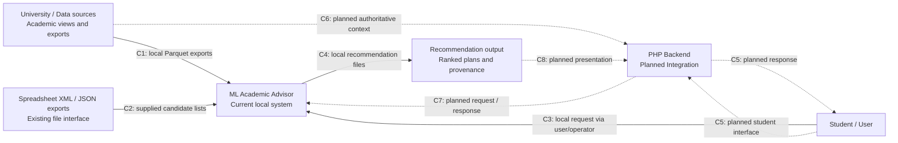

# 01 — System Context

لقطة **2026-10-06**. النظام المنفذ هنا هو ML Academic Advisor محلي، يستقبل exports وطلب توصية ويخرج خططًا مرتبة. PHP Backend والتجربة المباشرة للطالب حدود تكامل مخططة، ولا توجد لهما implementation في هذا repository.

لا تعرض هذه الصفحة تفاصيل Python الداخلية. الطالب مستفيد من التوصية؛ تشغيل الطلب المثبت حاليًا يتم محليًا بواسطة المستخدم/المشغل، ولا يثبت وجود بوابة طالب أو تسجيل مواد آلي.

## دليل العلاقات

| العلاقة | المصدر المثبت / حد الاستنتاج |
| --- | --- |
| C1 University → Advisor | [paths.py](../../src/paths.py) يحدد ملفات raw، و[clean_student_course.py](../../src/data/clean_student_course.py) و[clean_student_status.py](../../src/data/clean_student_status.py) يقرآنها. الملفات المحلية تثبت exports؛ لا تثبت SQL connector أو job استخراج. |
| C2 File export → Advisor | [inputs.py](../../src/recommendation/inputs.py): `read_candidate_file` يقبل JSON/Parquet؛ [evaluate_xml_recommendations.py](../../src/evaluation/evaluate_xml_recommendations.py): `xml_rows` و`run_case` يقبلان Spreadsheet XML. [xml_to_json.py](../../src/data/xml_to_json.py) يوفر تحويل ملفات منفصلًا. |
| C3 User → Advisor | [local_cli.py](../../src/recommendation/local_cli.py): الطالب والاختصاص والفصل وقائمة المرشحين وحد التاريخ مدخلات CLI. لا يتحقق CLI من هوية مستخدم عبر login. |
| C4 Advisor → Output | [output.py](../../src/recommendation/output.py): `save_recommendations` يحفظ `plans.parquet` و`courses.parquet` و`result.json`؛ `local_cli.py` يحفظ snapshot وتقرير الاستيراد أيضًا. |
| C5–C8 PHP / Student integration | الاتجاه موثق في [PRODUCTION_CONTRACT.md](../PRODUCTION_CONTRACT.md) و[LOCAL_RECOMMENDATION.md](../../LOCAL_RECOMMENDATION.md)، لكنه مخطط. حصر المصدر لم يجد PHP أو FastAPI أو endpoints. التسلسل المقترح منفصل في [06_api_sequence.md](06_api_sequence.md). |

## الأنظمة الخارجية الحقيقية وحدودها

مصدر البيانات الجامعي ممثل بستة exports محلية من views: student course، student degree status، degree course catalog، academic info، GradeScale، course request. لا تُستنتج DB engine أو API أو ملكية PHP من اسم View. dependency `oracledb` موجودة في [pyproject.toml](../../pyproject.toml)، لكن لم يُعثر على مسار اتصال حي في الشيفرة المفحوصة؛ dependency وحدها ليست تكاملًا منفذًا.

XML/JSON واجهة تبادل ملفات فعلية؛ لا تتطلب خدمة SaaS. LightGBM وpandas وPyArrow مكتبات داخلية للنظام وليست External Systems. graphify وVS Code وأدوات debugging أدوات تطوير، وليست أطرافًا في طلب الطالب.

التالي: [End-to-End Pipeline](02_end_to_end_pipeline.md).
