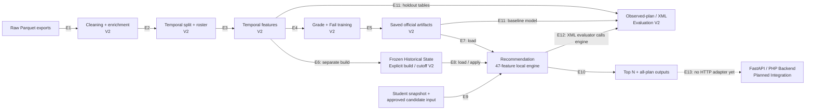
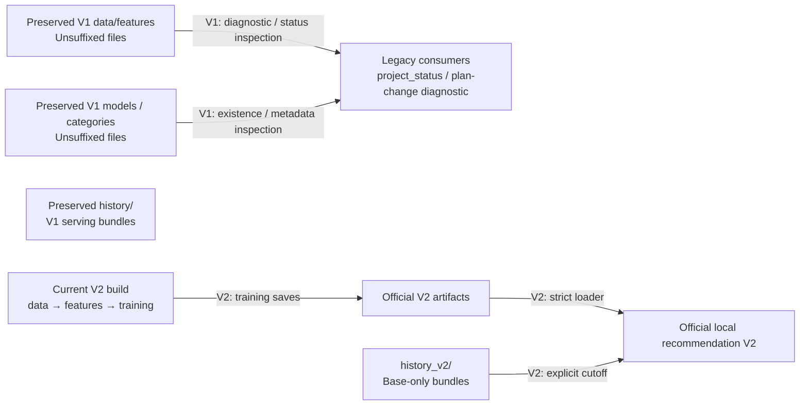
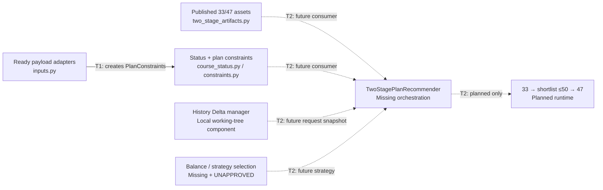

# 02 — End-to-End Pipeline

المسار الأساسي الحالي **V2** من cleaning حتى modeling/evaluation، والتوصية الرسمية تستهلك مودلي V2 وتاريخ V2. لا توجد حاليًا فجوة تلقائية V2→V1 بين feature engineering والتدريب كما تقول بعض الوثائق القديمة. لكن التشغيل الكامل ليس أمرًا واحدًا ينتهي بخدمة HTTP: Frozen History والتوصية والـXML خطوات مستقلة، والـAPI مخطط.

## المسار الحالي — 12 عقدة

التاريخ **ليس ناتجًا من Model Training**. كلاهما فرع من features/outcomes: التدريب ينتج المودلات؛ باني history يجمع النتائج النهائية فقط حتى cutoff مستقل. رسم العلاقة `Q → E` يعني أن XML evaluation يستخدم المحرك، ولا يعني أن كل طلب توصية يعقبه تقييم أو أن baseline evaluation يقرأ `result.json`.

| العلاقة | الملفات / الاستدعاءات التي تثبتها |
| --- | --- |
| E1 | [paths.py](../../../src/paths.py) + `main` في [clean_student_course.py](../../../src/data/clean_student_course.py)، [clean_student_status.py](../../../src/data/clean_student_status.py)، [clean_degree_course.py](../../../src/data/clean_degree_course.py). |
| E2 | [filter_common_students.py](../../../src/data/filter_common_students.py) → [build_student_course_enriched.py](../../../src/data/build_student_course_enriched.py) → [clean_student_diploma.py](../../../src/data/clean_student_diploma.py) → [clean_outliers.py](../../../src/data/clean_outliers.py) → [build_temporal_split.py](../../../src/data/build_temporal_split.py)؛ [build_registration_roster.py](../../../src/data/build_registration_roster.py) فرع من raw/status/catalog/audit. |
| E3 | [build_temporal_features.py](../../../src/features/build_temporal_features.py): `main` يقرأ train/test outcomes وrosters وstatus V2؛ `build_feature_tables` ينسق الحساب. |
| E4–E5 | [train_models.py](../../../src/modeling/train_models.py): يقرأ features V2، يختار المرشحين ويعيد fit، ويحفظ Grade/Fail/category levels/metadata V2. |
| E6 | [build_frozen_history.py](../../../src/features/build_frozen_history.py) → [frozen_history.py](../../../src/features/frozen_history.py): `build_frozen_history` ثم `save_frozen_history`. لا استيراد trainer. |
| E7–E8 | [artifacts.py](../../../src/recommendation/artifacts.py): `load_recommendation_artifacts` يحمل أصول V2 وbase history فقط؛ [engine.py](../../../src/recommendation/engine.py): `prepare_candidates` يطبقها. |
| E9 | [inputs.py](../../../src/recommendation/inputs.py): `load_local_inputs` → `normalize_candidates` وsnapshot؛ [local_cli.py](../../../src/recommendation/local_cli.py) يمررها إلى engine. |
| E10 | [engine.py](../../../src/recommendation/engine.py): `recommend` → [output.py](../../../src/recommendation/output.py): `save_recommendations`. |
| E11 | [evaluate_plan_gpa.py](../../../src/evaluation/evaluate_plan_gpa.py): features2025 + Grade V2 + GradeScale؛ [analyze_model_errors.py](../../../src/evaluation/analyze_model_errors.py) يقرأ train/test وmetadata ومودل Grade، وقد يعيد fit تاريخيًا لتحليل out-of-time. |
| E12 | [evaluate_xml_recommendations.py](../../../src/evaluation/evaluate_xml_recommendations.py): `main` يحمل engine، و`run_case` يستدعي `recommend` قبل إرفاق النتائج الفعلية. |
| E13 | [PRODUCTION_CONTRACT.md](../../PRODUCTION_CONTRACT.md) اتجاه تصميم؛ لا FastAPI route أو PHP client مثبت. |

## V1 وV2 مساران منفصلان

`V1H` مستقل ومحفوظ؛ لا سهم منه إلى Q لأن محمّل V2 لا يستخدمه. `feature_engineering_version=2` يوجد في metadata كلا الإصدارين، لذلك لا يحدد dataset بمفرده.

- دليل المستهلكين القديمين: [project_status.py](../../../src/project_status.py) يخلط data/features V2 بفحوص training/evaluation/experiments V1؛ [analyze_course_plan_changes.py](../../../src/diagnostics/analyze_course_plan_changes.py) يقرأ clean V1.
- دليل الفصل: [paths.py](../../../src/paths.py) يعرف المسارات الملحقة وغير الملحقة؛ [artifacts.py](../../../src/recommendation/artifacts.py) لا fallback عند غياب V2.
- [PIPELINE_README.md](../../../PIPELINE_README.md) و[Readme.md](../../../Readme.md) يصفان ترحيلًا أقدم؛ [START_HERE.md](../../../START_HERE.md) يبدأ بتحديث V2 لكن يحوي أمثلة V1 أقدم لاحقًا. لم تُعدّل هذه الوثائق.

## Orchestration وحدود التشغيل

[main.py](../../../src/main.py) يسجل `data → features → modeling → evaluation → experiments`. فحص `--list` و`--all --dry-run` أثبت أسماء الـmodules وترتيبها دون تنفيذ المراحل.

- `--all` يشمل تجربة degree/points المكلفة؛ ليست توصية Production.
- `build_frozen_history` يتطلب `--as-of-part` و`--finalized-through-part` ويستبعد من standard build.
- Recommendation وXML evaluation وbenchmark request-specific ومستبعدة من `--all`.
- لا raw ingestion stage أو service deployment stage في runner.
- frozen state الذي يحفظه feature builder في `course_history_state_v2.pkl` ليس تلقائيًا immutable bundle جاهزًا لخدمة الطالب. يلزم البناء المنفصل تحت `history_v2/as_of_<part>/`.

## المسار الجزئي للـTwo-Stage

T1 مثبت بـ`prepare_recommendation_payloads` في [inputs.py](../../../src/recommendation/inputs.py). T2 تصميم في [الخطة الموجودة](RECOMMENDATION_TWO_STAGE_IMPLEMENTATION_PLAN.md) وليس call path حاليًا. loader في [two_stage_artifacts.py](../../../src/recommendation/two_stage_artifacts.py) يحمل الأربعة ولا يكوّن خططًا. [history_update.py](../../../src/recommendation/history_update.py) ينفذ delta/save/swap محليًا؛ `engine.py` لا يستورده ولا يستخدمه. [manifest](../../../models/shortlist_v2/manifest.json) يبقي استراتيجيات المرحلتين والتوليفة `UNAPPROVED`.

## الفجوات المثبتة / حدود الإثبات

| المسار | الحالة |
| --- | --- |
| قاعدة الجامعة → raw Parquet عبر ETL آلي | exports موجودة؛ extraction job أو connector غير مثبت. |
| إعادة تدريب المصدر الحالي → artifacts يقبلها serving دائمًا | غير مضمون: `capaciy_63` في trainer مقابل `capacity_63` في loader؛ [تفصيل](04_model_training.md). |
| baseline → requirement/repeat constraints الحديثة | غير موصول: baseline يستدعي `enumerate_plan_indices`، لا `enumerate_feasible_plan_indices`. |
| الطلب → latest valid history تلقائيًا | موجود في `FrozenHistoryManager` الجزئي؛ baseline يطلب cutoff صريحًا. لا نخلط سياستي الاختيار. |
| PHP → FastAPI → engine → الطالب | Planned Integration؛ لا endpoints أو transport contract منشور. |
| التوصية → تسجيل المواد أو قياس التحسن الفعلي | غير موجود؛ XML يقارن خططًا مسجلة ويعرض توقعات البدائل فقط. |

التالي: [Data + Features](03_data_features_pipeline.md).
