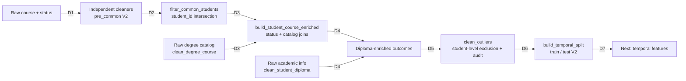
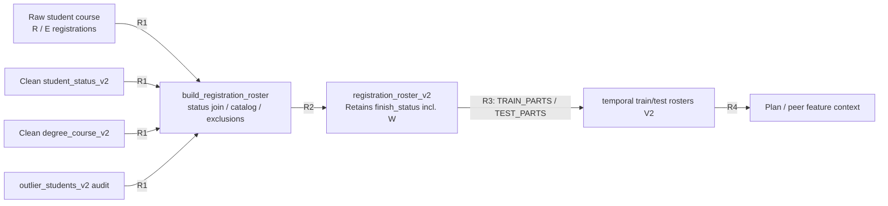
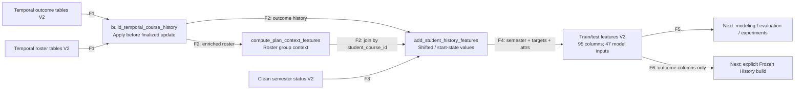

# 03 — Data + Features Pipeline

هذا Zoom لمسار **V2 المنفذ**. المصادر مشتركة دون suffix؛ المخرجات التالية ملحقة بـ`_v2`. مساراتها مركزية في [src/paths.py](../../src/paths.py). الأرقام أدناه قراءة headers وقت الفحص **2026-10-06**، وليست نتائج إعادة بناء أو إثبات اتساق جميع الوسائط.

## مصادر البيانات الفعلية

| Local raw artifact | عدد الصفوف | الاستخدام المثبت |
| --- | ---: | --- |
| `data/raw/v_crg_student_course_raw.parquet` | 1,017,491 | Outcomes cleaner وregistration roster؛ مفاتيح الطالب/المقرر/الفصل وmarks وfinish/register flags. |
| `data/raw/v_add_student_degree_status.parquet` | 189,158 | Semester status، start/end GPA وعدادات التسجيل؛ cleaning ثم student-history features. |
| `data/raw/v_acd_degree_course.parquet` | 4,006 | Degree catalog: نوع المادة والمتطلب وتسلسلها وساعاتها. |
| `data/raw/v_add_academic_info.parquet` | 32,548 | Diploma GPA/type. |
| `data/raw/v_acs_grade.parquet` | 72 | GradeScale عند evaluation/inference؛ ليس مدخل تنظيف outcomes في المسار الأساسي. |
| `data/raw/v_crg_std_cor_temp_request.parquet` | 556,700 | Export لمرشحين وحقول طلب؛ ليس stage لتدريب المودلات. `notebooks/request.ipynb` يقرأه، والـlocal adapter يقبل قائمة يوفرها caller. |

`COURSE_OFFER_PATH` و`COURSE_PREREQUISITE_PATH` معرفان في `paths.py`، لكن `v_sch_course_offers.parquet` و`v_cor_course_prerequisite.parquet` غير موجودين هنا، ولا يقرأهما محرك التوصية الحالي. لا نفترض offer/prerequisite flow.

## A. التنظيف والإثراء — 10 عقد

| Stage / العلاقة | Input → Transformation | Output الفعلي | Next consumer / الدليل |
| --- | --- | --- | --- |
| D1 course cleaning | Raw course → أسماء وأرقام ومفاتيح موحدة؛ `register_status ∈ {R,E}`؛ `part_id > 20193`؛ عدّ attempts قبل ترشيح finish/GPA flags؛ الاحتفاظ بـF/FE/FA/P واستبعاد أي GPA/include flag=N. | `data/clean/student_course_pre_common_v2.parquet` | `filter_common_students`؛ [clean_student_course.py](../../src/data/clean_student_course.py): `clean_student_course`, `main`. Withdrawal لا يبقى ضمن outcomes. |
| D1 status cleaning | Raw status → semester4 مستبعد؛ تاريخ enrolled GPA مزاح؛ gap semesters؛ permanent-status/study-mode/withdrawn-status filters. | `data/clean/student_status_pre_common_v2.parquet` | `filter_common_students`؛ [clean_student_status.py](../../src/data/clean_student_status.py): `clean_student_status`, `add_enrollment_features`؛ [academic_calendar.py](../../src/data/academic_calendar.py). |
| D2 common students | جدولا pre_common → تقاطع `student_id` فقط، مع إبقاء جميع صفوف الطالب المشترك. ليس تقاطعًا على `(student_id, degree_id, part_id)`. | `data/clean/student_course_v2.parquet`؛ `student_status_v2.parquet` | Enrichment، roster، student history، local inputs؛ [filter_common_students.py](../../src/data/filter_common_students.py). |
| D3 catalog cleaning | Raw catalog → types/IDs/sorting؛ لا تعلم أو اختيار مرشحين. | `data/clean/degree_course_v2.parquet` | Enrichment وroster وlocal candidate join؛ [clean_degree_course.py](../../src/data/clean_degree_course.py). |
| D3 enrichment | Clean course INNER status على `(student_id, degree_id, part_id)`؛ ثم LEFT catalog على `(degree_id, course_id)`، وكلاهما `many_to_one`. Prefix `plan_` لحقول catalog؛ `plan_match` مؤشر. | `data/clean/student_course_enriched_v2.parquet` | Diploma merge؛ [build_student_course_enriched.py](../../src/data/build_student_course_enriched.py): `main`. |
| D4 diploma cleaning + merge | Academic info → أعلى4 أنواع والبقية55.111، global GPA ffill كما ينفذه المصدر؛ ثم LEFT join على student_id دون إسقاط outcomes. | `data/clean/student_diploma_v2.parquet`؛ `data/merged/student_course_enriched_with_diploma_v2.parquet` | Outlier audit / local snapshot؛ [clean_student_diploma.py](../../src/data/clean_student_diploma.py). |
| D5 outlier policy | Diploma-enriched rows → audit لقواعد حدود ومجاميع واتساق status/course؛ حذف **كل صفوف الطلاب** الذين يظهرون في audit. | `data/merged/outlier_students_v2.parquet`؛ `student_course_enriched_without_outliers_v2.parquet` | Split وroster exclusion؛ [clean_outliers.py](../../src/data/clean_outliers.py): `build_outlier_audit`, `remove_outlier_students`. audit ليس مجرد قائمة فصل واحد. |
| D6 temporal split | Clean merged outcomes → train parts20201–20243 وtest20251/20252؛20253 مستبعد كغير مكتمل، وغير ذلك لا يدخل القائمتين. | `data/temporal/temporal_train_v2.parquet`؛ `temporal_test_v2.parquet` | `build_temporal_features`؛ [build_temporal_split.py](../../src/data/build_temporal_split.py): `TRAIN_PARTS`, `TEST_PARTS`, `INCOMPLETE_PARTS`. |
| D7 next feature consumer | Train/test + parallel rosters + clean status. | جدول features لكل مجموعة. | [build_temporal_features.py](../../src/features/build_temporal_features.py): `main`؛ القسم C أدناه. |

## B. فرع Roster — تسجيلات السياق وليست Targets

R1–R3 في [build_registration_roster.py](../../src/data/build_registration_roster.py): `build_registration_roster` و`main`. المخرجات:

- `data/clean/registration_roster_v2.parquet`.
- `data/temporal/temporal_train_roster_v2.parquet` و`temporal_test_roster_v2.parquet`.

R4 في [build_temporal_features.py](../../src/features/build_temporal_features.py): `attach_plan_context` يربط context إلى target بـ`student_course_id`. Roster يحافظ على تسجيلات withdrawals ضمن نطاق status/outlier joins؛ لا يمد history بنتائج إضافية. لا نساوي `W` بعلامة صفر أو ML fail label. هذا roster تاريخ تسجيل فعلي لبناء سياق التعلم؛ request-time context يأتي من الخطة المقترحة.

## C. Feature Engineering — 9 عقد

| Stage / علاقة | Input → Transformation → Output | Next consumer / دليل |
| --- | --- | --- |
| F1 course history | Outcomes مرتبة بفصلها + roster → `CourseHistoryState.apply` قبل `update` من outcomes النهائية →7 `course_history_*` لكل target/roster row. | Plan context وtarget features؛ [temporal_features.py](../../src/features/temporal_features.py): `build_temporal_course_history`, `CourseHistoryState`. |
| F1 holdout | Clone training state حتى20243 → apply20251 ثم update بنتائج20251 → apply20252؛ النسخة المرجعة من الباني تبقى state التدريب20243. | Features2025 وحفظ training state؛ التابع نفسه. لم يدخل20252 في features20251. |
| F2 context | Roster + course difficulty السابقة → group `(student_id, degree_id, part_id)` →14 `plan_*`/`peer_*`، مع leave-one-out للمادة الحالية. | `attach_plan_context` يدمجها في outcomes؛ [build_temporal_features.py](../../src/features/build_temporal_features.py) و`compute_plan_context_features`. |
| F3 student history | Clean status history → enrolled GPA shifts + trend + start counters + shifted `reg_total_semesters` →10 student-history features. | Train/test target merge بـstudent_status_id؛ `add_student_history_features` في [temporal_features.py](../../src/features/temporal_features.py). |
| F4 final table | جميع المكونات → `part_semester = part_id % 10`؛ `is_fail = final_mark < 50`؛ attrs version2. | `data/features/temporal_train_features_v2.parquet` و`temporal_test_features_v2.parquet`؛ [build_temporal_features.py](../../src/features/build_temporal_features.py). |
| F5 feature contract | جدول95 عمودًا → اختيار مرتب42 numeric +5 categorical، coercion float32/categories. Raw IDs وcurrent outcomes ليست ML inputs. | Trainers/evaluators/engine؛ [feature_contract.py](../../src/features/feature_contract.py): `BASE_FEATURES`, `prepare_model_matrix`, `LEAKAGE_COLUMNS`. |
| F6 Frozen History | Features/outcomes + cutoff وإقرار finalization → تجميع prefix بـ`part_id <= cutoff`، دون model predictions أو plan-dependent recomputation. | Immutable base bundle يستهلكه serving؛ [build_frozen_history.py](../../src/features/build_frozen_history.py)، [frozen_history.py](../../src/features/frozen_history.py). |

History fallback يستخدم `(degree, course)` ثم course ثم مجموعات requirement/rounded credits داخل degree أو faculty ثم requirement العام ثم global. يقوم smoothing على المجاميع، ويخرج support/fallback/missing. لا يحتفظ بـsnapshot الطالب أو سجل محاولاته الشخصي. التفاصيل الحسابية موجودة في `build_history_keys` و`CourseHistoryState.apply`، دون جعل كل تابع عقدة في الرسم.

`COURSE_HISTORY_STATE_PATH_V2` = `data/artifacts/course_history_state_v2.pkl` يحفظ state التدريب. serving يقرأ بدلًا منه حزمة `data/artifacts/history_v2/as_of_<part>/course_history_state.pkl` مع `metadata.json`. بناؤها مستقل ولا ينفذ تلقائيًا ضمن `--all`.

## لقطة الوسائط المحلية

| Artifact V2 | Rows | المعنى / التحفظ |
| --- | ---: | --- |
| student_course_pre_common | 459,620 | Outcomes بعد cleaner وقبل تقاطع الطلاب. |
| student_status_pre_common | 108,974 | Semester statuses بعد cleaner. |
| student_course | 456,595 | Local attempts source؛ ليس training cohort النهائي. |
| student_status | 107,939 | مصدر تاريخ الطالب؛ يبقى أوسع من outcome cohort. |
| student_course_enriched | 456,453 | inner status join قد يسقط صفوفًا؛ lineage كامل لم يُعد تشغيله في هذه المهمة. |
| without_outliers | 424,357 | Outcomes cohort قبل اختيار parts الثابتة. |
| temporal_train / train_features | 356,816 | Features95 عمودًا؛ training through20243. |
| temporal_test / test_features | 67,536 | Holdout20251/20252. |
| registration_roster | 474,165 | مصدر سياق أوسع من outcomes. |
| train_roster / test_roster | 388,978 / 74,814 | ليست أعداد target rows. |
| history_v2/as_of_20243 | 356,816 | source_row_count من metadata. |
| history_v2/as_of_20251 | 391,224 | training + finalized20251 من metadata. |

فحص SHA-256 لمصادر الحزمتين المذكورتين في metadata طابق ملفات features الحالية. لا يثبت ذلك تطابق كل raw/clean/enriched input أو SQL semantics. اختلاف clean/enriched لا يكفي وحده للحكم بوجود artifact قديم؛ يلزم join/cohort audit منفصل لإثبات السبب.

## حدود جودة البيانات والزمن

- `attempt_number` يُعد قبل finish/GPA filtering في cleaner؛ Local adapter يأخذ max attempts من الصفوف المنظفة المتبقية ثم يضيف1. فقد المحاولة الأخيرة المستبعدة يمكن أن يسبب اختلاف training/serving. Backend adapter الجديد يطلب attempt صريحًا حسب semantics التنظيف، لكنه غير موصول بالـCLI الحالي. [inputs.py](../../src/recommendation/inputs.py)، [تقرير التشخيص السابق](../../reports/attempt_number_feature_analysis.md).
- source status `total_*` يعاملها الكود كقيم بداية الفصل؛ لا تُطرح منها outcomes الفصل الحالي. تعريف View وتوقيت تحديثها الفعلي يحتاجان الجامعة، ولا يثبتان من export وحده.
- إقرار `finalized-through-part` جزء من عقد بناء التاريخ، لا تحقق آليًا من اعتماد نتائج الجامعة. semester cutoff يمنع اختلاط الزمن لكنه لا يثبت وقت finalization خارجيًا.
- ترشيح cohort/outlier والتنظيف لا ينفذ أثناء `engine.recommend`. snapshot المحلي يتطلب target status فريدًا أو JSON جاهزًا، وليس اكتشافًا تلقائيًا لأي طالب/فصل جديد.

التالي: [Model Training](04_model_training.md).
