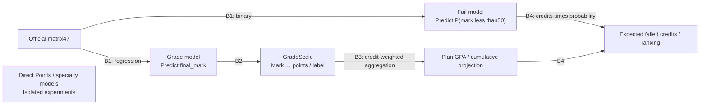

# 04 — Model Training Lifecycle

المودلان الرسميان الحاليان هما **Grade/mark regressor** و**Fail-risk classifier** باستخدام47 `BASE_FEATURES`. النقاط في التوصية ناتجة من تحويل العلامة عبر GradeScale، وليست Direct Points model. التدريب الأساسي وتقييمه يقرآن V2 فعلًا.

## دورة التدريب الأساسية — 9 عقد

```mermaid
flowchart LR
    F["V2 feature tables<br/>Train + separate holdout"]
    C["Feature Contract<br/>47 ordered inputs / categories"]
    V["Temporal Validation<br/>2023 / 2024 folds"]
    T["LightGBM candidate training<br/>Grade + Fail"]
    E["Fold evaluation<br/>MAE / LogLoss"]
    S["Selected Models<br/>Independent task selection"]
    R["Final refit through20243<br/>Chosen rounds / all train"]
    H["2025 holdout evaluation<br/>Reporting after selection"]
    A["Saved Artifacts V2<br/>Grade / Fail / levels / metadata"]
    F -->|"M1"| C
    C -->|"M2"| V
    V -->|"M3"| T
    T -->|"M4"| E
    E -->|"M5"| S
    S -->|"M6"| R
    R -->|"M7"| H
    F -->|"M7: test rows only"| H
    H -->|"M8: save models and report metadata"| A
```

| علاقة | الدليل من المصدر |
| --- | --- |
| M1 | [train_models.py](../../src/modeling/train_models.py): `main` يقرأ `TEMPORAL_*_FEATURES_PATH_V2` ويستدعي `require_current_features`؛ [feature_contract.py](../../src/features/feature_contract.py): `prepare_model_matrix`. |
| M2 | `prepare_folds`: train حتى20223 → valid20231–20233، ثم train حتى20233 → valid20241–20243. categories تُتعلم من fit فقط لكل fold. |
| M3 | `train_one` + `shared_parameters`: LightGBM، max900 rounds وearly stopping75؛ [training_config.py](../../src/modeling/training_config.py): fit weights0.25 قبل2022 و1 بعد ذلك. |
| M4–M5 | `tune_model`: المتوسط عبر foldين؛ اختيار Grade بأقلMAE وFail بأقلLogLoss، كل مهمة مستقلّة. Targets من `TARGET_GRADE=final_mark`, `TARGET_FAIL=is_fail`. |
| M6 | `main`: تعلم final categories من training، refit كامل بـmean best iterations للمرشح المختار؛ لا validation2025 لاختيار المرشح. |
| M7 | `main`: predictions على test2025، Grade clipping0–100 وFail0–1؛ `regression_metrics`, `classification_metrics`, `calibration_table`. history features2025 مجهزة roll-forward في مرحلة features، لا online fit هنا. |
| M8 | `save_model` و`save_category_levels` وكتابة `MODEL_METADATA_PATH_V2` في `main`. هذا حفظ مباشر في official paths، بلا registry activation transaction. |

التحقق الزمني هنا مبني على Feature Tables محسوبة مسبقًا بـapply-before-update؛ لا يعيد trainer بناء history أثناء كل fold. نتائج الفصول السابقة قد تغذي history للفصل اللاحق وفق sequential protocol، بينما لا تدخل نتائج الفصل نفسه في ميزاته.

## الأهداف والاستهلاك — 7 عقد

العقدة E مستقلة عمدًا؛ لا سهم منها إلى inference الرسمي. B1 في trainer، B2 في [grade_scale.py](../../src/grade_scale.py) و[engine.py](../../src/recommendation/engine.py): `score_rows`، وB3–B4 في [plan_scoring.py](../../src/recommendation/plan_scoring.py): `summarize_scored_plans` و`rank_plans`. `expected_points` ليس `(1-fail_probability) × predicted_points`؛ يتبع GradeScale مباشرة، بينما احتمال الرسوب يدخل objective منفصلًا.

| Model family | Target / ميزات | Production Recommendation الحالي |
| --- | --- | --- |
| Official Grade V2 | `final_mark`،47 ميزة؛ metadata الحالية `capacity_63`,114 rounds. | **نعم**، ينتج predicted_mark ثم GradeScale. |
| Official Fail V2 | `is_fail=(final_mark<50)`،47 ميزة؛ `balanced_31`,112 rounds. | **نعم**، احتمال رسوب، وليس official finish_status. |
| Legacy Grade/Fail V1 | نفس أنواع الأهداف، أصول unsuffixed؛ Grade metadata الحالية `balanced_31`. | **لا**؛ محفوظة ومستهلكة جزئيًا بأدوات حالة/تشخيص قديمة. |
| Direct Points variants | target `points`، variants في `degree_points_config.py`؛ لا GradeScale لتحويل target points المتوقع. | **لا**؛ experiments. |
| Degree/specialty selected V2 | `degree_history_mark_temporal`،target mark؛57 ميزة بحسب metadata. | **لا**؛ `KEEP EXPERIMENTAL`. الأفضل في تجربة ليس بديلًا رسميًا تلقائيًا. |
| Degree/specialty selected V1 | `degree_history_points_temporal`،target points؛57 ميزة. | **لا**؛ نسخة تجربة أقدم مستقلة. |
| Course-only original | Grade/Fail33، حذف14 plan/peer؛ [course_only_training.py](../../src/experiments/course_only_training.py). | **لا** في baseline؛ مصدر النسخ33 المنشورة للـTwo-Stage. |
| Published shortlist assets | Grade33/Fail33 نسخ byte-identical، contract مستقل في manifest، training cutoff20243. | loader موجود؛ **لا محرك Two-Stage متكامل حاليًا**. |
| Previous course status | Grade/Fail48 و34، إضافة status إلى47/33؛ [previous_course_status_training.py](../../src/experiments/previous_course_status_training.py). | **لا**؛ `NEEDS MORE DATA`. status helpers التجارية لا تعني إدخاله في47 الرسمية. |
| Attempt-number ablations | Grade/Fail A/B/C: exact attempts / repeat flag / removed information. | **لا**؛ `INCONCLUSIVE` في [التقرير](../../reports/attempt_number_feature_analysis.md)؛ لم يُغيّر العقد الرسمي. |

## Artifacts: من ينتجها ومن يستهلكها؟

| Artifact / group | Producer | Actual consumer |
| --- | --- | --- |
| `models/grade_regressor_v2.txt` | `modeling/train_models.main` | `recommendation/artifacts.py`؛ `evaluate_plan_gpa.py`؛ `analyze_model_errors.py`؛ Stage2 asset loader. |
| `models/fail_risk_classifier_v2.txt` | trainer نفسه | `recommendation/artifacts.py`؛ Stage2 loader؛ بعض التجارب تقرأه للمقارنة. observed-plan GPA evaluator لا يستخدمه. |
| `models/model_metadata_v2.json` | trainer نفسه | Official loader/evaluators/experiments؛ Stage2 manifest evidence. يسجل الاختيار والميزات والmetrics/history protocol، ولا يحوي `dataset_version` صريحًا في النسخة المحلية الحالية. |
| `data/artifacts/category_levels_v2.json` | trainer: learn from final train | `prepare_model_matrix` في inference/evaluation؛ يمنع تعلم categories من الطلب. |
| `data/raw/v_acs_grade.parquet` | university export، ليس trainer | `GradeScale.from_parquet` في inference/evaluation/experiments؛ hash مثبت أيضًا في Two-Stage manifest. |
| `data/artifacts/course_history_state_v2.pkl` | feature builder | baseline training state output؛ الرسمي يحمل immutable bundle بدلًا منه. |
| `data/artifacts/history_v2/as_of_<part>/` | explicit Frozen History builder؛ Delta publisher المحلي يمكن أن ينشئ إصدارًا جديدًا | Official artifact loader بـcutoff صريح؛ manager الجديد له سياسة latest-valid منفصلة. لا يكتب trainer هذه الحزم. |
| `data/evaluation/plan_gpa_*2025_v2.*` | `evaluate_plan_gpa.main` | degree/points experiment وقراءة التقارير؛ ليست serving inputs. |
| `data/evaluation/error_analysis/*_v2.*` | `analyze_model_errors.main` | diagnostics/reporting؛ ليست inference features. |
| `models/experiments/degree_points/selected_model_v2.txt` + levels | `degree_points` → `modeling.evaluate_selected_holdout` | isolated evaluation/cache/research؛ counterpart V1 بلا suffix محفوظ. |
| `models/experiments/course_only_recommendation/` | `course_only_training.train_experiment` | experimental comparison؛ promotion script ينسخ أصولًا بعينها فقط. |
| `models/shortlist_v2/{grade_model.txt,fail_model.txt,category_levels.json,manifest.json}` | [promote_shortlist_artifacts.py](../../scripts/promote_shortlist_artifacts.py): validation + byte-preserving publication، **بلا تدريب** | [two_stage_artifacts.py](../../src/recommendation/two_stage_artifacts.py): loads33+47+GradeScale؛ لا scores أو ranking. |
| `models/experiments/previous_course_status/`؛ `attempt_number/` | isolated trainers/workflows | isolated evaluators/recommendation experiments؛ لا official fallback. |

أسماء المسارات أعلاه مثبتة في [paths.py](../../src/paths.py)، وmetadata experiments تحت `data/evaluation/experiments/degree_points/experiment_metadata*.json` توضح فرق الفائز V1/V2. Published shortlist يتجاوز حاجته إلى استيراد `src.experiments` وقت التحميل؛ الأصل البحثي محفوظ ولا يعتمد serving على كوده.

## Evaluation ليست مسارًا واحدًا

- Trainer يقيّم holdout course marks/fail probabilities ويحفظ metrics داخل metadata.
- [evaluate_plan_gpa.py](../../src/evaluation/evaluate_plan_gpa.py) يقيّم GPA للـ**observed registered plans** من test features؛ لا يقيس نجاح اختيار خطة بديلة.
- [analyze_model_errors.py](../../src/evaluation/analyze_model_errors.py) يجزئ الأخطاء ويحسب SHAP؛ إعادة fit تاريخية فيه جزء تحليل، وليست training داخل طلب الطالب.
- [evaluate_xml_recommendations.py](../../src/evaluation/evaluate_xml_recommendations.py) يمرر مرشحين إلى engine ثم يقارن observed metrics/overlap. نتائج المواد غير المسجلة لا تصبح ground truth.
- Degree/points يختار variant على2023/2024 ثم يقيّمه على2025 ضمن namespace منفصل. [experiment_winner_decision_v2.md](../../reports/experiment_winner_decision_v2.md) يبقيه experimental.

## Version / release debt

**اختلاف اسم مرشح مهم:** [train_models.py](../../src/modeling/train_models.py) يعرّف `capaciy_63` في `PARAMETER_CANDIDATES`، لكن [artifacts.py](../../src/recommendation/artifacts.py) يقبل `capacity_63` فقط، وmetadata الموجودة تسجل الأخيرة. [test_train_models.py](../../tests/test_train_models.py) يتوقع `capacity_63`. لم يُشغّل الاختبار هنا؛ الاختلاف مثبت نصيًا، وليس إعلان نتيجة test suite. عند إعادة التدريب واختيار هذا المرشح يمكن أن تصبح metadata الناتجة غير مقبولة لدى loader.

حفظ trainer يكتب الملفات الرسمية تباعًا. لا manifest ذري baseline يجمعها عند النشر، بينما loader يتحقق من schema والأسماء ويحفظ hashes في provenance. Two-Stage manifest يثبت hashes لكنه ليس release orchestration للمودلات الأساسية. لذلك artifact-ready المحلي لا يكفي لادعاء deployment/retraining آمنين من زر API.

التالي: [Recommendation Runtime](05_recommendation_runtime.md).
