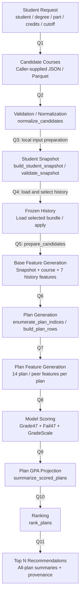
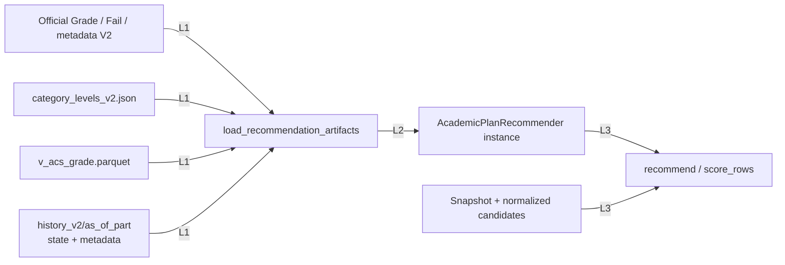

# 05 — Recommendation Runtime

هذا تدفق **`AcademicPlanRecommender` الحالي ذي47 ميزة** عند طلب طالب واحد، وليس التدريب ولا التصميم Two-Stage. entry point المحلي [src/recommend_local.py](../../../src/recommend_local.py) يفوض إلى [local_cli.py](../../../src/recommendation/local_cli.py). المودلات والتاريخ تُحمّل في العملية؛ لا raw cleaning أو retraining أثناء `recommend`.

## الطلب الحالي — 12 عقدة



الميزات تنقسم زمنيًا: base قبل توليد الخطط، ثم plan/peer بعده. لا يصح جعل Feature Generation كاملة قبل Plan Generation؛ ذلك يخالف `score_rows` الفعلي. «Load selected history» لا يعني بناء التاريخ من snapshot؛ الحزمة موجودة مسبقًا ويختار caller cutoff صريحًا.

| علاقة | الرئيسي من modules / functions | السلوك المثبت |
| --- | --- | --- |
| Q1 | [local_cli.py](../../../src/recommendation/local_cli.py): `main` | يطلب candidates/identity/target/history cutoff وحد الساعات؛ defaults batch2000 وthreads4 وtop_n3. |
| Q2 | [inputs.py](../../../src/recommendation/inputs.py): `read_candidate_file`, `normalize_candidates` | توحيد keys/credits؛ ترشيح student و`is_requestable=Y` عند وجود الحقل؛ رفض فصول مختلفة وتكرارات متعارضة؛ catalog V2 join والتحقق من credits؛ attempts من تاريخ `<target`. |
| Q3 | `load_local_inputs`, `build_student_snapshot`, `validate_snapshot` في `inputs.py` | صف target status فريد + history مزاح + diploma/faculty من prior history، أو snapshot JSON جاهز. لا يستخدم end fields في47 inputs. |
| Q4 | [engine.py](../../../src/recommendation/engine.py): `AcademicPlanRecommender.load` → [artifacts.py](../../../src/recommendation/artifacts.py): `load_recommendation_artifacts` | Grade/Fail/categories/metadata V2 + GradeScale + base-only frozen bundle. رفض missing/stale/incompatible artifacts؛ بلا fallback. |
| Q5 | `engine.prepare_candidates` → [temporal_features.py](../../../src/features/temporal_features.py): `CourseHistoryState.apply` | تحقق target/snapshot/training cutoffs؛ نسخ حقول allowlist فقط؛ ترتيب course IDs؛ إلحاق7 history features. حقول outcomes التي يوفرها caller لا تتجاوز العقد. |
| Q6 | [plan_generation.py](../../../src/recommendation/plan_generation.py): `resolve_credit_bounds`, `enumerate_plan_indices`, `build_plan_rows` | Decimal exact-credit exhaustive subsets ثم صف لكل course-in-plan. مجال12–18 يعني18 فقط. |
| Q7 | `engine.score_rows` → `compute_plan_context_features(group_columns=['plan_id'])` | حساب14 feature من الخطة المقترحة، وليس من كامل قائمة المرشحين؛ peer يستثني المادة الحالية. |
| Q8 | `engine.score_rows` → [feature_contract.py](../../../src/features/feature_contract.py): `prepare_model_matrix` → `Booster.predict` → [GradeScale.convert](../../../src/grade_scale.py) |47 مرتبة؛ mark clip0–100 وprobability0–1؛ رفض non-finite. expected points والgrade label من mark وgrade version. |
| Q9 | [plan_scoring.py](../../../src/recommendation/plan_scoring.py): `summarize_scored_plans`, `project_cumulative_gpa` | تجميع quality points وexpected failed credits وحساب plan/cumulative GPA. |
| Q10 | `rank_plans` في `plan_scoring.py` | projected GPA تنازلي، expected failed credits تصاعدي، expected plan GPA تنازلي، plan_id تصاعدي. |
| Q11 | `engine.recommend` ثم [output.py](../../../src/recommendation/output.py): `save_recommendations` | جميع summaries مرتبة + تفاصيل top_n + status/reason/provenance؛ CLI يحفظ النتائج والتقارير محليًا. |

## اعتماد التحميل مقابل اعتماد الطلب — 8 عقد



L1 في `artifacts.load_recommendation_artifacts`، وL2 في `AcademicPlanRecommender.load/__init__`، وL3 في `recommend`. CLI يحمل instance مرة لتشغيله؛ حفظ instance لكل worker طويل العمر اتجاه API مستقبلي وليس process lifecycle منفذًا هنا.

## المدخلات وحدود المرشحين

الـlocal adapter يقرأ `student_course_v2` و`degree_course_v2`، وعند غياب snapshot file يقرأ status/diploma V2. هذا طلب ملفات محلي؛ لا HTTP ولا query للجامعة. قائمة الجامعة/Backend هي مصدر المرشحين المتوقع. Python لا يولد أهلية المواد من prerequisites أو offerings أو graduation rules.

`normalize_candidates` يحذر عند `part_id` فارغ ويستخدم target الصريح؛ هذا fallback محلي وليس إثباتًا أن export كان صالحًا تاريخيًا لذلك الفصل. source list ليست training feature table. أي حكم بأهلية/توفر حقيقي يحتاج مصدرًا موثقًا للفصل.

Snapshot يضم الحقائق المتاحة عند بداية الفصل؛ Frozen History يجمع صعوبة المقررات فقط. وجود history أقدم لا يعني الرجوع إلى snapshot طالب أقدم. النموذج الحالي المدرب حتى20243 يستطيع استخدام history20251 لتوصية20252 بعد finalization، دون إعادة تدريب.

## الحساب والترتيب

```text
L = sum(course_credits)
Q = sum(course_credits * expected_points)
expected_plan_gpa = Q / L
projected_cumulative_gpa = (current_gpa * current_gpa_credits + Q)
                           / (current_gpa_credits + L)
expected_failed_credits = sum(course_credits * fail_probability)
```

`current_gpa_credits` يأتي من override، ثم snapshot field، ثم `prior_total_reg_credits` في المسار المحلي. Backend payload adapter الجديد يطلبه صريحًا ولا يستخدم ذلك fallback. شرط `is_expected_cumulative_improvement` علم وصفي؛ لا يستبعد المحرك جميع الخطط غير المحسنة. عدم وجود subset exact credits يعطي `no_matching_credit_plan` ومصفوفة توصيات فارغة، دون خفض الساعات تلقائيًا.

مع الإعادات، GPA الحالي سيناريو additive؛ لا استبدال لنقاط محاولة سابقة. يظهر `projected_gpa_requires_repeat_policy` عندما observed attempt>1. غياب العلم لا يثبت عدم وجود محاولة أقدم مستبعدة أو خارج النافذة.

## أين توضع المكونات الجديدة؟ — موجودة ولم تدمج

| Component موجود | ما ينفذه | الفجوة مع baseline |
| --- | --- | --- |
| `prepare_recommendation_payloads` | payloads جاهزة، identity/numeric validation، trend مشتق، constraints، candidate groups. | `local_cli` و`engine.recommend` لا يستدعيانه. ليس HTTP implementation. |
| `classify_candidate_status` | يفصل NEW/FAILED/WITHDRAWN/OTHER بناءً على supplied status؛ لا يستنتجه من mark أو attempt. | `prepare_candidates` يسمح بقائمة حقول محددة ويهمل status/group في baseline. |
| `enumerate_feasible_plan_indices` | requirement remaining credits وfailed/withdrawn retake caps حول exact subset search. | baseline يستدعي `enumerate_plan_indices` مباشرة؛ هذه القيود ليست مطبقة في توصيته الحالية. |
| `load_two_stage_artifacts` | يحمل33 و47 مع pinned manifest وGradeScale. | `AcademicPlanRecommender.load` يستخدم loader الرسمي47؛ لا shortlist stage. |
| `FrozenHistoryManager` | latest valid V2، capture snapshot، finalized aggregate delta، atomic bundle publish/swap، idempotency. | موجود محليًا في [history_update.py](../../../src/recommendation/history_update.py)؛ `engine.py` يحتفظ بـ`course_history` المباشر ولا يستخدم manager. |

الأدلة: [inputs.py](../../../src/recommendation/inputs.py)، [course_status.py](../../../src/recommendation/course_status.py)، [constraints.py](../../../src/recommendation/constraints.py)، [two_stage_artifacts.py](../../../src/recommendation/two_stage_artifacts.py)، [history_update.py](../../../src/recommendation/history_update.py)، ومراجعة imports/calls في `engine.py`.

اختيار التاريخ يختلف: baseline يطلب previous academic part افتراضيًا، ويسمح بالأقدم فقط بـ`allow_older_history`. manager الجزئي يختار latest valid عند التحميل، ويقبل stale finalized snapshot مع وصف عمره؛ لا يجوز وصف baseline بهذه السياسة الجديدة.

## الكلفة ومخرجات الطلب

- التوليد exhaustive، و`top_n=3` يحد ما يعرضه المستخدم فقط. المادة تظهر في خطط متعددة وتتنبأ المودلات بها ضمن كل سياق؛ لا cache عام على `(student, course)` لمودل47.
- batching يجزئ Course-in-plan rows؛ جميع plan summaries تجمع في الذاكرة وتُرتب. `course_sink` يتيح streaming إلى Parquet، وليس shortlist أو pruning بالscores.
- المخرجات: `plans.parquet` لجميع الخطط، `courses.parquet` لجميع صفوف scoring، `result.json` لتفاصيل Top N والإثبات؛ `snapshot.json`, `candidates.parquet`, `import_report.json` يسجلها CLI. لا request table writeback أو registration transaction.
- [benchmark.py](../../../src/recommendation/benchmark.py) أداة اختيارية مستقلة وليست stage في الطلب، ولم تُشغّل هنا.
- اختبارات العقود ذات الصلة: [test_recommendation_v2.py](../../../tests/test_recommendation_v2.py)، [test_recommendation_inputs_v2.py](../../../tests/test_recommendation_inputs_v2.py)، [test_projected_recommendation.py](../../../tests/test_projected_recommendation.py)، [test_two_stage_payloads.py](../../../tests/test_two_stage_payloads.py)، [test_history_update.py](../../../tests/test_history_update.py). تم فحصها كمصدر، دون ادعاء نتيجة تشغيل حديثة.

التالي: [API Sequence](06_api_sequence.md).
