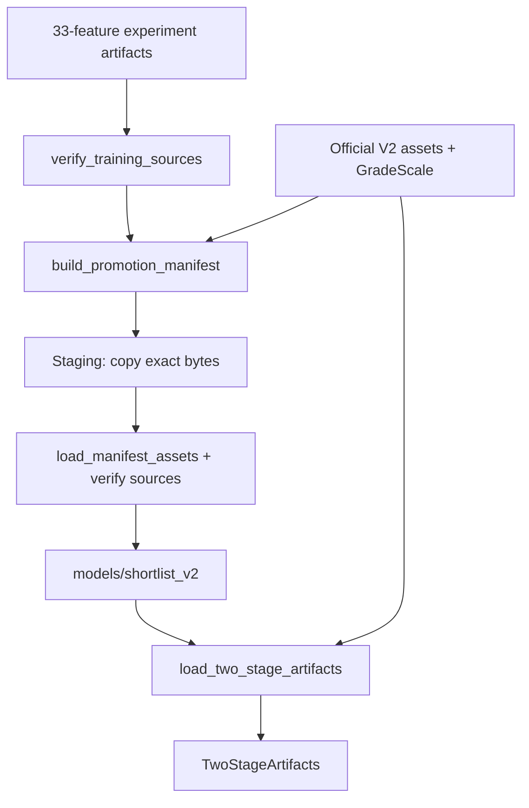

# `Phase 1 — Artifacts & Contracts`

**الحالة:** `COMPLETE` — سجل التنفيذ بتاريخ `2026-10-05`، مع مراجعة الملفات الحالية بتاريخ `2026-10-06`.

## 1. الفكرة العامة

أخذت هذه المرحلة مودلات `Stage 1` الموجودة أصلًا، ونسختها إلى مساحة مستقلة عن التجارب، وثبتت عقود `33/47 features` داخل `Manifest` و`Loader` صارم. تحقق التنفيذ من تطابق النسخ دون إعادة تدريب. أصبحت أصول المرحلتين جاهزة للتحميل، دون تنفيذ التوصية نفسها.

## 2. قبل → بعد

```text
Before
  ↓
مودلات 33 محفوظة ضمن experiments، ومودلات V2 الرسمية منفصلة
  ↓
Phase 1
  ↓
After: نسخ مستقلة + Manifest للمرحلتين + Loader صارم
```

| `Before` | `After` |
|---|---|
| أصول `33` داخل `models/experiments/course_only_recommendation/`. | نسخ مطابقة للبايتات داخل `models/shortlist_v2/`. |
| أدلة العقود والمصدر موزعة في ملفات أصلية. | `Manifest` واحد يحفظ العقود والبصمات والأدلة الأصلية. |
| لا تحميل مخصص لأصول المرحلتين معًا. | `load_two_stage_artifacts()` يعيد `TwoStageArtifacts`. |

## 3. الملفات المنتجة أو المعدلة

### ملفات جديدة

| الملف | الدور |
|---|---|
| `scripts/promote_shortlist_artifacts.py` | تدقيق المصدر ونسخ أصول `33` ونشرها بعد فحصها. |
| `src/recommendation/two_stage_artifacts.py` | تعريف العقود وتحميل مودلات المرحلتين والتحقق منها. |
| `tests/test_two_stage_artifacts.py` | اختبار النشر والعقود والرفض والعزل باستخدام أصول مصطنعة. |

### ملفات معدلة

| الملف | ما الذي تغير؟ |
|---|---|
| `src/paths.py` | أضاف ثوابت مسارات `SHORTLIST_*` و`TWO_STAGE_MANIFEST_PATH`. |
| `.gitattributes` | أضاف `-text` لملفي المودل وملف الفئات المنشورة لحماية البايتات. |
| `docs/architecture/RECOMMENDATION_TWO_STAGE_IMPLEMENTATION_PLAN.md` | سجل اكتمال المرحلة ونتائجها وقيود النقل. |

### `Artifacts` ناتجة

| المسار | النوع |
|---|---|
| `models/shortlist_v2/grade_model.txt` | `Model`، نسخة `Grade33`. |
| `models/shortlist_v2/fail_model.txt` | `Model`، نسخة `Fail33`. |
| `models/shortlist_v2/category_levels.json` | `Categories`. |
| `models/shortlist_v2/manifest.json` | `Manifest` يتضمن `Metadata` الأصلية والعقود والبصمات. |

لم تُنشأ `Metadata` مستقلة جديدة أو `History state`. أصول `Stage 2` الرسمية تُشار إليها في `Manifest`، ولم تُنسخ أو تُعدّل.

### `Generated / Auxiliary files`

تحديث `graphify-out/` وسجلات الفحص المؤقتة ملفات مساعدة، وليست أصول تشغيل للمرحلة.

## 4. أهم الملفات بالتفصيل المختصر

### `scripts/promote_shortlist_artifacts.py`

**الفكرة:** نشر أصول موجودة بعد تدقيق مصدرها، مع رفض استبدال مجلد منشور.

**يدخل إليه:** `project_root` وأصول `course_only_recommendation` و`Metadata` الأصلية وأصول `V2` و`GradeScale`.

**يخرج منه:** مجلد `models/shortlist_v2/` بأربعة ملفات و`dict` للـ`Manifest`.

| `Function / Class` | ماذا يفعل؟ |
|---|---|
| `verify_training_sources()` | يتحقق من بصمات المدخلات والمصادر الـ`11` وأدلة تعريف هدفي التدريب. |
| `build_promotion_manifest()` | يجمع عقدي المرحلتين والبصمات ومقياس الدرجات وأدلة المصدر الأصلية. |
| `promote_shortlist_artifacts()` | ينسخ إلى `Staging` ويفحص النسخ ثم ينشر مجلدًا جديدًا دون استبدال الموجود. |

### `src/recommendation/two_stage_artifacts.py`

**الفكرة:** تحميل الأصول المثبتة دون قراءة ملفات التدريب أو استيراد التجارب وقت التشغيل.

**يدخل إليه:** `Manifest` وأصول المرحلتين الرسمية و`GradeScale`؛ ويمكن تمرير `target_part`.

**يخرج منه:** `TwoStageArtifacts` أو رفض صريح عند عدم التوافق.

| `Function / Class` | ماذا يفعل؟ |
|---|---|
| `ModelPair` | يجمع مودلي `Grade/Fail` وفئات مرحلة واحدة. |
| `TwoStageArtifacts` | يجمع زوجي المودلات و`GradeScale` و`Manifest`. |
| `stage_feature_contract()` | يشتق `33` بحذف `14` من ترتيب `BASE_FEATURES`، أو يعيد عقد `47`. |
| `artifact_relative_paths()` | يأخذ مسارات الأصول من `src.paths` ويحولها إلى مراجع نسبية. |
| `verify_artifact_hash()` | يرفض ملفًا مفقودًا أو مختلف البصمة قبل تفسير محتواه. |
| `validate_stage_metadata()` | يتحقق من عقد التدريب والأهداف والاختيارات و`Cutoff` المسجل. |
| `validate_archived_provenance()` | يطلب أدلة المصدر الأصلية المكتملة دون إعادة فتح مصادر التدريب. |
| `validate_artifact_manifest()` | يثبت النسخ والعقود والمسارات والأهداف وحالة الاعتماد غير المفعلة. |
| `load_model_pair()` | يفحص أسماء وعدد وترتيب الميزات والفئات وهدف مودلات `LightGBM` الفعلية. |
| `load_manifest_assets()` | يتحقق من الأصول الأربعة و`GradeScale` وشرط سبق التدريب للفصل المستهدف إن مرر. |
| `load_two_stage_artifacts()` | يقرأ `Manifest` ويعيد الأصول المتحقق منها دون توليد أو مسار بديل. |

### `src/paths.py` و`.gitattributes`

**الفكرة:** مركزية مسارات النشر وحماية الملفات المنسوخة من تحويل نهايات الأسطر.

**يدخل إليهما:** جذر المشروع وقواعد تخزين `Git`.

**يخرج منهما:** المسارات `SHORTLIST_MODEL_DIR` و`SHORTLIST_GRADE_MODEL_PATH` و`SHORTLIST_FAIL_MODEL_PATH` و`SHORTLIST_CATEGORY_LEVELS_PATH` و`TWO_STAGE_MANIFEST_PATH`، وقواعد `-text`؛ لا توابع جديدة للمرحلة.

### `tests/test_two_stage_artifacts.py`

**الفكرة:** فصل التحقق من النشر والتحميل عن التدريب والبيانات الحقيقية.

**يدخل إليه:** `artifact_root` مؤقت و`FakeBooster` ونسخ مصطنعة من الأدلة.

**يخرج منه:** تأكيد تطابق النسخ أو تأكيد رفض حالات التلف وعدم التوافق.

| `Function / Class` | ماذا يفعل؟ |
|---|---|
| `FakeBooster` | يحاكي ترويسات المودل وتوقعاته لفحص عقود الأصول المصطنعة. |
| `artifact_root()` | ينشئ مجلد اختبار كاملًا دون لمس أصول المشروع. |
| `test_promotion_copies_exact_bytes_and_archives_original_provenance()` | يتحقق من تطابق البايتات وحفظ المصدر الأصلي. |
| `test_promoted_pair_produces_the_same_synthetic_predictions()` | يقارن توقعات الأصل والنسخة داخل تجهيز الاختبار المصطنع. |
| `test_runtime_load_needs_no_experiment_or_training_file_reads_or_imports()` | يثبت استقلال قراءة الأصول عن مصادر التجارب والتدريب. |

## 5. مخطط سير البيانات



1. يتحقق النشر من مصدر الأصول الأصلية.
2. يبني `Manifest` للمرحلتين ومقياس الدرجات.
3. ينسخ ملفات `Stage 1` دون تدريب.
4. يعيد التحميل والفحص قبل نشر المجلد.
5. يتحقق `Loader` من الأصول عند استخدامها لاحقًا.

## 6. `Input → Processing → Output`

```text
INPUT: Grade33 + Fail33 + Categories + original Metadata + official V2 + GradeScale
  ↓
PROCESSING: Verify → Manifest → Copy staging → Reload/verify → Publish
  ↓
OUTPUT: models/shortlist_v2/ → load_two_stage_artifacts() → TwoStageArtifacts
```

## 7. كيف تم اختبار المرحلة؟

ملف الاختبار: `tests/test_two_stage_artifacts.py`.

| مجال الاختبار | ماذا يثبت؟ |
|---|---|
| النسخ والتوقعات | تطابق البايتات والتوقعات المصطنعة. |
| عقود الميزات والفئات | رفض تغيير الاسم أو الترتيب أو العدد أو فئات المودل حتى مع إعادة توقيع البصمة. |
| الأهداف والبصمات والمصدر | رفض هدف غير متوافق أو ملف مختلف أو أدلة ناقصة. |
| النشر الفاشل والمتكرر | عدم نشر حزمة جزئية وعدم استبدال حزمة موجودة. |
| الزمن والعزل | رفض تدريب حالي/مستقبلي عند تمرير `target_part`، وعدم الاعتماد على التجارب وقت التحميل. |

**نتائج مسجلة وقت تنفيذ المرحلة، ولم تُعد تشغيلها هذه المهمة:**

```text
Focused tests: 68 passed
Related regression: 108 passed
Full pytest: 680 passed, 1 failed, 6 subtests passed in 68.37s
Known baseline failure: grade-capacity_63-mae
```

المصدر الدائم: قسم تقدم الأولى في [الخطة](../docs/architecture/RECOMMENDATION_TWO_STAGE_IMPLEMENTATION_PLAN.md). سجل `Full pytest` المحلي المتحقق منه: `%TEMP%/recommendation_phase1_miy7l3z5/full_pytest_final.log`. قائمة أوامر اختبارات `Related regression` التفصيلية غير مسجلة في قسم التقدم.

فحص فعلي منفصل للمودلات الأصلية والمنسوخة على `32` صفًا مصطنعًا سجل فرقًا أقصى `0.0` لكل من `Grade/Fail` في `real_artifact_synthetic_parity.json`. وفحص السلامة وقتها سجل `873 → 877` ملفًا مع أربع إضافات نشر فقط و`changed=[]` و`removed=[]`.

خلال التوثيق فُحصت بصمات الأصول المثبتة الثمانية فقط دون تشغيل توقعات: اختلافات `[]`، وعقدا `33/47` و`Cutoff=20243` موجودان في `Manifest`.

## 8. أهم ما أثبتته المرحلة

- أصبحت أصول `Stage 1` مستقلة عن مساحة التجارب وقت التحميل.
- ثُبت ترتيب عقدي `33/47` والفئات والأهداف والبصمات.
- طابقت توقعات الأصل والنسخ الفعلية على الصفوف المصطنعة المسجلة.
- رفضت الاختبارات الأصول غير المتوافقة وأدلة المصدر الناقصة.
- لم يجر تدريب جديد أو تعديل أصول `Stage 2` أو تاريخ موجود.

## 9. ما الذي لم تنفذه هذه `Phase`؟

```text
NOT DONE IN THIS PHASE
```

- `Payload adapters` وتعميم `Matrix helper` والتصنيف والقيود.
- `History Delta` أو التقاط وتبديل التاريخ النشط.
- توقعات `Stage 1` داخل محرك توصية، أو توليد واختصار الخطط.
- `Balance ranking` و`Stage 2` المتكاملة و`Top K`.
- `Benchmark` أو اعتماد استراتيجيات أو `API`.

`prediction_contract` يصف المعالجة المستقبلية؛ تحميله لا ينفذها. كما أن `TwoStageArtifacts` لا يحتوي تاريخًا؛ تحميل التاريخ مسؤولية الربط اللاحق.

## 10. المشاكل أو القيود المعروفة

- `KNOWN BASELINE FAILURE`: المصدر يستخدم `capaciy_63` والاختبار يتوقع `capacity_63`؛ لم يصلح ضمن الأولى.
- `Production Ranking: UNAPPROVED`، وكذلك الاستراتيجيتان وتوليفتهما.
- `Stage 2` قد تختلف بايتاته بعد تحويل نهايات الأسطر في `Git checkout`؛ يلزم نقل الأصول المثبتة دون تطبيع. حماية `-text` الجديدة تخص نسخ `Stage 1` الثلاثة.
- `GradeScale` لا يحمل إصدارًا أصليًا مستقلًا؛ استُخدم `sha256:<digest>` بوصفه إصدار المحتوى.
- بعد تغييرات البند الثاني في مصادر موقعة، تبقى أدلة النشر الأصلية محفوظة؛ لا تعاد كتابة `Metadata` التجارب لمطابقة المصدر الجديد، ولا يُعاد النشر خلال التوثيق.

## 11. ماذا تستلم المرحلة التالية؟

```text
HANDOFF TO NEXT PHASE

هذه Phase أنتجت
  ↓
stage_feature_contract() + TwoStageArtifacts + pinned Manifest
  ↓
البند 2 يستخدم العقد لتجهيز Matrix ومدخلات جاهزة وتصنيف وقيود
```
