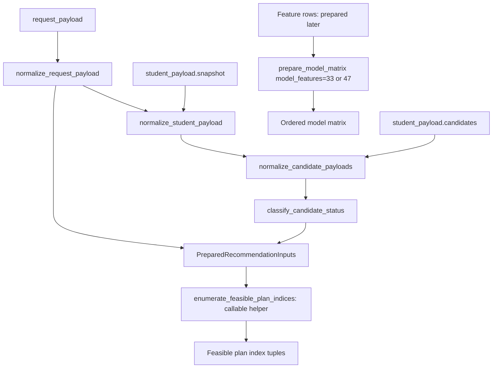

# `Phase 2 — Payload Adapters, Matrix Helper, Classification & Constraints`

**الحالة:** `COMPLETE` — بحسب سجل التنفيذ بتاريخ `2026-10-06` ومراجعة الكود والاختبارات الحالية.

## 1. الفكرة العامة

أضافت المرحلة مدخلات جاهزة من `Backend` دون قراءة كتالوج محلي أو إعادة حساب التاريخ الشخصي. صنفت الحالة الرسمية السابقة وجهزت قيود الساعات والفئات، وعممت تجهيز المصفوفة مع بقاء الافتراضي `47`. اكتملت مسؤوليات التجهيز والتحقق؛ ربطها بمحرك `Two-Stage` يأتي في مرحلة لاحقة.

## 2. قبل → بعد

```text
Before
  ↓
Local adapters + Matrix من 47 + توليد خطط بالساعات الدقيقة
  ↓
Phase 2
  ↓
After: Backend-ready inputs + official status + constraints + Matrix subset
```

| `Before` | `After` |
|---|---|
| المحول المحلي يستكمل بيانات من ملفات المشروع. | محولات منفصلة تقبل `snapshot/candidates/request` جاهزة دون قراءة ملفات. |
| `prepare_model_matrix()` يجهز `47` دائمًا. | يقبل `model_features` مرتبة، والافتراضي يبقى `BASE_FEATURES`. |
| مولد الخطط القديم يضبط مجموع الساعات. | غلاف جديد يضيف حدود الفئات وإعادة الراسب والمنسحب على الخطط الكاملة. |

## 3. الملفات المنتجة أو المعدلة

### ملفات جديدة

| الملف | الدور |
|---|---|
| `src/recommendation/course_status.py` | تطبيع الحالة الرسمية وتصنيف المرشح دون الاعتماد على توقع أو علامة. |
| `src/recommendation/constraints.py` | تطبيع رصيد الفئات وتطبيق قيود الخطط. |
| `tests/test_two_stage_matrix.py` | مقارنة المصفوفة المعممة بالسلوك السابق. |
| `tests/test_two_stage_payloads.py` | اختبارات المدخلات والهوية والتصنيف والعزل. |
| `tests/test_two_stage_constraints.py` | اختبارات قيود الخطط مقابل توقع مستقل. |

### ملفات معدلة

| الملف | ما الذي تغير؟ |
|---|---|
| `src/recommendation/inputs.py` | أضاف `PreparedRecommendationInputs` ومحولات `Payload` وفحص المجال العددي دون إلغاء المحولات المحلية. |
| `src/features/feature_contract.py` | أضاف اختيار `model_features` والتحقق من التكرار والأسماء خارج العقد. |
| `src/experiments/course_only_core.py` | جعل `prepare_course_matrix()` يفوض تجهيز `33` إلى المساعد العام مع إبقاء فحص الأعمدة الناقصة. |
| `src/recommendation/__init__.py` | صدر المدخلات والقيود والتصنيف الجديدة. |
| `docs/architecture/RECOMMENDATION_TWO_STAGE_IMPLEMENTATION_PLAN.md` | سجل إتمام الثانية واختباراتها وحماية الأصول والمرحلة التالية. |

### `Artifacts` ناتجة

لا مودلات أو `Manifest` أو `Metadata` أو `History state` جديدة لهذه المرحلة. مخرجاتها كائنات في الذاكرة؛ نتائج التحقق مسجلة في الخطة وليست تقريرًا مستقلًا جديدًا. تحديث `graphify` باستخدام `AST` فقط مخرج مساعد، وليس أصل تشغيل.

## 4. أهم الملفات بالتفصيل المختصر

### `src/recommendation/inputs.py`

**الفكرة:** عقد محول داخلي يقبل `student_payload={snapshot,candidates}` و`request_payload`، دون نشر عقد نقل `HTTP`.

**يدخل إليه:** بيانات الطالب والمرشحين الجاهزة، الهوية والفصل والساعات وسياسات الفئات وحد الإعادة الرسمي.

**يخرج منه:** `PreparedRecommendationInputs(snapshot, candidates, constraints, request_metadata)`.

| `Function / Class` | ماذا يفعل؟ |
|---|---|
| `PreparedRecommendationInputs` | يجمع المدخلات المطبعة والقيود وبيانات الطلب المرافقة. |
| `normalize_student_payload()` | يتحقق من الهوية والقيم ويشتق فقط الاتجاه المفقود/الموجود والفصل. |
| `normalize_candidate_payloads()` | يتحقق من المرشحين ويصنفهم ويرتب معرفاتهم دون استكمال من كتالوج. |
| `normalize_request_payload()` | يحول الساعات وسياسات الفئات وحدود الإعادة إلى `PlanConstraints`. |
| `prepare_recommendation_payloads()` | يجمع المحولات ويتحقق من وجود سياسة لكل فئة مرشح. |
| `_payload_number()` | يرفض الأرقام المفقودة أو غير الصالحة أو التي تصبح غير محدودة عند التحويل إلى `float`. |

تُحفظ قيم `prior_fail_credit_ratio` و`observed_gap_semesters` و`attempt_number` الجاهزة. `current_gpa_credits` إلزامي هنا. تُحذف فقط المواد المرفوضة صراحة بواسطة `is_requestable/allow_register`؛ حدود الخطة لا تحذف مرشحًا قبل التوقع. `allowed_fail_credits` و`allowed_pass_position_type` بيانات وصفية فقط.

### `src/recommendation/course_status.py`

**الفكرة:** فصل حالة المادة الرسمية عن هدف مودل الفشل `final_mark < 50`.

**يدخل إليه:** `previous_course_status` و/أو `previous_finish_status`.

**يخرج منه:** المعنى الموحد و`candidate_group`، أو رفض تعارض المعنيين.

| `Function / Class` | ماذا يفعل؟ |
|---|---|
| `normalize_previous_status()` | يطبع الرمز الدلالي أو الرسمي إلى معنى موحد دون تخمين من العلامة. |
| `classify_candidate_status()` | يقارن الحقلين إن وجدا ويعيد المعنى ومجموعة المرشح. |

`NEW/NEVER_TAKEN → NEW`، و`F/FE/FA → FAILED_RETAKE`، و`W → WITHDRAWN_RETAKE`؛ الحالات الأخرى تصبح `OTHER_PREVIOUS` ولا تُحذف تلقائيًا.

### `src/recommendation/constraints.py`

**الفكرة:** قيود رسمية على الخطة الكاملة مع ساعات `Decimal`، فوق البحث الموجود.

**يدخل إليه:** سياسات الفئات والحدود والمرشحون المصنفون.

**يخرج منه:** `PlanConstraints` وفهارس جميع الخطط التي تحقق الساعات والقيود.

| `Function / Class` | ماذا يفعل؟ |
|---|---|
| `normalize_requirement_policies()` | يحسب الرصيد `max(0, maximum + overflow − completed − reserved)` لكل فئة. |
| `PlanConstraints` | يثبت الهدف الدقيق وحد الفئات وحدي إعادة الراسب والمنسحب المستقلين. |
| `PlanConstraints.__post_init__()` | يرفض الساعات والسياسات غير الصالحة ويطبع قيمها. |
| `enumerate_feasible_plan_indices()` | يرشح الخطط الدقيقة من المولد الموجود وفق استهلاك الفئات وحدود الإعادة. |

لا يغير الغلاف `enumerate_plan_indices()` أو يقلم المرشحين مسبقًا. إعادة الراسب والمنسحب تستهلك كامل ساعات المادة من رصيد الفئة؛ احتمال الفشل المتوقع لا يستهلك حد الإعادة الرسمي.

### `src/features/feature_contract.py`

**الفكرة:** تجهيز `33` أو `47` بنفس تحويل الأرقام والفئات.

**يدخل إليه:** صفوف تحتوي الميزات المطلوبة، و`category_levels`، و`model_features` اختياريًا.

**يخرج منه:** مصفوفة مرتبة بأرقام `float32` وفئات مثبتة؛ لا يبني ميزات التاريخ أو الخطة الناقصة.

| `Function / Class` | ماذا يفعل؟ |
|---|---|
| `prepare_model_matrix()` | يحول الميزات المختارة بالترتيب المطلوب ويبقي `47` افتراضيًا. |

### `src/experiments/course_only_core.py` و`src/recommendation/__init__.py`

**الفكرة:** إعادة استخدام المساعد العام وتصدير الواجهة الجديدة دون جعل الإنتاج يعتمد على التجارب.

**يدخل إليهما:** صفوف تجربة `33` والفئات، أو استيراد واجهة `recommendation`.

**يخرج منهما:** مصفوفة التجربة أو أسماء الواجهات المصدرة.

| `Function / Class` | ماذا يفعل؟ |
|---|---|
| `prepare_course_matrix()` | يفحص أعمدة `33` ثم يستدعي المساعد العام بعقد `COURSE_ONLY_FEATURES`. |

### ملفات الاختبار الثلاثة

**الفكرة:** فحص العقود والتوافق والقيود دون بيانات طلاب حقيقية.

**يدخل إليها:** إطارات وقيم مصطنعة، ومرجع تحويل قديم، وتعداد مجموعات مستقل.

**يخرج منها:** تأكيدات للسلوك المطلوب مع نتائج تشغيل مسجلة في تقدم المرحلة.

| `Function / Class` | ماذا يفعل؟ |
|---|---|
| `test_default_matrix_matches_legacy_47_exactly_without_mutating_inputs()` | يقارن افتراضي `47` بالسلوك السابق حرفيًا ويحمي المدخلات. |
| `test_stage1_matches_legacy_slice_without_requiring_plan_context()` | يقارن `33` بجزء المرجع السابق دون طلب سياق الخطة. |
| `test_ready_values_are_preserved_without_io_or_candidate_cap_filtering()` | يتحقق من حفظ القيم الجاهزة ومنع القراءة وحذف المرشحين بسبب حد خطة. |
| `test_official_classification_does_not_use_marks_or_attempts()` | يفحص الحالة الرسمية رغم قيم مصطنعة مضللة للعلامة والمحاولة. |
| `test_constraints_match_independent_exhaustive_oracle_and_preserve_candidates()` | يقارن الخطط الممكنة بمرجع مجموعات مستقل ويتحقق من عدم تغيير المرشحين. |
| `test_fractional_subsets_match_hand_derived_oracle()` | يفحص الساعات الكسرية وخيارات الصفر وحدود الإعادة. |
| `test_decimal_to_float_overflow_is_rejected()` | يرفض قيمة `Decimal` محدودة تصبح `infinity` عند التحويل العددي. |

## 5. مخطط سير البيانات



1. يطبع الطلب الهوية والساعات وسياسات الفئات.
2. يتحقق من `Snapshot` ويشتق الاتجاه والفصل.
3. يتحقق من المرشحين ويصنف الحالة الرسمية السابقة.
4. يجمع البيانات في `PreparedRecommendationInputs`.
5. يمكن استدعاء غلاف القيود على خطط كاملة؛ المحول لا يستدعيه تلقائيًا.
6. يستطيع المساعد تجهيز مصفوفة عند توفير صفوف الميزات؛ الربط إلى التاريخ والمودلات لاحق.

## 6. `Input → Processing → Output`

```text
INPUT: student_payload + request_payload
  ↓
PROCESSING: Normalize identity/values/status/policies → validate coverage
  ↓
OUTPUT: PreparedRecommendationInputs
  ↓
اختياري حاليًا: enumerate_feasible_plan_indices() → tuples

مسار مساعد منفصل:
Feature rows + Categories + model_features → prepare_model_matrix() → Matrix
```

## 7. كيف تم اختبار المرحلة؟

| الملف | مجال الاختبار وما يستهدف إثباته |
|---|---|
| `tests/test_two_stage_matrix.py` | تطابق `47` السابق، وتطابق `33`، والترتيب والتحويل ومنع أعمدة مكررة أو غريبة. |
| `tests/test_two_stage_payloads.py` | حفظ القيم الجاهزة، غياب القراءة، هوية الطلب، الحالة الرسمية والتعارض والفيض العددي وعدم قبول ميزات محقونة. |
| `tests/test_two_stage_constraints.py` | حدود الفئات والإعادة المستقلة والكسور والصفر ومرجع مستقل وعدم وجود رجوع لساعات أقل. |

```text
Focused tests: 125 passed
Related regression: 258 passed
Full pytest: 805 passed, 1 failed, 6 subtests passed
NEW REGRESSION: 0
No skipped tests recorded in the summary.
```

المصدر: قسم تقدم `Phase 2` في [الخطة](../docs/architecture/RECOMMENDATION_TWO_STAGE_IMPLEMENTATION_PLAN.md). الفشل الوحيد المسجل هو `grade-capacity_63-mae` القديم. هذه أرقام مسجلة أثناء التنفيذ وليست إعادة تشغيل ضمن مهمة التوثيق؛ قائمة أوامر المجموعة المرتبطة التفصيلية غير مسجلة في قسم التقدم.

يسجل التقدم أيضًا نجاح تحميل الأصول الفعلية بعقود `33/33/47/47` دون توقعات، وثبات الملفات الـ`877` تحت `models/` و`data/`، ومراجعة مستقلة أغلقت حالة الفيض العددي. نتيجة `680 passed` تخص الأولى قبل تغييرات الثانية.

## 8. أهم ما أثبتته المرحلة

- المدخلات تحافظ على القيم الجاهزة وتمنع القراءة المحلية والحساب التاريخي البديل.
- تصنيف الإعادة يعتمد الحالة الرسمية ولا يعتمد العلامة أو المحاولة أو توقع الفشل.
- القيود تطبق على الخطط الكاملة وتحافظ على الكسور والصفر وحدي الإعادة المستقلين.
- تجهيز `33/47` يحافظ على التحويل والترتيب والسلوك السابق.
- نتيجة التحقق المسجلة لا تحتوي تراجعًا جديدًا؛ الأصول والتاريخ الموجودان بقيا ثابتين.

## 9. ما الذي لم تنفذه هذه `Phase`؟

```text
NOT DONE IN THIS PHASE
```

- `History Delta` والتبديل الذري.
- تطبيق التاريخ وتجميع صفوف `33` داخل محرك جديد.
- توقعات `Stage 1` والاختصار إلى `≤50` و`Balance ranking`.
- ربط `Stage 2` وإنتاج `Top K` أو `Benchmark`.
- اتفاق نقل منشور مع `Backend` أو `API`.

## 10. المشاكل أو القيود المعروفة

لم يثبت اختلاف وظيفي عن نطاق المرحلة. `Next` القديم في سجل الأولى تاريخي؛ سجل الثانية الأحدث يثبت الإتمام ويحدد الثالثة تالية.

- عقد `Payload` داخلي؛ اكتمال اتفاق `Backend` الحقيقي غير مثبت بهذه الملفات.
- المصدران المعدلان `feature_contract.py` و`course_only_core.py` ضمن أدلة التدريب الأصلية المؤرشفة؛ توقيع التجربة السابق يظل مرفوضًا بعد تغيير المصدر. لم يُضعف فحصه أو تُكتب أدلة تدريب جديدة؛ نسخ الأولى المنشورة تستمر بالتحميل مستقلًا.
- الفشل القديم `capaciy_63/capacity_63` ما زال قائمًا؛ `Production Ranking` يبقى `UNAPPROVED`.

## 11. ماذا تستلم المرحلة التالية؟

```text
HANDOFF TO NEXT PHASE

هذه Phase أنتجت
  ↓
PreparedRecommendationInputs + PlanConstraints + Matrix subset helper
  ↓
البند 3 يبني مسار History Delta مستقلًا
  ↓
البند 5 سيربط المدخلات والتاريخ والمصفوفة بمحرك المرحلتين
```
