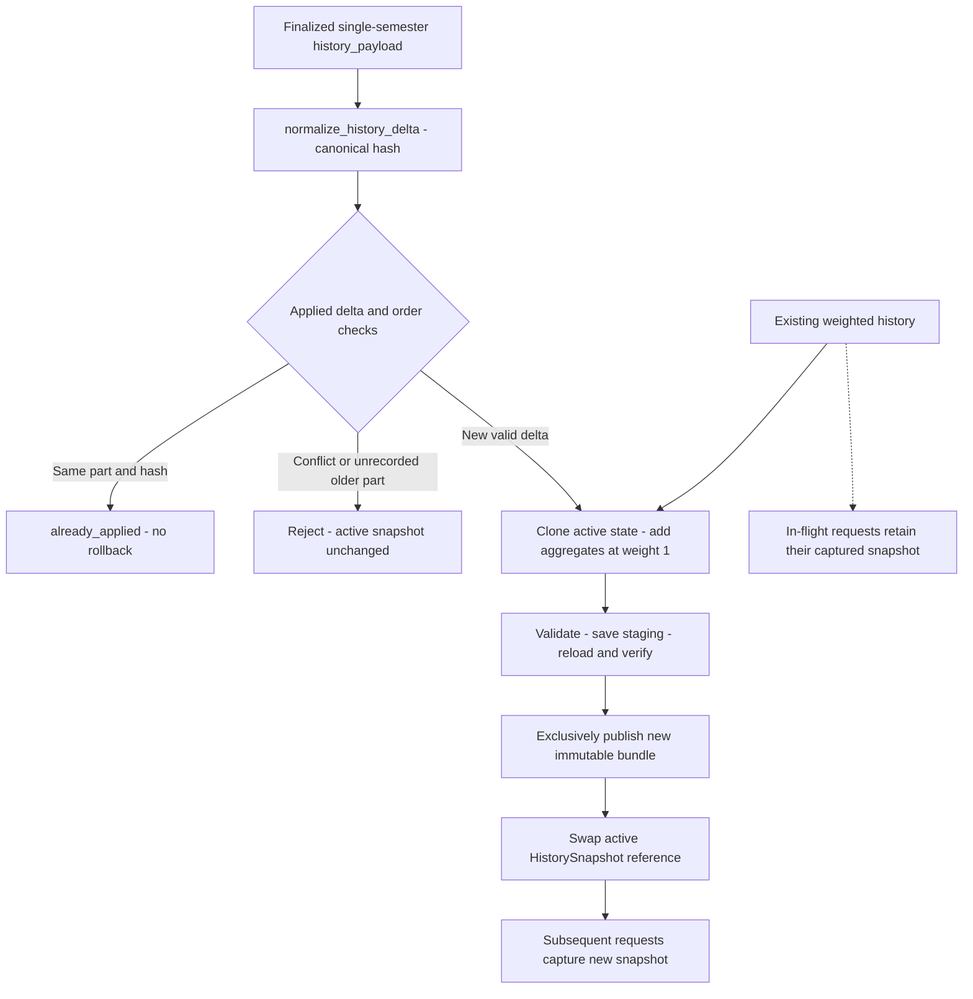

# `Phase 3 — History Delta, Immutable Save & Atomic Swap`

**الحالة:** `COMPLETE` — تنفيذ `2026-10-06`؛ شرح محدث بتاريخ `2026-10-08`.

## 1. الفكرة العامة — Overview

تضيف المرحلة مجاميع فصل نهائي واحد إلى نسخة من `Frozen History`، ثم تتحقق منها وتنشر حزمة جديدة قبل تبديل المرجع النشط. الهدف حفظ التاريخ القديم وأوزانه، ومنع إضافة الفصل مرتين أو خلط تاريخين في طلب واحد. المسار مستقل عن طلب التوصية؛ يفوض إليه المحرك الحالي عبر `update_history_from_payload()`.

## 2. قبل → بعد

| `Before` | `After` |
|---|---|
| حفظ وتحميل حزم تاريخ موجودان، دون إدارة `Delta` أو نسخة نشطة. | `FrozenHistoryManager` يدير التحميل والالتقاط والتحديث والنشر والتبديل. |
| تحديث `CourseHistoryState` القديم يستقبل صفوف نتائج خام. | `apply_history_delta()` يستهلك مجاميع نهائية ويضيفها بوزن `1` دون إعادة وزن الماضي. |
| لا سجل لتكرار دفعة التحديث. | بصمة `Delta` وسلسلة مصدر وسجل `applied_deltas` يميزون التكرار من التعارض. |

## 3. الملفات المنتجة أو المعدلة — Files

| الملف | النوع والدور |
|---|---|
| [history_update.py](../src/recommendation/history_update.py) | جديد في المرحلة: تطبيع المجاميع، تطبيقها، `HistorySnapshot` وإدارة النسخة النشطة. |
| [frozen_history.py](../src/features/frozen_history.py) | معدل: إضافة `save_frozen_history_atomic()` مع إعادة استخدام الحفظ والتحميل والتحقق السابقين. |
| [temporal_features.py](../src/features/temporal_features.py) | مكون مشترك موجود: `CourseHistoryState` ومفاتيح المستويات وميزات التاريخ السبع. |
| [recommendation/__init__.py](../src/recommendation/__init__.py) | تصدير واجهات إدارة التاريخ. |
| [test_history_update.py](../tests/test_history_update.py) | جديد: التكرار والتعارض والدقة وفشل النشر وثبات الطلب الجاري. |
| [two_stage_engine.py](../src/recommendation/two_stage_engine.py) | ربط لاحق في `Phase 5`: يفوض التحديث ويلتقط نسخة واحدة لكل طلب. |

حزم التشغيل تحت [data/artifacts/history_v2/](../data/artifacts/history_v2/). حزمتا `as_of_20243/` و`as_of_20251/` كانتا موجودتين قبل هذه المرحلة؛ وجودهما لا يثبت نشر `Delta` جديدة. اختبارات المرحلة كتبت حزمًا مؤقتة، ولم تعِد كتابة الحزم الفعلية.

## 4. أهم الدوال والكلاسات — Important Functions

| المكون | المسؤولية |
|---|---|
| `HistoryDelta` و`normalize_history_delta()` | التحقق من `history_payload={delta_part, finalized: true, aggregates: [...]}`، وتطبيع القيم وترتيب الصفوف وبصمتها. |
| `validate_history_state()` | فحص توافق الحالة والمجاميع وثبات إعدادات التاريخ المطلوبة. |
| `apply_history_delta()` | استنساخ الحالة وإضافة المجاميع عبر مفاتيح التاريخ الحالية؛ لا يرسل المجاميع إلى `CourseHistoryState.update()`. |
| `HistorySnapshot.apply()` | تطبيق ميزات التاريخ على صفوف الطلب من النسخة الملتقطة. |
| `HistorySnapshot.metadata_for_target()` | إعادة بيانات مصدر منفصلة مع عمر التاريخ وإشارة `history_is_stale`. |
| `FrozenHistoryManager.load()` | اختيار أحدث حزمة `V2` مكتملة وصحيحة من نوع التاريخ الأساسي، وتسجيل الحزم المتجاوزة في `skipped_bundles`؛ لا إعادة بناء ولا رجوع إلى `V1`. |
| `FrozenHistoryManager.capture()` | التقاط مرجع واحد تحت قفل قصير مع شرط `history_as_of_part < target_part`؛ يقبل تاريخًا أقدم. |
| `FrozenHistoryManager.update_history_from_payload()` | تسلسل التحديثات والتحقق من التكرار والترتيب، ثم النشر والتبديل. |
| `save_frozen_history_atomic()` | حفظ مرحلي، إعادة تحميل وفحص البصمات وتطابق الحالة، حجز نشر حصري، ثم نقل إلى حزمة جديدة دون استبدال الموجود. |

المجاميع تحمل مفاتيح التاريخ و`course_credits` الكاملة و`count/fail_count/retake_count/mark_sum/attempt_sum`. تُرفض القيم غير المحدودة والمجاميع غير المتسقة والتكرار أو تعارض المفاتيح. تستخدم الإضافة مستويات المفاتيح الخمسة مع المستوى العام السادس؛ تبقى `smoothing_k=20` و`min_support=20` وقاعدة القيم المفقودة كما هي.

## 5. مخطط سير البيانات — Data Flow



الفشل قبل نجاح النشر يبقي النسخة النشطة السابقة. بعد نشر حزمة صحيحة، يسجل فشل تنظيف الملفات المؤقتة في `cleanup_warnings` ولا يمنع التبديل إليها. القفل القصير لالتقاط المرجع لا يبقى ممسوكًا أثناء عمليات الملفات أو التوقع.

## 6. `Input → Processing → Output`

| المدخل | المعالجة | المخرج |
|---|---|---|
| حالة تاريخ موجودة + مجاميع فصل نهائي واحد | تطبيع وبصمة → تكرار/تعارض/ترتيب → نسخ وإضافة → تحقق وحفظ مرحلي وإعادة تحميل → نشر وتبديل | حالة جديدة وحزمة ثابتة و`status=applied` وبيانات المصدر. |
| فصل وبصمة موجودان في السجل | التعرف على التكرار دون تغيير الحالة | `status=already_applied`، حتى بعد فصل أحدث وإعادة التحميل. |
| فصل موجود ببصمة أخرى | رفض التعارض | خطأ `CONFLICT` دون تغيير النسخة النشطة. |

سلسلة المصدر تحفظ `previous_as_of_part/previous_history_sha256/delta_part/delta_sha256/new_history_sha256/created_at/feature_engineering_version` وسجل `applied_deltas`. الطلب العادي لا يحمل التاريخ الكامل ولا يشغل هذا التحديث تلقائيًا.

## 7. التحقق والاختبارات — Validation & Tests

المصدر: سجل `Phase 3` في [الخطة](../docs/architecture/RECOMMENDATION_TWO_STAGE_IMPLEMENTATION_PLAN.md)، و[test_history_update.py](../tests/test_history_update.py). هذه نتائج التنفيذ التاريخية، ولم تُشغّل مجددًا في مهمة التوثيق:

```text
Focused: 61 passed
Related: 352 passed, 6 subtests passed
Full: 866 passed, 1 failed, 6 subtests passed
Known baseline failure: capacity_63 / capaciy_63
New regression: 0; unrelated existing failure: 0; no skips recorded
```

| مجال الاختبار | الدليل المثبت ضمن الحالات المختبرة |
|---|---|
| المجاميع والأوزان | مقارنة بمرجع مستقل من نتائج مصطنعة، مع تاريخ قديم بوزن `0.25` وإضافة بوزن `1` وساعات كسرية وصفرية. |
| التكرار وإعادة التحميل | نفس البصمة لا تضيف الفصل مرتين ولا ترجع التاريخ إلى نسخة أقدم؛ البصمة المختلفة ترفض. |
| فشل الحفظ والتحقق والنشر | بقاء الحالة السابقة وعدم استبدال حزمة قائمة، حتى إن كانت غير مكتملة. |
| التزامن | الطلب الجاري يبقى على نسخته بينما تلتقط الطلبات اللاحقة النسخة المنشورة. |
| الزمن والتحميل | قبول تاريخ نهائي أقدم، ورفض التداخل مع الفصل المستهدف، وتجاوز الحزم التالفة مع توضيح السبب. |

سجل التنفيذ ثبات `877` ملفًا تحت `models/` و`data/` وقت المرحلة؛ هذه نتيجة تاريخية ولا تعني أن التحديثات التشغيلية المستقبلية لا تكتب حزمًا جديدة.

## 8. أهم ما أثبتته المرحلة

المسار المنفذ يحفظ المصدر القديم، ويمنع التكرار المسجل، ويربط الحالة المحملة ببصمتها وقطعها الزمني. اختبارات الربط في `Phase 5` تستخدم واجهة الالتقاط نفسها خلال مرحلتي التوصية.

## 9. حدود المسؤولية

لا توقعات أو ترتيب خطط داخل مدير التاريخ، ولا تدريب أو إعادة بناء تلقائي. `finalized=true` عقد وارد من المصدر؛ لا اتصال بخدمة خارجية لإثبات أن نتائج الفصل نهائية. واجهة التحديث عقد داخل العملية، وليست بروتوكول `HTTP` معتمدًا.

## 10. المشاكل والقيود المعروفة — Known Limitations

- إدارة المرجع النشط محلية لكل `FrozenHistoryManager`. الحارس يمنع استبدال حزمة بين الكتاب المتعاونين، لكنه لا يزامن الحالة النشطة بين عمليات أو خوادم مستقلة.
- لا استرداد تلقائي لقفل نشر متروك بعد توقف مفاجئ؛ الاختبارات المحلية لا تثبت تنسيقًا موزعًا أو جميع حالات تعطل النظام.
- التاريخ الأقدم مقبول مع بيانات توضح قدمه؛ القبول لا يثبت أن أحدث نتائج الطالب وصلت بالفعل.
- فشل `capacity_63/capaciy_63` وحدود التشغيل المفتوحة ما زالت ضمن [حالة المشروع](README.md). نجاح التحديث لا يزيل مشكلة `GradeScale` في مسار التوصية.

## 11. التسليم لبقية النظام — Handoff

يسلم المدير `HistorySnapshot` وقطعها وبصمتها وبيانات المصدر إلى [Phase 5](PHASE_05_TWO_STAGE_INTEGRATION_VALIDATION.md)، فتطبق ميزات التاريخ السبع قبل `Stage 1`. تعمل [Phase 4](PHASE_04_BALANCE_METRICS_STRATEGIES.md) على مقاييس الخطط بصورة مستقلة، ولا تستدعي تحديث التاريخ.
