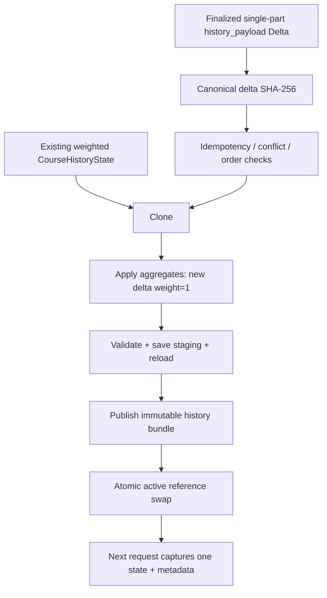

# `Phase 3 — History Delta والحفظ immutable والتحويل الذري`

**الحالة:** `NOT IMPLEMENTED YET`.

## 1. الفكرة العامة

ستضيف هذه المرحلة مجاميع فصل نهائي واحد إلى نسخة من `Frozen History` الموجودة، ثم تتحقق منها وتحفظها قبل تبديل المرجع النشط. الهدف إبقاء التاريخ القديم وأوزانه ثابتة ومنع إضافة الفصل مرتين. الموجود حاليًا أدوات تاريخ مجمد سابقة، وليس مسار `Delta` المطلوب.

## 2. قبل → بعد

```text
Before
  ↓
CourseHistoryState + immutable history_v2 bundles
  ↓
Phase 3: NOT IMPLEMENTED YET
  ↓
After المخطط: Clone → Apply Delta → Validate → Publish → Atomic swap
```

| `Before` الفعلي | `After` المخطط |
|---|---|
| حالات تاريخ محفوظة عند `20243` و`20251`. | إصدار جديد يضيف فصلًا نهائيًا واحدًا دون إعادة بناء القديم. |
| حفظ وتحميل لحزم تاريخ موجودان. | منع التكرار والتعارض وحفظ مرحلي وتبديل ذري للمرجع. |

## 3. الملفات المنتجة أو المعدلة

### ملفات جديدة

لا ملفات تنفيذ جديدة لهذه المرحلة. `src/recommendation/history_update.py` مكون **متوقع في الخطة وغير موجود**.

### ملفات معدلة

لا تعديل منسوب لهذه المرحلة. `src/features/temporal_features.py` و`src/features/frozen_history.py` مكونات سابقة ستستفيد المرحلة من عقودها؛ وجودها لا يثبت تنفيذ التحديث الجديد.

### `Artifacts` ناتجة

لا `History state` أو `Metadata` جديدة للمرحلة. حزمتا `data/artifacts/history_v2/as_of_20243/` و`as_of_20251/` موجودتان مسبقًا.

## 4. أهم الملفات بالتفصيل المختصر

| المكون الموجود سابقًا | الفكرة | يدخل إليه | يخرج منه |
|---|---|---|---|
| `src/features/temporal_features.py` | مفاتيح ومجاميع تاريخ المقررات. | صفوف نتائج أو صفوف تريد ميزات تاريخ. | `CourseHistoryState` وميزات التاريخ. |
| `src/features/frozen_history.py` | حفظ وتحميل تاريخ مجمد مع التحقق. | حالة وتاريخ قطع وبيانات وصفية. | حزمة ثابتة أو حالة محملة متحقق منها. |

| `Function / Class` الموجود | ماذا يفعل؟ |
|---|---|
| `build_history_keys()` | يبني مفاتيح مستويات التجميع الحالية للمقررات والفئات. |
| `CourseHistoryState` | يحتفظ بمجاميع التاريخ ويطبقها على صفوف الميزات. |
| `CourseHistoryState.update()` | يحدث الحالة من صفوف نتائج خام؛ ليس محول مجاميع `Delta`. |
| `CourseHistoryState.apply()` | يستخرج ميزات التاريخ من الحالة دون استخدام نتائج الفصل المستهدف. |
| `save_frozen_history()` | يحفظ حزمة جديدة دون استبدال حزمة موجودة. |
| `load_frozen_history()` | يحمل حزمة التاريخ المطلوبة ويتحقق من توافقها. |
| `validate_history_selection()` | يفحص سبق التاريخ للفصل المستهدف وسياسة السماح بتاريخ أقدم. |

`apply_history_delta()` مثال اسم مقترح في الخطة، **غير منفذ**؛ لا توجد توابع جديدة لهذه المرحلة يمكن توثيقها فعليًا.

## 5. مخطط سير البيانات

المخطط التالي مطلوب مستقبلًا؛ الأسهم لا تعني وجود مسار تشغيل:



1. يطبع فصل `Delta` وبصمته ويتحقق من التسلسل والتكرار.
2. يستنسخ الحالة دون تغيير التاريخ السابق.
3. يضيف المجاميع الجديدة دون إعادة تطبيق الوزن القديم.
4. يتحقق ويحفظ ويعيد التحميل قبل النشر.
5. يبدل المرجع، مع بقاء النسخة السابقة عند الفشل.
6. تلتقط التوصية مرجعًا واحدًا طوال مرحلتيها.

## 6. `Input → Processing → Output`

```text
INPUT المخطط: Existing CourseHistoryState + one finalized history_payload Delta
  ↓
PROCESSING المخطط: Clone → Apply aggregates → Validate → Staging → Reload → Swap
  ↓
OUTPUT المخطط: immutable bundle + provenance Metadata + active state reference

المخرج الفعلي لهذه Phase حاليًا: لا يوجد
```

## 7. كيف تم اختبار المرحلة؟

لا ملف اختبار مخصص لتحديث `Delta` موجود. الخطة تطلب:

| مجال الاختبار المخطط | ماذا يجب أن يثبت؟ |
|---|---|
| إضافة المجاميع | حفظ القديم الموزون وإضافة وزن `1` للفصل الجديد فقط. |
| التكرار والتعارض | نفس الفصل والبصمة يعيدان `already_applied`، والبصمة المختلفة تعطي `CONFLICT`. |
| الحفظ والتزامن | فشل الحفظ يبقي السابق، والطلب الجاري لا يخلط نسختي تاريخ. |
| سلامة الزمن | قبول تاريخ نهائي أقدم ومنع الحالي والمستقبلي. |

```text
Test result not recorded.
```

اختبارات التاريخ القديمة لا تثبت هذه المسؤوليات الجديدة.

## 8. أهم ما أثبتته المرحلة

- لم تثبت المرحلة نتائج تنفيذية لأنها لم تبدأ.
- حالة التاريخ وأدوات الحفظ السابقة موجودة لتبني عليها.
- وجود حزمة `20251` لا يثبت إضافة فصل بواسطة `Delta` أو تبديل مرجع نشط.

## 9. ما الذي لم تنفذه هذه `Phase`؟

```text
NOT DONE IN THIS PHASE
```

- جميع مسؤوليات `Delta` والتكرار والتعارض والنشر والتبديل الجديدة.
- توقعات أو ترتيب خطط أو `Balance`.
- إعادة تدريب أو تغيير الأوزان القديمة أو إعادة بناء التاريخ الكامل.
- طبقة نقل `HTTP/API`.

## 10. المشاكل أو القيود المعروفة

- لا مسار جديد لإدارة النسخة النشطة أو التقاطها عند بداية الطلب.
- يجب الحفاظ على `smoothing_k=20` و`min_support=20` ومفاتيح المستويات الستة وفق الخطة.
- السماح الافتراضي بالتاريخ الأقدم في المحرك الجديد لم ينفذ؛ المحرك المحلي الحالي يطلب `allow_older_history=True` للسماح به.
- أمثلة فصول الخطة ليست حزمًا منشورة فعلًا.

## 11. ماذا تستلم المرحلة التالية؟

```text
HANDOFF TO NEXT PHASE

المخرج المخطط، غير المتاح بعد
  ↓
state + history SHA-256 + as_of_part + Delta lineage
  ↓
البند 4 يضيف مقاييس الترتيب بصورة مستقلة
  ↓
البند 5 يلتقط التاريخ ويطبق ميزاته قبل توقع Stage 1
```
