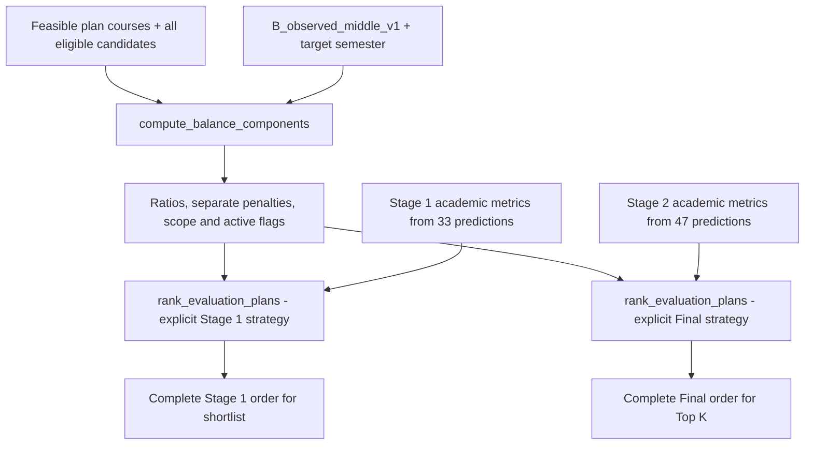

# `Phase 4 — Balance Metrics & Independent Ranking Strategies`

**الحالة:** `COMPLETE` — تنفيذ `2026-10-06`؛ شرح محدث بتاريخ `2026-10-08`.

## 1. الفكرة العامة — Overview

نفذت المرحلة `Balance` هدفًا فعليًا في ترتيب الخطط، بمكونات منفصلة ونطاق تطبيق واضح، دون تحويل النسب التاريخية إلى شروط أهلية أو حصص إلزامية. وفرت `balance_first v1` و`pareto v1` كمرشحين يمكن اختيارهما بصورة مستقلة لـ`Stage 1` و`Final`.

كان الاعتماد `UNAPPROVED` وقت تنفيذ المرحلة. الحالة الحالية بعد [Phase 7](PHASE_07_MANIFEST_POLICIES_REVALIDATION.md) هي اعتماد `pareto v1` لكل مرحلة واعتماد توليفتهما؛ `balance_first` يبقى متاحًا للتقييم دون اعتماد ضمن `Manifest` الحالي.

## 2. قبل → بعد

| `Before` | `After` |
|---|---|
| نسب وصفية في تقارير إعادة الراسب والمنسحب. | سياسة `B_observed_middle_v1` بحساب كسري دقيق ومكونات وأسباب تعطيل صريحة. |
| `rank_plans()` المحلي يرتب أكاديميًا. | ترتيب مستقل في `ranking.py` يشمل `Balance`؛ المسار المحلي السابق باقٍ للتوافق. |
| هوية وترتيب يحتاجان ثباتًا عبر تبديل المدخلات. | هوية قانونية للخطة وترتيب كامل ثابت، يشمل المواد ذات الساعات الصفرية. |

## 3. الملفات المنتجة أو المستخدمة — Files

| الملف | الدور |
|---|---|
| [balance_policy.py](../src/recommendation/balance_policy.py) | جديد: حدود السياسة ونطاقها وحساب المكونات دون `I/O` أو تغيير الأهلية. |
| [ranking.py](../src/recommendation/ranking.py) | جديد: هوية الخطة، هوية الاستراتيجية، المرجع الأكاديمي ومرشحا الترتيب. |
| [test_balance_policy.py](../tests/test_balance_policy.py) | جديد: النطاق والكسور والتعطيل وأهلية المرشحين والصفر. |
| [test_ranking_strategies.py](../tests/test_ranking_strategies.py) | جديد: الاستقلال والأثر والترتيب الكامل ومرجع `Pareto` والتعادل. |
| [plan_scoring.py](../src/recommendation/plan_scoring.py) | مشترك: `project_cumulative_gpa()` والملخص الأكاديمي؛ `rank_plans()` القديم ليس سياسة تفعيل المرحلتين. |
| [policy_candidates.json](../reports/repeat_withdrawal_analysis/policy_candidates.json) | دليل وصفي سابق يفسر أصل النطاقات؛ لا يقرأه ترتيب التشغيل. |

لا مودلات أو بيانات أو `Manifest` اعتماد جديدة في هذه المرحلة. ثبتت `Phase 7` لاحقًا السياسة نفسها داخل سجل الاعتماد.

## 4. أهم الدوال والكلاسات — Important Functions

| المكون | المسؤولية |
|---|---|
| `BalancePolicy` و`B_OBSERVED_MIDDLE_V1` | تعريف النسخة والحدود كـ`Fraction` ونطاق الفصل والحمل. |
| `compute_balance_components()` | حساب الساعات والنسب والعقوبات وأعلام التفعيل لكل خطة نسبة إلى جميع المرشحين المؤهلين. |
| `PlanIdentity` و`canonical_plan_identity()` | تطبيع معرفات المواد وترتيبها وبصمة `JSON` ثابتة؛ اختيار مادة صفرية يبقى جزءًا من هوية الخطة. |
| `RankingStrategy` | اختيار ثابت للمرحلة والاسم والإصدار؛ لا يمنح اعتمادًا ذاتيًا. |
| `rank_academic_reference()` | مرجع تشخيصي كامل للترتيب؛ ليس بديل تشغيل قابلًا للاختيار عند غياب الموافقة. |
| `_pareto_levels()` | حساب جبهات عدم الهيمنة باستخدام التراكمي المتوقع وساعات الفشل وكل عقوبة مفعلة. |
| `rank_evaluation_plans()` | ترتيب كامل حسب الاستراتيجية الصريحة؛ تستخدمه النواة المعتمدة أيضًا، بينما يمنح المحرك هوية الاعتماد. |

### سياسة التوازن الحالية

| المكون | النسبة من كامل ساعات الخطة | النطاق المرغوب |
|---|---|---|
| `failed` | ساعات `FAILED_RETAKE` | `[1/6, 4/17]` |
| `withdrawn` | ساعات `WITHDRAWN_RETAKE` | `[0, 3/17]` |
| `total_previous` | ساعات `FAILED_RETAKE + WITHDRAWN_RETAKE` فقط | `[1/6, 2/7]` |

العقوبة هي المسافة إلى النطاق: `max(lower − ratio, 0, ratio − upper)`. يعمل النطاق في الفصلين `1/2` وحمل `12–18`، مع عدم اختيار أي `OTHER_PREVIOUS` حتى لو كانت ساعاتها صفرًا. يتفعل كل مكون فقط عند وجود مرشحين مؤهلين ذوي ساعات موجبة في مجموعته؛ توافر `failed` أو `withdrawn` يفعل `total_previous`. المكون المعطل يعيد `None` وأسبابًا، ولا يعامل كعقوبة مثالية صفرية.

### كيف يكتمل الترتيب؟

- `balance_first`: عقوبة `Failed` ثم `Total Previous` ثم `Withdrawn`، للمكونات المفعلة فقط، ثم المقاييس الأكاديمية وهوية الخطة.
- `pareto`: رقم جبهة عدم الهيمنة أولًا، ثم ترتيب كسر التعادل الكامل نفسه. لا أوزان مخفية ولا مجموع واحد للعقوبات.
- الخطط خارج النطاق تحتفظ بمواقعها في الترتيب الأكاديمي؛ تعاد موازنة الخطط داخل النطاق في المواقع المتبقية فقط. عند غياب المكونات المفعلة يبقى المرجع الأكاديمي.
- المرجع الأكاديمي لـ`Stage 1` يقدم `expected_quality_points` ثم الفشل والهوية؛ مرجع `Final` يقدم `projected_cumulative_gpa` ثم الفشل ثم معدل الخطة والهوية. `Pareto` نفسها تستخدم التراكمي المتوقع في المرحلتين.

## 5. مخطط سير البيانات — Data Flow



المساران يستخدمان السياسة نفسها دون اشتراط اسم استراتيجية واحد. في الربط الحالي تُحمل مقاييس `Balance` وهوية الخطة من المختصر إلى المرحلة النهائية؛ تستبدل التوقعات الأكاديمية بتوقعات `47` وحدها.

## 6. `Input → Processing → Output`

`Feasible plans + official groups + eligible set + semester + stage-specific academic metrics`
→ حساب الكسور والنطاق والمكونات → ترتيب الاستراتيجية المختارة
→ ترتيب كامل و`plan_id/course_tuple` ومكونات قابلة للفحص، و`pareto_front` عند استخدام `pareto`.

لا تولد هذه الدوال خططًا ولا تقصها إلى `50` ولا تشغل مودلات؛ ينفذ `shortlist.py` والمحرك هاتين المسؤوليتين.

## 7. التحقق والاختبارات — Validation & Tests

بحسب سجل `Phase 4` في [الخطة](../docs/architecture/RECOMMENDATION_TWO_STAGE_IMPLEMENTATION_PLAN.md):

```text
Focused: 97 passed
Related: 445 passed, 6 subtests passed
Full: 963 passed, 1 failed, 6 subtests passed
Known baseline failure: capacity_63 / capaciy_63
New regression: 0; unrelated existing failure: 0; no skips recorded
```

تغطي الاختبارات أثر التوازن مع اختلاف المعدل والفشل، والحدود الكسرية الدقيقة، والصفر، وتعطيل كل مكون، والنطاق المختلط، والهوية، والتعادل وجبهات `Pareto` والترتيب الكامل مقابل مرجع مستقل. أعيدت المركزة وقت مراجعة التنفيذ ونجحت `97`، مع `240` حالة مصطنعة إضافية في المراجعة المسجلة؛ ليست تشغيلًا جديدًا هنا.

## 8. أهم ما أثبتته المرحلة

التوازن قادر على تغيير الاختيار حين تختلف المقاييس الأكاديمية، وليس كاسر تعادل فقط. الاستراتيجيتان مستقلتان، والترتيب حتمي ضمن المدخلات والنسخة المثبتتين، والمكونات المعطلة لا تحصل على أفضلية مصطنعة. سجلت المرحلة ثبات `877` أصلًا تحت `models/` و`data/`.

## 9. حدود المسؤولية

وفرت هذه المرحلة الخوارزميات المرشحة؛ الربط حدث في `Phase 5`، والقياس المصحح في `Phase 6`، والاعتماد البشري في `Phase 7`. `RankingStrategy.metadata()` تظل تعيد هوية تقييم غير معتمدة؛ المحرك المفعّل وحده ينسب اعتماد `Manifest` إلى الاختيارات المتحقق منها.

## 10. المشاكل والقيود المعروفة — Known Limitations

- النسب التاريخية وصفية، وليست قواعد أهلية أو دليلًا على تحسين النتائج الفعلية للطلاب.
- تنفيذ `Pareto` الحالي يقارن الأزواج بكلفة تربيعية في عدد الخطط الداخلة إليه. يعمل ترتيب `Stage 1` على جميع الخطط الممكنة قبل القص؛ حد `50` لا يحد هذه الكلفة.
- الجبهات تعتمد مجموعة الخطط التي يجري ترتيبها؛ ترتيب المختصر لا يضمن ترتيبًا عالميًا مطابقًا.
- اختيار `pareto → pareto` اعتماد سياسة محدد، ولا يعتمد حدود المواد أو الزمن أو الذاكرة. مشكلة `GradeScale` والفشل المعروف ما زالا موثقين في [README](README.md).

## 11. التسليم لبقية النظام — Handoff

تستخدم [Phase 5](PHASE_05_TWO_STAGE_INTEGRATION_VALIDATION.md) `compute_balance_components()` و`canonical_plan_identity()` و`rank_evaluation_plans()` لاختصار خطط `Stage 1` وترتيب `Final`. تقارن [Phase 6](PHASE_06_BENCHMARK_STRATEGY_APPROVAL.md) المرشحين بصورة مستقلة، وتثبت [Phase 7](PHASE_07_MANIFEST_POLICIES_REVALIDATION.md) القرار دون تغيير خوارزميتهما.
