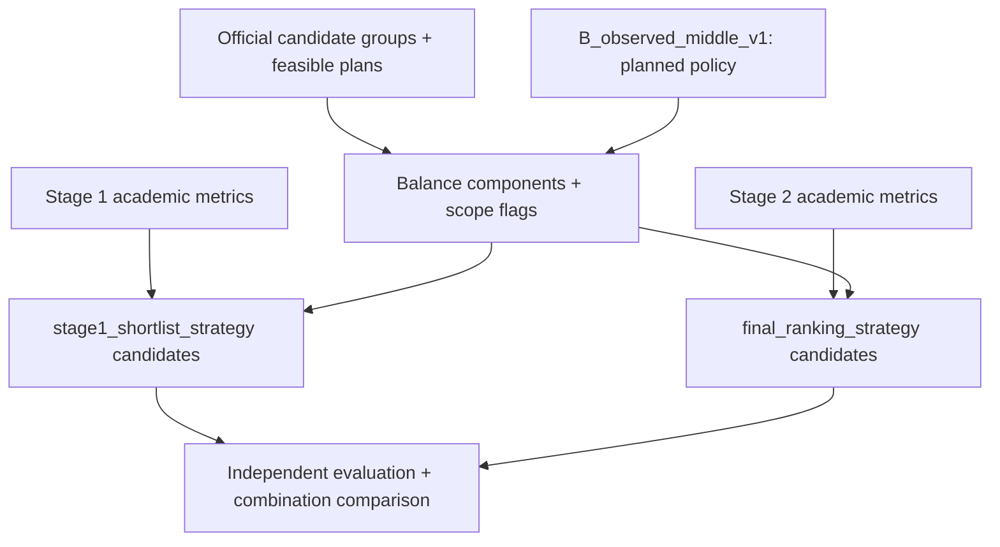

# `Phase 4 — تنفيذ مقاييس Balance وواجهة الاستراتيجيات ومرشحي التقييم المستقل لكل مرحلة.`

**الحالة:** `NOT IMPLEMENTED YET`.

## 1. الفكرة العامة

ستجعل هذه المرحلة `Balance` هدفًا فعليًا يمكنه تغيير الترتيب رغم اختلاف التوقع الأكاديمي. ستعرض مكوناته منفصلة وتوفر مرشحين مستقلين للاختصار والترتيب النهائي. الموجود الآن تقارير تشخيصية واقتراح سياسة، وليس ترتيبًا إنتاجيًا معتمدًا.

## 2. قبل → بعد

```text
Before
  ↓
تقارير تراكيب تاريخية + ترتيب أكاديمي محلي
  ↓
Phase 4: NOT IMPLEMENTED YET
  ↓
After المخطط: Balance metrics + separate strategy candidates
```

| `Before` الفعلي | `After` المخطط |
|---|---|
| `policy_candidates.json` يقترح حدودًا وصفية. | مكونات توازن قابلة للفحص مع نطاق تفعيل واضح. |
| `rank_plans()` يرتب أكاديميًا. | `stage1_shortlist_strategy` و`final_ranking_strategy` مستقلتان. |

## 3. الملفات المنتجة أو المعدلة

### ملفات جديدة

لا ملفات منفذة لهذه المرحلة. `src/recommendation/balance_policy.py` **متوقع في الخطة وغير موجود**. الخطة لا تحدد اسم ملف نهائي مستقل لواجهة الاستراتيجيات.

### ملفات معدلة

لا تغييرات منسوبة لها. `src/recommendation/plan_scoring.py` موجود مسبقًا ولم يتحول إلى ترتيب `Balance`.

### `Artifacts` ناتجة

لا تقرير تقييم أو `Manifest` اعتماد جديد. `reports/repeat_withdrawal_analysis/policy_candidates.json` والتقارير المجمعة سابقة لهذه المرحلة، ولا تعد أصولًا لتشغيل الترتيب.

## 4. أهم الملفات بالتفصيل المختصر

| المرجع الموجود | الفكرة | يدخل إليه | يخرج منه |
|---|---|---|---|
| `reports/repeat_withdrawal_analysis/policy_candidates.json` | نطاقات وصفية لمرشحي السياسات. | ملخصات التحليل التاريخي السابق. | اقتراح بداية `B_observed_middle` دون اعتماد. |
| `src/recommendation/plan_scoring.py` | تلخيص الخطط وترتيبها أكاديميًا في المحرك الموجود. | توقعات مواد الخطط وبيانات المعدل السابق. | ملخصات وخطط مرتبة. |

| `Function / Class` الموجود | ماذا يفعل؟ |
|---|---|
| `rank_plans()` | يرتب حسب التراكمي المتوقع ثم ساعات الفشل ثم معدل الخطة ثم معرفها. |
| `summarize_scored_plans()` | يجمع توقعات المواد إلى مقاييس لكل خطة. |

هذه توابع سابقة وليست إضافات المرحلة. لا توابع تنفيذية جديدة لمقاييس `Balance` أو مرشحي الترتيب؛ لا نختلق أسماء لها.

## 5. مخطط سير البيانات

المسار مخطط وغير منفذ:



1. تحسب مكونات التوازن من فئات المواد والخطة الممكنة.
2. توضح أعلام نطاق التطبيق دون عقوبة رفض.
3. تقارن مرشحي `Stage 1` بصورة مستقلة.
4. تقارن مرشحي الترتيب النهائي بصورة مستقلة.
5. تحفظ أدلة المفاضلات والتوليفات دون اعتماد تلقائي.

## 6. `Input → Processing → Output`

```text
INPUT المخطط: feasible plans + official groups + academic metrics + policy
  ↓
PROCESSING المخطط: separate Balance components → independent strategy evaluation
  ↓
OUTPUT المخطط: component metrics + candidate rankings + strategy identities/versions

المخرج الفعلي لهذه Phase حاليًا: لا يوجد
```

## 7. كيف تم اختبار المرحلة؟

لا اختبارات مرحلة منفذة. المطلوب في الخطة:

| مجال الاختبار المخطط | ماذا يجب أن يثبت؟ |
|---|---|
| أثر التوازن | تغير الترتيب مع اختلاف المعدل أو خطر الفشل، لا عند التعادل فقط. |
| المكونات والنطاق | صحة القيم والأعلام، دون وزن مخفي أو أفضلية مصطنعة للمكون المعطل. |
| الاستقلال | إمكان استخدام استراتيجيتين مختلفتين دون اشتراط تطابقهما. |
| الثبات والمرجع | ترتيب كلي ثابت ومقارنة الاختصار بمرجع مستقل على حالات صغيرة. |

```text
Test result not recorded.
```

## 8. أهم ما أثبتته المرحلة

- لم تثبت أثر `Balance` داخل محرك المرحلتين بعد.
- يوجد مرجع تاريخي وصفي سابق؛ لا يثبت أفضل مفاضلة أكاديمية.
- ما زالت الاستراتيجيتان وتوليفتهما غير معتمدتين في `Manifest` الحالي.

## 9. ما الذي لم تنفذه هذه `Phase`؟

```text
NOT DONE IN THIS PHASE
```

- المقاييس وواجهة الاستراتيجيات ومرشحو الترتيب أنفسهم.
- اعتماد أوزان أو ترتيب إنتاجي.
- دمج المحرك أو توقعات إضافية أو `Benchmark`.
- تحويل النسب التاريخية إلى قواعد أهلية أو حدود رفض.

## 10. المشاكل أو القيود المعروفة

- `Production Ranking Strategy: UNAPPROVED`؛ اعتماد التنفيذ لا يجيز اختيار استراتيجية تلقائيًا.
- التقارير السابقة لا تحتوي بدائل المرشحين المؤهلة وتوقعات كل الخطط والسياسات التاريخية الكاملة.
- `Pareto` وحدها لا تحدد `Top 50/Top K`؛ يلزم اختيار كامل وكلفة مقاسة قبل أي اعتماد.
- الترتيب الأكاديمي السابق مرجع مقارنة تشخيصي للخطة الجديدة، وليس بديل تفعيل يختزل `Balance` إلى كسر تعادل.

## 11. ماذا تستلم المرحلة التالية؟

```text
HANDOFF TO NEXT PHASE

المخرج المخطط، غير المتاح بعد
  ↓
Balance component metrics + Stage 1 candidates + Final candidates
  ↓
البند 5 يربط الاستراتيجيات ويختبر توليفاتها وتأثير Shortlist
```
