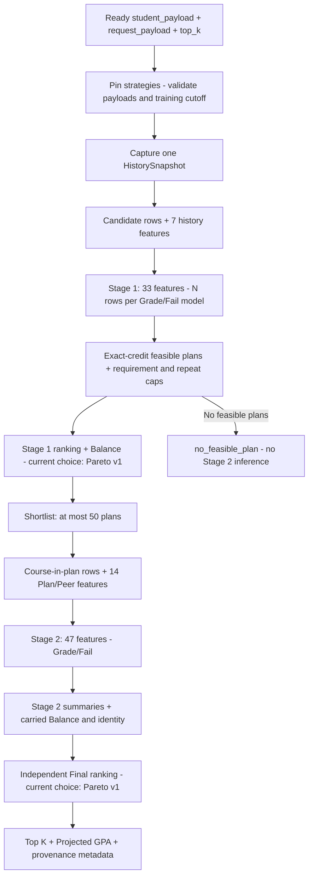

# `Phase 5 — Two-Stage Integration, Parity & Oracles`

**الحالة:** `COMPLETE` — تنفيذ `2026-10-07`؛ شرح محدث بتاريخ `2026-10-08`.

## 1. الفكرة العامة — Overview

ربطت المرحلة المكونات في محرك يستقبل مدخلات جاهزة، ويستخدم `33` ميزة لكل مرشح، ثم يختصر جميع الخطط الممكنة إلى `≤50` قبل تشغيل `47` ميزة لكل ظهور مادة داخل خطة. تعاد النتائج من توقعات المرحلة الثانية وحدها، مع مصدر التاريخ والأصول والمدخلات والسياسات.

كان المحرك متاحًا للتقييم فقط عند اكتمال هذه المرحلة. [Phase 7](PHASE_07_MANIFEST_POLICIES_REVALIDATION.md) فعلت `TwoStagePlanRecommender.load()` وفق اعتماد `pareto v1 → pareto v1`؛ لا تزال القيود التشغيلية مفتوحة.

## 2. قبل → بعد

| `Before` | `After` |
|---|---|
| مكونات الأصول والمدخلات والتاريخ والترتيب منفصلة؛ محرك محلي سابق يستخدم `47`. | `TwoStagePlanRecommender` يربطها في طلب واحد بحد واضح لتشغيل المرحلة الثانية. |
| لا اختصار مبني على توقعات `33` في هذا المسار. | توقع كل مرشح مرة لكل مودل ثم تجميع توقعاته عبر الخطط الممكنة دون استدعاءات إضافية. |
| ميزات `Plan/Peer` متاحة في المسار المحلي. | تستخدم بعد الاختصار فقط، مع اختبارات توافق على الخطط نفسها. |
| تقريب سياق `Decimal` قد يؤثر في ساعات دقيقة جدًا. | جمع وتحجيم بوحدات صحيحة يحفظان جميع الأرقام أثناء البحث والقيود. |

## 3. الملفات المنتجة أو المعدلة — Files

| الملف | الدور |
|---|---|
| [two_stage_engine.py](../src/recommendation/two_stage_engine.py) | جديد: التحميل والتقاط التاريخ وتجميع الصفوف وتوقع المرحلتين والمخرج؛ توسع تفعيله في `Phase 7`. |
| [shortlist.py](../src/recommendation/shortlist.py) | جديد: توليد الخطط المقيدة وتجميع توقعات `Stage 1` وترتيبها وقصها إلى `50`. |
| [plan_scoring.py](../src/recommendation/plan_scoring.py) | معدل: `score_course_rows()` مشترك للـ`33/47`، مع تلخيص الخطط والإسقاط الموجودين. |
| [plan_generation.py](../src/recommendation/plan_generation.py) و[constraints.py](../src/recommendation/constraints.py) | تصحيح دقة الساعات دون استبدال خوارزمية البحث أو تغيير القيود. |
| [engine.py](../src/recommendation/engine.py) و[recommendation/__init__.py](../src/recommendation/__init__.py) | استخدام مساعد التوقع المشترك في المحرك المحلي وتصدير المحرك الجديد مع الحفاظ على التوافق. |
| [evaluate_two_stage_ranking.py](../scripts/evaluate_two_stage_ranking.py) | أداة مقارنة تاريخية بتوقعات مصطنعة وتحليل سياسة على تراكيب مجمعة؛ ليست مسار تشغيل. |
| [comparison.md](../reports/two_stage_phase5/comparison.md) و[comparison.json](../reports/two_stage_phase5/comparison.json) | أدلة المرحلة التاريخية ومصدرها وحدودها. |
| [test_two_stage_engine.py](../tests/test_two_stage_engine.py)، [test_two_stage_shortlist.py](../tests/test_two_stage_shortlist.py)، [test_two_stage_evaluation.py](../tests/test_two_stage_evaluation.py) | الربط والاختصار والتوافق والمرجع والتقارير؛ تجهيزات مشتركة في [two_stage_fixtures.py](../tests/two_stage_fixtures.py). |

لا مودلات جديدة أو إعادة تدريب. تعتمد النواة أصول `Phase 1` وتاريخ `Phase 3`، ولا تستورد أدوات التقييم لتقديم توصية.

## 4. أهم الدوال والكلاسات — Important Functions

| المكون | المسؤولية الحالية |
|---|---|
| `TwoStagePlanRecommender.load()` | تحميل الأصول والسياسة المعتمدة والتاريخ مرة واحدة؛ سلوك التفعيل الحالي أضيف في `Phase 7`. |
| `load_for_evaluation()` | تحميل الأصول والتاريخ مع اختيارين صريحين مستقلين؛ يبقى المخرج `evaluation_only / UNAPPROVED`. |
| `recommend_from_payloads()` | تثبيت الاستراتيجيتين، تطبيع المدخلات، فحص القطع، التقاط التاريخ، تشغيل المسار وإرجاع النتيجة. |
| `_prepare_candidates()` | دمج `snapshot` مع المرشحين وتطبيق ميزات التاريخ السبع من نسخة واحدة. |
| `build_stage1_shortlist()` و`ShortlistResult` | تجميع مقاييس كل خطة ممكنة مع `Balance` وهوية ثابتة، ثم إعادة الترتيب الكامل والمختصر وخريطة فهارس المواد. |
| `build_plan_rows()` | تحويل خطط المختصر وحدها إلى صفوف `course-in-plan` مع ربط هوياتها الثابتة. |
| `_score_stage2()` و`compute_plan_context_features()` | إضافة ميزات السياق الأربع عشرة داخل كل `plan_id` ثم تشغيل مودلي `47`. |
| `score_course_rows()` | مصفوفة مرتبة → مودلا العلامة والفشل → رفض الشكل غير الصحيح وغير المحدود → قص العلامة إلى `0..100` والفشل إلى `0..1` → نقاط وتصنيف `GradeScale`. |
| `summarize_scored_plans()` و`project_cumulative_gpa()` | جمع مقاييس توقعات `Stage 2` وحساب التراكمي المتوقع وفق مقام الساعات الجاهز. |
| `update_history_from_payload()` | تفويض مستقل إلى المدير؛ لا يستدعيه طلب التوصية العادي. |

المقاييس النهائية لا تخلط توقعات `33` و`47`. تنقل النواة من المختصر هوية الخطة ومكونات `Balance` فقط؛ تعيد تجميع المعدل والفشل من `Stage 2`.

## 5. مخطط سير البيانات — Data Flow



التحديث المستقل للتاريخ موضح في [Phase 3](PHASE_03_HISTORY_DELTA_SAVE_ATOMIC_SWAP.md) و[المسار العام](TWO_STAGE_DATA_FLOW.md)؛ لا يدخل ضمن هذا الطلب.

## 6. `Input → Processing → Output`

| العنصر | العقد |
|---|---|
| المدخل | `student_payload={snapshot,candidates}` و`request_payload`؛ `top_k` عدد صحيح من `1` إلى `50`، افتراضيه `3`. |
| المعالجة | `33` مرة لكل مرشح لكل مودل → كل الخطط الممكنة → اختيار `≤50` → `14` ميزة سياق → `47` → ترتيب نهائي. |
| المخرج | `status=ok` أو `no_feasible_plan`، و`metadata` و`recommendations` مع المواد والمقاييس والترتيب. |

تحفظ `metadata` بصمة المدخل المطبع، وبصمات المودلات والفئات ومقياس العلامات، وتاريخ التدريب ونسخة الميزات، وقطع التاريخ وبصمته وعمره، وهويتي الاستراتيجيتين، وأعداد المرشحين والخطط الممكنة والمختصرة والصفوف المقيمة. تضيف `Phase 7` هوية الاعتماد وبصمة السياسة وعقود التشغيل.

`Projected GPA = (current_gpa × current_gpa_credits + expected_quality_points) / (current_gpa_credits + plan_total_credits)`.

يأتي `current_gpa_credits` إلزاميًا من `snapshot`. هذه إضافة متوقعة دون استبدال العلامة القديمة؛ تسجل `projected_gpa_requires_repeat_policy` الحاجة إلى سياسة الإعادة. `GradeScale` يحول العلامة المتوقعة إلى نقاط؛ هذه ليست نتيجة الطالب الفعلية.

## 7. التحقق والاختبارات — Validation & Tests

نتائج التنفيذ التاريخية من [سجل Phase 5](../docs/architecture/RECOMMENDATION_TWO_STAGE_IMPLEMENTATION_PLAN.md)، دون إعادة تشغيل في هذه المهمة:

```text
Focused: 91 passed
Related: 529 passed, 6 subtests passed
Full: 1054 passed, 1 failed, 6 subtests passed
Known baseline failure: capacity_63 / capaciy_63
New regression: 0; unrelated existing failure: 0; no skips recorded
```

| التحقق | ما ثبت |
|---|---|
| عدد التوقعات | `Stage 1` تستقبل جميع المرشحين المؤهلين مرة لكل مودل، و`Stage 2` لا تتجاوز `50` خطة. |
| `Parity` الفعلية | على `3` خطط مصطنعة و`12` صفًا، تطابقت المصفوفة وميزات السياق والتوقعات والنقاط والملخصات مع المسار المحلي باستخدام المودلات الرسمية نفسها. |
| `Oracle` والتوليفات | مقارنة جميع المجموعات الصغيرة بمرجع مستقل، مع اختيارين مستقلين والتوليفات الأربع والحالات الكسرية والصفرية وغياب الحل. |
| دقة الساعات | رفض تقريب هدف `12.00000000000000000000000000001` إلى `12`، وحماية حدود الفئات والراسب والمنسحب؛ سجلت مراجعة التنفيذ `300` مجموع و`40` مرجع قيود إضافيًا تحت `precision=2`. |
| التاريخ والمصدر | ثبات النسخة خلال الطلب، وثبات بصمة المدخلات عند التبديل المكافئ، وعدم تسرب توقعات الأولى إلى النتيجة النهائية. |

## 8. أهم ما أثبتته المرحلة وحدود تقاريرها

أثبت الربط التوافق للحالات المختبرة، وسجل بقاء `877` ملفًا تحت `models/` و`data/` دون تغيير. تقرير المقارنة التاريخي استخدم `10` مواد و`176` خطة بتوقعات **مصطنعة**: تقاطع مختصري `balance_first/pareto` مع المرجع الأكاديمي كان `0/50` و`13/50`؛ احتفاظهما بـ`Top 3` كان `3/3` و`1/3` في تلك الحالة. هذه الأرقام لا تمثل مقارنة الجودة المصححة بالمودلات الفعلية في `Phase 6`.

تحليل السياسة استعمل `3507` تركيبات مجمعة/`95150` حالة وصفية، منها `686` تركيبًا/`49907` حالة ضمن الحمل والنطاق المدروس. ليست هذه عينة المرجع التاريخي `23535`، ولا تحدد بدائل مؤهلة أو توقعات أو سياسات كاملة لكل طالب. لم تُمحَ النتائج؛ استُبعدت من استنتاجات الجودة الأحدث.

## 9. حدود مسؤولية المرحلة الأصلية

وقت `Phase 5` كانت `load()` ترفض التفعيل، بينما `load_for_evaluation()` تعمل. هذا سجل تاريخي تجاوزه اعتماد `Phase 7`. القياس والاعتماد اللاحقان لم يغيرا عدد الميزات أو حد `Stage 2`، ولم يضيفا `HTTP/Backend`.

## 10. المشاكل والقيود المعروفة — Known Limitations

- `global_top_k_guaranteed=false`: النتيجة مرتبة داخل المختصر. قد تُستبعد خطط عالمية أفضل، وقد تتغير جبهات `Pareto` عند تغيير مجموعة المقارنة.
- البحث يستكشف الخطط الممكنة قبل الاختصار؛ لا عقد معتمد لعدد المواد أو زمن الطلب أو الذاكرة.
- إصدار علامات غير مدعوم قد يمر إلى `GradeScale.convert()` ويعيد نقاطًا صفرية دون رفض؛ صحة البصمات أو نجاح `Parity` لا يكشفان وحدهما هذه الفجوة.
- فشل `capacity_63/capaciy_63` ومشكلة استعادة بايتات `Stage 2` من `Git` قائمان.
- الأدلة المصطنعة لا تثبت جودة على طلاب حقيقيين أو صحة سياسة استبدال علامات الإعادة.

## 11. التسليم لبقية النظام — Handoff

سلمت المرحلة محركًا متكاملًا وأدلة توافق ومرجع إلى [Phase 6](PHASE_06_BENCHMARK_STRATEGY_APPROVAL.md) لتقييم الكلفة والمفاضلات. يعتمد المسار الحالي سياسة [Phase 7](PHASE_07_MANIFEST_POLICIES_REVALIDATION.md)، ويعيد بيانات قابلة للتتبع إلى مستدعي `Core`. الحالة العامة تبقى [READY_FOR_STABILIZATION_REVIEW](README.md).
