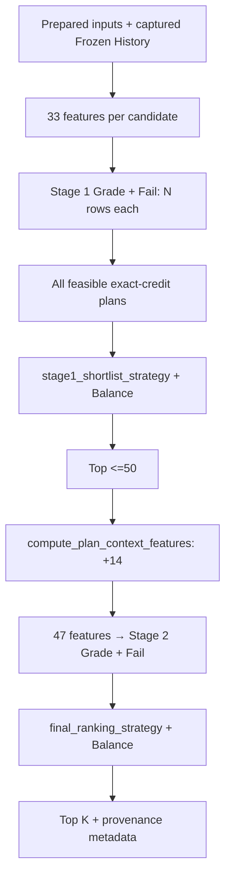

# `Phase 5 — ربط المرحلتين واختبارات Parity وOracle وتوليفات الاستراتيجيات والتقرير التاريخي والسياساتي.`

**الحالة:** `NOT IMPLEMENTED YET`.

## 1. الفكرة العامة

ستربط هذه المرحلة المكونات في مسار واحد: توقع المواد بميزات `33`، وتوليد الخطط الممكنة، واختصارها إلى `≤50`، ثم إضافة سياق الخطة وتقييمها بميزات `47`. الموجود الآن محرك محلي يستخدم `47` ومكونات تجهيز جديدة؛ لا يوجد محرك `Two-Stage` متكامل.

## 2. قبل → بعد

```text
Before
  ↓
AcademicPlanRecommender يقيّم الخطط محليًا بـ47
  ↓
Phase 5: NOT IMPLEMENTED YET
  ↓
After المخطط: Stage 1 → feasible plans → ≤50 → Stage 2 → final Top K
```

| `Before` الفعلي | `After` المخطط |
|---|---|
| لا اختصار مبني على مودلات `33` داخل المحرك الرسمي الحالي. | توقع لكل مرشح ثم اختصار مستقل. |
| سياق الخطة وتوقعات `47` موجودان في المسار المحلي. | تشغيلهما على `Shortlist` وحدها مع اختبار التطابق. |

## 3. الملفات المنتجة أو المعدلة

### ملفات جديدة

`src/recommendation/two_stage_engine.py` و`src/recommendation/shortlist.py` **متوقعان في الخطة وغير موجودين**. لا ملفات اختبار أو تقرير ربط جديد للمرحلة.

### ملفات معدلة

لا تغييرات منسوبة لهذه المرحلة. `engine.py` و`plan_generation.py` و`plan_scoring.py` مكونات سابقة؛ إضافات `constraints.py` تخص البند الثاني.

### `Artifacts` ناتجة

لا نتائج `Two-Stage` أو تقرير توافق/مرجع أو تقرير توليفات جديد.

## 4. أهم الملفات بالتفصيل المختصر

| الملف السابق | الفكرة | يدخل إليه | يخرج منه |
|---|---|---|---|
| `src/recommendation/engine.py` | المحرك المحلي الحالي، مرجع المقارنة. | `Snapshot` ومرشحون وتاريخ ومودلا `47`. | ملخصات خطط وتفاصيل أفضلها. |
| `src/features/temporal_features.py` | تطبيق التاريخ وحساب سياق الخطة. | صفوف مرشحين أو صفوف خطط. | `7` ميزات تاريخ و`14` ميزة سياق. |
| `src/recommendation/plan_generation.py` | توليد التركيبات بالساعات الدقيقة. | مرشحون وهدف ساعات. | فهارس خطط وصفوف خطط. |

| `Function / Class` الموجود | ماذا يفعل؟ |
|---|---|
| `AcademicPlanRecommender` | يدير التوصية المحلية الحالية بمودلي `47`. |
| `AcademicPlanRecommender.prepare_candidates()` | يجمع بيانات الطالب والمرشحين ويطبق التاريخ المجمد. |
| `AcademicPlanRecommender.score_rows()` | يحسب سياق الخطة ويجهز `47` ويتوقع العلامة والفشل. |
| `compute_plan_context_features()` | يحسب ميزات `Plan/Peer` الأربع عشرة داخل كل خطة. |
| `enumerate_plan_indices()` | يولد التركيبات المطابقة للهدف الدقيق دون رجوع لساعات أقل. |
| `build_plan_rows()` | يحول فهارس الخطط إلى صفوف مواد مع معرفات خطط. |

واجهات `TwoStagePlanRecommender.load()` و`update_history_from_payload()` و`recommend_from_payloads()` واردة في الخطة **فقط**؛ لا توجد أصناف أو توابع منفذة بهذه الأسماء حاليًا.

## 5. مخطط سير البيانات

كل هذا الربط ما زال مخططًا:



1. يلتقط المدخلات والتاريخ مرة واحدة.
2. يتوقع لكل المرشحين دون ميزات خطة في `Stage 1`.
3. يولد الخطط الممكنة وفق القيود.
4. يرتب ويختصر إلى `≤50`.
5. يحسب السياق ويشغل `Stage 2` على المختصر فقط.
6. يرتب نهائيًا ويرجع `Top K` وأدلة النتيجة.

## 6. `Input → Processing → Output`

```text
INPUT المخطط: PreparedRecommendationInputs + TwoStageArtifacts + captured history
  ↓
PROCESSING المخطط: 33 inference → feasible plans → ≤50 → +14 → 47 inference → ranking
  ↓
OUTPUT المخطط: Top K + model/history/input/strategy provenance

المخرج الفعلي لهذه Phase حاليًا: لا يوجد
```

## 7. كيف تم اختبار المرحلة؟

لا اختبارات ربط منفذة. المطلوب:

| مجال الاختبار المخطط | ماذا يجب أن يثبت؟ |
|---|---|
| توقع الأولى | دخول `N` صفًا لكل مودل وعدم بناء سياق خطة أو حذف مرشح بسبب قيد خطة. |
| التطابق | تطابق ميزات وتوقعات وتلخيص `Stage 2` مع المسار السابق للخطط نفسها. |
| المرجع المستقل | صحة الخطط والاختصار على مسائل صغيرة كاملة. |
| التوليفات والاختصار | استقلال الاستراتيجيتين وقياس فقد خطط أفضل عند تجاوز `50`. |
| التاريخ والسياسات | سلامة التقاط النسخة وحدود أدلة التركيبات التاريخية المصطنعة. |

```text
Test result not recorded.
```

## 8. أهم ما أثبتته المرحلة

- لم يثبت الربط أو تطابق `Stage 2` داخل المحرك الجديد بعد.
- يوجد مسار محلي فعلي يصلح مرجعًا للخطط نفسها.
- مكونات الأولى والثانية لا تساوي اكتمال المسار كله.

## 9. ما الذي لم تنفذه هذه `Phase`؟

```text
NOT DONE IN THIS PHASE
```

- المحرك الجديد والاختصار والربط والتقارير المقارنة.
- ضمان أفضل `Top K` عالمي خارج المختصر.
- اعتماد إنتاجي للاستراتيجيات أو `Benchmark` الجديد.
- `HTTP/FastAPI/PHP/Deployment`.

## 10. المشاكل أو القيود المعروفة

- `two_stage_engine.py` و`shortlist.py` غير موجودين.
- `Top K` المخطط هو الأفضل داخل `Shortlist` فقط؛ `Guaranteed Global Top-K` غير مطلوب ولا مثبت.
- التوقع التراكمي إضافة متوقعة وفق الخطة، وليس قياس نتائج فعلية للطلاب.
- يجب أن يرفض التفعيل الإنتاجي غياب اعتماد الاستراتيجيتين وتوليفتهما؛ هذه البوابة داخل المحرك لم تنفذ بعد.

## 11. ماذا تستلم المرحلة التالية؟

```text
HANDOFF TO NEXT PHASE

المخرج المخطط، غير المتاح بعد
  ↓
integrated two-stage core + parity/oracle/strategy-combination evidence
  ↓
البند 6 يقيس الكلفة ويعرض المفاضلات للاعتماد المستقل
```
