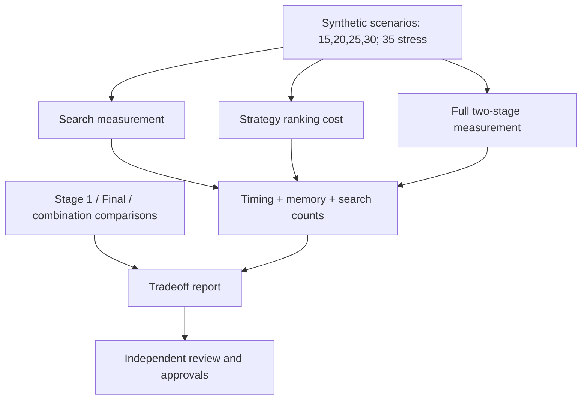

# `Phase 6 — تنفيذ Benchmark وعرض نتائج المرحلتين والمفاضلات لاعتماد الاستراتيجيات بصورة مستقلة.`

**الحالة:** `NOT IMPLEMENTED YET`.

## 1. الفكرة العامة

ستقيس هذه المرحلة كلفة البحث والترتيب والمسار الكامل على حالات مصطنعة متنوعة، ثم تعرض مفاضلات كل استراتيجية وتوليفات المرحلتين للاعتماد. يوجد `Benchmark` محلي أقدم يعتمد كتالوجًا وبيانات المشروع؛ لا يحقق برنامج القياس الجديد ولا يثبت أداء `Two-Stage`.

## 2. قبل → بعد

```text
Before
  ↓
Local benchmark لمحرك AcademicPlanRecommender
  ↓
Phase 6: NOT IMPLEMENTED YET
  ↓
After المخطط: Synthetic two-stage measurements + independent approval evidence
```

| `Before` الفعلي | `After` المخطط |
|---|---|
| أداة قديمة بأحجام `15/20/25` وقراءة ملفات محلية. | حالات مصطنعة سهلة وصعبة بأحجام `15/20/25/30` و`35` للضغط فقط. |
| قياس المسار المحلي السابق. | فصل قياس البحث عن الترتيب وعن المسار الكامل للمرحلتين. |

## 3. الملفات المنتجة أو المعدلة

### ملفات جديدة

لا أداة أو تقرير جديد لهذه المرحلة. الخطة لا تثبت أسماء ملفات نهائية لبرنامج القياس وتقرير المقارنة.

### ملفات معدلة

لا تعديل منسوب لها. `src/recommendation/benchmark.py` أداة سابقة، وليس تنفيذًا للبند السادس.

### `Artifacts` ناتجة

لا `Report` أداء أو مفاضلات أو اعتماد مستقل جديد. النتائج السابقة، إن وجدت، لا تنسب لهذا المسار غير الموجود.

## 4. أهم الملفات بالتفصيل المختصر

### `src/recommendation/benchmark.py` — موجود مسبقًا

**الفكرة:** قياس محلي لمحرك `AcademicPlanRecommender` مع قراءة كتالوج وصفوف المشروع.

**يدخل إليه:** الحجم والمخرج والخيوط وقطع التاريخ وملفات `V2` المحلية.

**يخرج منه:** ملفات مدخلات ونتائج محلية و`benchmark.json` عند تشغيل الأداة السابقة؛ لم تُشغّل هنا.

| `Function / Class` الموجود | ماذا يفعل؟ |
|---|---|
| `peak_memory_mib()` | يقرأ ذروة ذاكرة العملية حسب منصة التشغيل. |
| `benchmark()` | يجهز حالة من الكتالوج ويشغل المحرك المحلي ويسجل قياسه. |
| `main()` | يقرأ معاملات التشغيل ويشغل الأحجام المحلية المحددة. |

لا توابع جديدة لمقارنة استراتيجيات `Two-Stage` أو لاعتمادها يمكن توثيقها فعليًا.

## 5. مخطط سير البيانات

المسار مخطط وغير منفذ:



1. يبني حالات مصطنعة متنوعة، منها الكسور والصفر والتعادل وغياب الحل.
2. يقيس البحث والترتيب والمسار الكامل منفصلين.
3. يسجل الوقت والذاكرة وأعداد البحث والخطط والاختصار.
4. يعرض جودة الاختصار وتغير `Top K` والمقاييس الأكاديمية ومكونات التوازن.
5. يعرض كل استراتيجية وتوليفتهما للمراجعة دون اختيار تلقائي.

## 6. `Input → Processing → Output`

```text
INPUT المخطط: synthetic scenarios + integrated core + candidate strategies
  ↓
PROCESSING المخطط: separate timing/memory → independent comparisons → review
  ↓
OUTPUT المخطط: Benchmark report + tradeoff evidence + explicit approval decisions

المخرج الفعلي لهذه Phase حاليًا: لا يوجد
```

المقاييس المطلوبة: `candidate_count` و`visited_search_states` و`feasible_plan_count` و`elapsed_time` و`peak_memory` و`shortlist_count`.

## 7. كيف تم اختبار المرحلة؟

لا تشغيل `Benchmark` جديد أو نتيجة اختبارات مخصصة مسجلة.

| مجال التحقق المخطط | ماذا يجب أن يثبت؟ |
|---|---|
| تنوع الحالات | القياس لا يعتمد حالة واحدة أو قائمة تاريخية غير مثبتة الأهلية. |
| فصل الكلفة | معرفة مساهمة البحث والترتيب والمسار الكامل في الزمن. |
| المفاضلات | تقييم الاختصار والنهائي مستقلين ثم مقارنة توليفاتهما. |
| قرار البحث | اقتراح إبقاء البحث أو تحسين منفصل بناء على قياس فعلي. |

```text
Test result not recorded.
Benchmark result not recorded for the planned two-stage path.
```

## 8. أهم ما أثبتته المرحلة

- لم تثبت أداء أو مفاضلات أو اختيارًا إنتاجيًا بعد.
- الأداة السابقة تقيس مسارًا مختلفًا عن البرنامج المطلوب.
- لا دليل حالي يسمح بتثبيت حد مرشحين أو زمن أو ذاكرة إنتاجي.

## 9. ما الذي لم تنفذه هذه `Phase`؟

```text
NOT DONE IN THIS PHASE
```

- برنامج القياس الجديد وتقرير المقارنة والاعتماد.
- تعديل خوارزمية البحث أو فرض `max_candidates`.
- تعيين `SLA` أو حد ذاكرة افتراضي.
- تدريب أو توصية على طلاب حقيقيين أو نشر خدمة.

## 10. المشاكل أو القيود المعروفة

```text
backend_max_candidate_count = UNRESOLVED
recommendation_latency_sla = UNRESOLVED
memory_budget_per_request = UNRESOLVED
production_ranking_strategy = UNAPPROVED
```

تصنيفات الوقت في الخطة تشخيصية فقط: أقل من ثانية، `1–3`، `3–5`، وأكثر من `5` ثوانٍ؛ ليست بوابة نجاح إنتاجية أو نتيجة مقاسة الآن.

## 11. ماذا تستلم المرحلة التالية؟

```text
HANDOFF TO NEXT PHASE

المخرج المخطط، غير المتاح بعد
  ↓
Benchmark + independent strategy/combination approval records
  ↓
البند 7 يثبت فقط السياسات والإصدارات والمعاملات المعتمدة في Manifest
```
