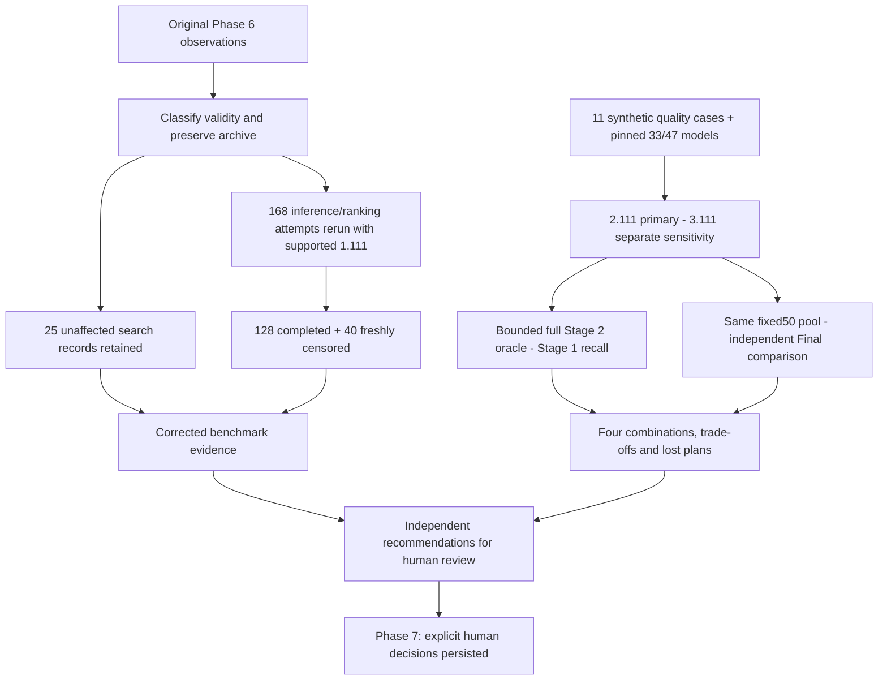

# `Phase 6 — Corrected Benchmark & Independent Strategy Evidence`

**الحالة:** `COMPLETE` — الأدلة المصححة بتاريخ `2026-10-07`؛ شرح محدث بتاريخ `2026-10-08`. هذه صفحة نتائج مسجلة، وليست تشغيل `Benchmark` جديدًا.

## 1. الفكرة العامة — Overview

قاست المرحلة كلفة البحث والترتيب والمسار الكامل، وفصلت تقييم جودة اختصار `Stage 1` عن مفاضلات `Final`، ثم قارنت التوليفات الأربع. مرجعها الحالي هو [التقرير المصحح](../reports/two_stage_phase6/corrected/RESULT.md). انتهت المرحلة بتوصيات `RECOMMENDED`؛ حصل الاعتماد البشري لاحقًا في `Phase 7`، ولم يُعد كتابة التقرير ليبدو معتمدًا في تاريخ أقدم.

## 2. قبل → بعد

| `Before` | `After` |
|---|---|
| أداة قياس محلية قديمة وتقرير `Phase 5` بتوقعات مصطنعة. | قياسات منفصلة وحالات `Synthetic` ومقارنة بالمودلات المثبتة ومرجع كامل محدود خارج التشغيل. |
| القياس الأول استعمل `grade_version_id=1` غير المدعومة، فأعادت العلامات نقاطًا صفرية. | إبطال كل الملاحظات المتأثرة وإعادة القياس بعينة تحويل صالحة، وتقييم جودة مستقل بإصدار معروف للمودلات. |
| لا دليل كافٍ للاختيار بين الاستراتيجيات. | استدعاء مستقل لكل استراتيجية وتوليفة، مع خسائر الاختصار ومفاضلات التوازن والأداء موثقة. |

## 3. الملفات المنتجة أو المستخدمة — Files

| الملف أو المجموعة | الدور |
|---|---|
| [benchmark_two_stage.py](../scripts/benchmark_two_stage.py) | حالات مصطنعة وقياس البحث و`Stage 1` و`Final` والمسار الكامل في عمال منفصلين، مع مهلات وتسجيل الموارد. |
| [rerun_corrected_phase6.py](../scripts/rerun_corrected_phase6.py) | تصنيف الأدلة القديمة وأرشفتها، وإعادة الملاحظات المتأثرة والتحقق من مصدر الاستئناف وتجميع التقرير المصحح. |
| [evaluate_corrected_phase6.py](../scripts/evaluate_corrected_phase6.py) | تقييم جودة الاختصار بالمودلات الفعلية ومرجع `Stage 2` كامل محدود ومقارنة `Final` على مجموعة ثابتة. |
| [test_two_stage_benchmark.py](../tests/test_two_stage_benchmark.py) | عقود القياس والحالات والمهلات والمخرجات. |
| [test_corrected_phase6_rerun.py](../tests/test_corrected_phase6_rerun.py) و[test_corrected_phase6_evaluation.py](../tests/test_corrected_phase6_evaluation.py) | صلاحية الاستبدال ومصدر القياس والاستئناف ومرجع الجودة وفحوص الثبات. |
| [corrected/benchmark.json](../reports/two_stage_phase6/corrected/benchmark.json) و[benchmark.md](../reports/two_stage_phase6/corrected/benchmark.md) | القياسات المصححة مع فصل البحث المحتفظ به. |
| [corrected_ranking_evaluation.json](../reports/two_stage_phase6/corrected/corrected_ranking_evaluation.json) | الجودة الأساسية بإصدار `2.111`. |
| [grade_version_3_sensitivity.json](../reports/two_stage_phase6/corrected/grade_version_3_sensitivity.json) | حساسية منفصلة بإصدار `3.111`. |
| [review_metrics.json](../reports/two_stage_phase6/corrected/review_metrics.json) و[verification.json](../reports/two_stage_phase6/corrected/verification.json) | مقاييس المراجعة والتحقق النهائي. |
| [measurement_source/](../reports/two_stage_phase6/corrected/measurement_source/) و[old_invalidated/README.md](../reports/two_stage_phase6/corrected/old_invalidated/README.md) | مصدر الجولة المقاسة وأرشيف الأدلة المبطلة؛ يحفظان السجل دون مزج نتائجه. |

`src/recommendation/benchmark.py` أداة محلية أقدم لمسار `AcademicPlanRecommender`، وليست أداة هذه المرحلة. لا تعتمد النواة وقت التشغيل على هذه السكربتات أو التقارير، ولم تُنشر مودلات جديدة.

## 4. أهم الدوال — Important Functions

| المكون | المسؤولية |
|---|---|
| `synthetic_case()` و`synthetic_history_manager()` | مدخلات وتاريخ اصطناعيان لقياس لا يستهلك سجلات طلاب حقيقيين. |
| `supported_synthetic_grade_version()` | اختيار إصدار تدعمه حزم نجاح `GradeScale` لعينة القياس؛ لا يضيف فحصًا إلى طلبات الإنتاج. |
| `measure_case()` و`run_worker()` | قياس المسار المحدد في عملية مستقلة بمهلة، مع فصل إعداد الحالة عن وقت العملية المقاس. |
| `censored_result()` | تسجيل تجاوز المهلة دون اختلاق زمن مكتمل أو ذاكرة أو عدد خطط مكتمل. |
| `classify_old_evidence()` و`assemble_corrected_results()` | فصل البحث غير المتأثر عن النتائج الواجب استبدالها، ورفض مزج قياسات غير متطابقة. |
| `run_corrected_benchmarks()` | إدارة الإعادة وحماية بصمات الأصول والمصدر والخيوط وسياق الاستئناف. |
| `evaluate_fixture()` و`recall_evidence()` | مرجع كامل محدود لكل حالة وقياس احتفاظ المختصر بـ`Top K` حسب هويات الخطط. |
| `compare_fixed_final()` | مقارنة المرشحين النهائيين على معرفات `Top50` أكاديمية واحدة وتوقعات `Stage 2` نفسها. |
| `summarize_evidence()` | جمع المقاييس مع فصل الحالات داخل النطاق والحالات السهلة أو التي لا حل لها. |

## 5. مخطط سير البيانات — Data Flow



فرع الجودة تقييم `Offline` محدود؛ تشغيل `Stage 2` على كل خطط هذه العينات لا يغير حد التشغيل `≤50`.

## 6. `Input → Processing → Output`

حالات مصطنعة + أصول مثبتة + اختياران مستقلان → قياس منفصل + مرجع محدود + مقارنة مجموعة نهائية ثابتة → تقارير وقت وذاكرة وعدد حالات بحث وخطط، واحتفاظ `Top K`، وتوزيعات المقاييس، وخسائر ومفاضلات وتوصيات.

تستخدم عينة القياس المصححة `1.111`: الإصدار مدعوم في `GradeScale` لكنه `__UNKNOWN__` لدى فئات المودلين. تستخدم الجودة `2.111` والحساسية `3.111`، وهما مدعومان ومعروفان لدى المرحلتين؛ لا تدمج نتائج هذه العينات بوصفها حملًا واحدًا.

## 7. التحقق والاختبارات — Validation & Tests

| الدليل | النتيجة المثبتة |
|---|---|
| القديم المتأثر | `168` ملاحظة استدلال/ترتيب أُبطلت، بما فيها أوقاتها وذاكرتها والـ`40` التي تجاوزت المهلة؛ ليست أرقامًا صالحة للحالة الحالية. |
| الإعادة المصححة | `168` محاولة جديدة: `128 completed, 40 freshly censored, 0 errors`. |
| البحث المحتفظ به | `25` ملاحظة لا تحمل مودلات أو `GradeScale`؛ بقيت بتاريخها ومصدرها الأصليين. |
| التقرير المجمع | `193` سجلًا: `153` مكتملًا و`40` متجاوزًا للمهلة، وليس `193` قياسًا جديدًا. |
| الجودة لكل إصدار | `11` حالة، `1750` خطة ممكنة و`8210` صف `Stage 2` قبل فحوص التبديل الإضافية. أكبر حالة `441` خطة؛ الحد التشخيصي `1000`. |
| الثبات | نجحت فحوص تبديل المرشحين وترتيب المختصر ومقاييس `Stage 2` وترتيبي `Final` في الإصدارين. |

الاختبارات النهائية المسجلة في [الخطة](../docs/architecture/RECOMMENDATION_TWO_STAGE_IMPLEMENTATION_PLAN.md) و[التقرير المصحح](../reports/two_stage_phase6/corrected/RESULT.md):

```text
Focused: 65 passed
Related: 583 passed
Full: 1119 passed, 1 failed, 6 subtests passed
Known baseline failure: capacity_63 / capaciy_63
New regression: 0; unrelated existing failure: 0; no skips recorded
```

لا إعادة قياس أو اختبارات جديدة في تحديث هذه الوثائق. تقرير `Phase 5` ذو التوقعات المصطنعة محفوظ تاريخيًا ومستبعد من استنتاجات الجودة المصححة.

## 8. أهم ما أثبتته المرحلة

### جودة الاختصار والنهائي

في تسع حالات تحتوي أكثر من `50` خطة، مقارنة المختصر بمرجع `Final Pareto` الكامل:

| اختيار `Stage 1` | احتفاظ `Top 3` | احتفاظ `Top 10` |
|---|---:|---:|
| `balance_first v1` | `25/27` | `66/90` |
| `pareto v1` | `26/27` | `85/90` |

عند اختيار مرجع `Final Balance-first` تصبح النتائج `27/27, 90/90` لـ`balance_first` و`25/27, 86/90` لـ`pareto`. هذه أهداف مختلفة، ولا تصح مقارنة نسبها كأنها معيار جودة واحد.

على مجموعة `Final` ثابتة في سبع حالات داخل نطاق التوازن، حققت `Pareto` مقابل `Balance-first` فرق تراكمي متوقع `+0.00003968` وساعات فشل `−0.01628759` عند `Top 3`، و`+0.00161218` و`−0.05354007` عند `Top 10`. كانت عقوبات التوازن الثلاثة أسوأ مع `Pareto`؛ لا تفوق شامل عبر جميع الأهداف.

أوصى التقرير بـ`pareto → pareto` للاحتفاظ الأوسع بخيارات `Top 10` ومفاضلات المعدل والفشل، مع بديل `balance_first → balance_first` إذا اختيرت أولوية التوازن الصارمة. التوليفة الموصى بها فقدت خطة من `Global Top 3` وثلاثًا من `Top 10` في `retake_strong`، وخمس مراتب `Top 10` عبر الحالات التسع إجمالًا. تغير مجموعة الخطط قد يغير جبهات `Pareto`؛ يقيس التقرير الاحتفاظ والنتائج المعادة منفصلين.

### الكلفة المسجلة

| الحالة | القياس |
|---|---|
| `15` مرشحًا كثيفًا، قياس تكميلي لترتيب `Stage 1` | `1.869s` للتوازن مقابل `7.987s` لـ`Pareto`. |
| المسار الكامل لنفس الحالة | `8.438–18.879s` عبر التوليفات؛ `Pareto/Pareto=18.366s`. |
| `30` مرشحًا مع الكسور والصفر | `4.461–7.420s` للمسار الكامل. |
| أعلى ذروة عملية مكتملة في القياس المصحح | `181.73 MiB`. |
| البحث المحتفظ به: `25/30/35` مرشحًا، هدف `18` | `6.677/25.535/68.661s`؛ `35` اختبار ضغط. |

البيئة المسجلة: `Windows / Python 3.11.5 / pandas 3.0.5` وخيط مودل واحد، وعينة واحدة لكل ملاحظة. مهلة العامل تشمل الإعداد وليست `SLA`؛ الأوقات المكتملة أوقات العمليات المقاسة، وذروة العملية تشمل الإعداد والاستيراد والذاكرة الأصلية. لا تُنسب قياسات مكتملة للملاحظات المتجاوزة للمهلة.

## 9. حدود مسؤولية المرحلة

أنتجت أدلة وتوصيات ولم تمنح موافقة أو تستبدل خوارزمية البحث أو تفرض حدًا جديدًا. نسخ مصدر الجولة المقاسة محفوظة؛ أضيفت لاحقًا حماية استئناف ترفض نقطة تحقق قديمة تفتقر إلى سياق البصمات الجديد بدل خلط جولتين.

## 10. المشاكل والقيود المعروفة — Known Limitations

- إصلاح إصدار عينة `Benchmark` لا يضيف رفضًا للإصدار غير المدعوم في `GradeScale.convert()` أو مدخلات المحرك؛ العيب التشغيلي باقٍ.
- `backend_max_candidate_count / recommendation_latency_sla / memory_budget_per_request = UNRESOLVED`. المهل والفئات التشخيصية لا تعتمد أداء البحث الحالي.
- الأدلة تستخدم معرفات وتاريخًا مصطنعين؛ لا تثبت جودة توصيات لطلاب حقيقيين أو `Global Top-K`.
- الفشل المعروف ونقل أصول `Stage 2` عبر `Git` باقيان ضمن [القيود العامة](README.md). اعتماد `Phase 7` لا يمحو هذه القيود.

## 11. التسليم لبقية النظام — Handoff

سلمت المرحلة أدلة مصححة وتوصية مستقلة لكل استراتيجية وتوليفة للمراجعة البشرية. ثبتت [Phase 7](PHASE_07_MANIFEST_POLICIES_REVALIDATION.md) قرار `2026-10-08` وبصمات الأدلة في `Manifest`. تبقى الأدلة التاريخية `RECOMMENDED/UNAPPROVED` في وقتها، بينما الحالة الحالية للسياسات الثلاث `APPROVED` ضمن `Core` فقط.
