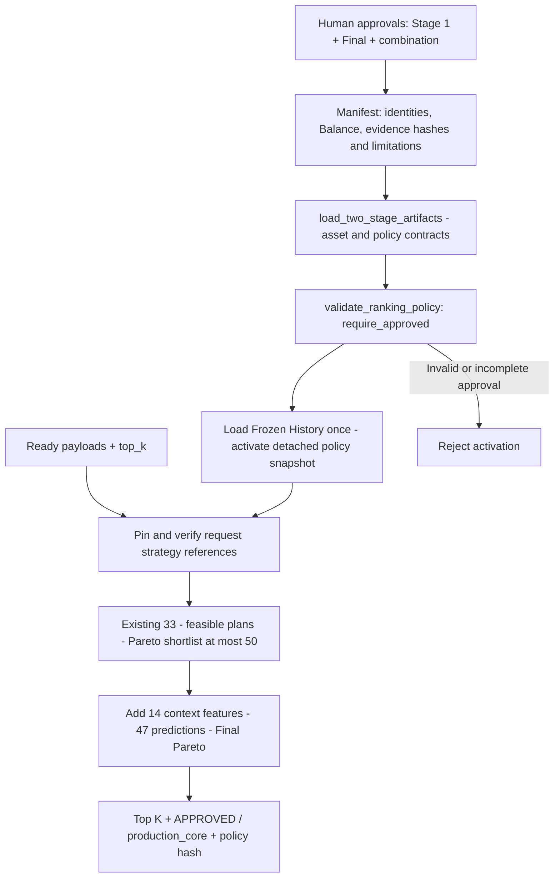

# `Phase 7 — Approved Manifest Policies & Revalidation`

**الحالة:** `COMPLETE` — تنفيذ واعتماد بشري بتاريخ `2026-10-08`. الحالة العامة **`READY_FOR_STABILIZATION_REVIEW`**.

القرار الحالي: `Stage 1 = pareto v1`، و`Final = pareto v1`، والتوليفة `pareto v1 → pareto v1`. المصدر هو [Manifest](../models/shortlist_v2/manifest.json) وسجل `Phase 7` في [الخطة](../docs/architecture/RECOMMENDATION_TWO_STAGE_IMPLEMENTATION_PLAN.md)، ودليل التحقق في [تقرير المرحلة](../reports/two_stage_phase7/RESULT.md). يبقى تقرير `Phase 6` المصحح سجل الأدلة السابق للاعتماد؛ لم يتحول `RECOMMENDED` فيه إلى موافقة تاريخية.

## 1. الفكرة العامة — Overview

حولت المرحلة القرارات البشرية الثلاثة إلى عقد سياسة قابل للتحقق والتتبع داخل `Manifest`. أصبح `load()` يختار السياسات المعتمدة ويحمل الأصول والتاريخ مرة واحدة. يثبت كل طلب مراجع الاستراتيجيتين التي تحققت منها النواة، فلا يصف مخرج معتمد ترتيبًا مختلفًا تبدل أثناء التنفيذ.

اعتماد السياسة لا يغير خوارزمية `Pareto` أو عدد الميزات أو البحث، ولا يمثل اعتماد استقرار النواة أو الأداء الخدمي.

## 2. قبل → بعد

| `Before` | `After` |
|---|---|
| الاعتمادات الثلاثة `UNAPPROVED`، و`load()` ترفض التفعيل دائمًا. | اعتمادات مستقلة `APPROVED` وسجل سياسة كامل؛ `load()` تفعّل الاختيارين المطابقين له. |
| الاختيار الصريح متاح للتقييم فقط. | مسار معتمد من `Manifest` مع بقاء مسار التقييم غير معتمد. |
| بيانات مصدر التقييم لا تكفي لوصف قرار بشري. | `production_core` وهوية السياسة وبصمتها ومصدر اعتمادها وحدوده في `metadata`. |
| إمكان إعادة قراءة حقول استراتيجية متغيرة أثناء الطلب. | تثبيت المراجع التي تم التحقق منها طوال الطلب، ورفض تغيير غير مطابق في الطلب اللاحق قبل التوقع. |

## 3. الملفات الجديدة والمعدلة — Files

| الملف | الدور |
|---|---|
| [models/shortlist_v2/manifest.json](../models/shortlist_v2/manifest.json) | معدل في المرحلة: الاعتمادات الثلاثة وهويات الاستراتيجيات ونسخها والتوليفة و`Balance` والأدلة والحدود. |
| [ranking_policy.py](../src/recommendation/ranking_policy.py) | جديد: عقد تحقق مشترك لا يقرأ التقارير أو التدريب أو التجارب. |
| [two_stage_artifacts.py](../src/recommendation/two_stage_artifacts.py) | معدل: إدراج فحص السياسة مع استمرار فحوص الأصول والعقود السابقة. |
| [two_stage_engine.py](../src/recommendation/two_stage_engine.py) | معدل: التفعيل من `Manifest` وتثبيت الاختيارات وبيانات الاعتماد. |
| [test_two_stage_activation.py](../tests/test_two_stage_activation.py) | جديد: حالات الرفض والتفعيل والتوافق وثبات المصدر والاختيارات. |
| [human_approval.json](../reports/two_stage_phase7/human_approval.json)، [verification.json](../reports/two_stage_phase7/verification.json)، [production_activation.json](../reports/two_stage_phase7/production_activation.json) | سجلات القرار والتحقق والتفعيل الفعلي بالتحميل فقط. |
| [protection.json](../reports/two_stage_phase7/protection.json) و[full.xml](../reports/two_stage_phase7/full.xml) | سلامة الملفات ونتائج الاختبارات النهائية؛ بقية أدلة المرحلة في [مجلد التقارير](../reports/two_stage_phase7/). |

يبقى `manifest_version=1` لعقد الأصول، و`ranking_policy.schema_version=1` عقدًا مستقلًا. تغير اعتماد `Manifest` في تنفيذ `Phase 7` سابقًا؛ مهمة التوثيق الحالية لا تغيره.

## 4. أهم الدوال والكلاسات — Important Functions

| المكون | المسؤولية |
|---|---|
| `balance_policy_contract()` | تمثيل حدود `Balance` الدقيقة ونطاقها كما ينفذه الكود، دون قراءة التقارير. |
| `validate_ranking_policy()` | قبول `Manifest` القديم غير المفعّل للتقييم، أو التحقق الكامل من الاعتمادات والأسماء والإصدارات والتوليفة والنطاق والمصدر؛ `require_approved=True` يمنع التفعيل غير المعتمد. |
| `validate_artifact_manifest()` | دمج السياسة مع استمرار عقود ترتيب الميزات والأهداف والقطع والمصدر والبصمات. |
| `TwoStagePlanRecommender.load()` | تحميل الأصول والسياسة المعتمدة، ثم التاريخ، وإنشاء اختيارات مستقلة من هويتي `Manifest`. |
| `_ranking_metadata()` | التحقق من مطابقة الاختيارات المثبتة للسياسة، وإرجاع بيانات اعتماد وبصمة ثابتة أو هوية تقييم غير معتمدة. |
| `recommend_from_payloads()` | التقاط مراجع الاستراتيجيتين والتحقق منهما قبل التوقع واستخدامهما طوال المرحلتين. |

يتحقق عقد السياسة من سجل الأدلة وبنية مساراتها وبصماتها. **لا يعيد قراءة ملفات التقارير أو حساب بصماتها أثناء التشغيل**؛ تطابق الملفات الفعلية كان جزءًا من تحقق المرحلة. `Manifest` هو سجل الاعتماد الموثوق في هذا العقد، وليس نظام توقيع أو جهة تمنح موافقة تلقائية.

### التفعيل والاستخدام

```python
from src.recommendation import TwoStagePlanRecommender

engine = TwoStagePlanRecommender.load()
result = engine.recommend_from_payloads(
    student_payload=ready_student_payload,
    request_payload=ready_request_payload,
    top_k=3,
)
```

المتغيرات مدخلات جاهزة كما في [Phase 2](PHASE_02_PAYLOAD_ADAPTERS_MATRIX_CLASSIFICATION_CONSTRAINTS.md). هذا عقد `Core` داخل العملية؛ لا اتصال `Backend/HTTP` أو قراءة ملفات الطالب المحلية. لا معلمة لتجاوز الاستراتيجيات في `load()` أو الطلب؛ خيارات التحميل الصريحة هي `project_root/history_root/num_threads`.

تبقى `RankingStrategy` هوية مشتركة لمرشحي التقييم. حقن المكونات مباشرة و`load_for_evaluation()` يعيدان `evaluation_only / UNAPPROVED` حتى لو حملت الأصول `Manifest` معتمدًا؛ الاعتماد ينسبه المحرك المفعّل إلى الاختيارات التي تحقق منها.

## 5. مخطط سير البيانات — Data Flow



هذا المخطط يوضح بوابة التفعيل واستهلاكها في المسار الحالي؛ تفاصيل المراحل في [TWO_STAGE_DATA_FLOW](TWO_STAGE_DATA_FLOW.md). لا تتصل أدلة التدريب والتقارير بمسار التوقع.

## 6. `Input → Processing → Output`

| المدخل | المعالجة | المخرج |
|---|---|---|
| `Manifest` + أصول مثبتة + تاريخ `V2` صالح | تحقق من الاعتمادات الثلاثة والعقود → تحميل الاختيارات والتاريخ | محرك معتمد للسياسة المحددة. |
| مدخلات الطلب الجاهزة | تثبيت الاختيارات والتاريخ → مسار `33 → ≤50 → 47` القائم | خطط داخل المختصر، وبصمات مصدر واعتماد وسياسة. |
| تحميل تقييم باختيارين صريحين | التحقق من الأصول دون وراثة اعتماد المحرك | مخرج `evaluation_only / UNAPPROVED`. |

تعرض `metadata` أيضًا العقود غير المحسومة، و`global_top_k_guaranteed=false`، وطريقة الإسقاط الإضافي. لا تحمل هذه الحقول وعدًا بجودة أو زمن إنتاجي.

## 7. التحقق والاختبارات — Validation & Tests

النتائج النهائية التاريخية في [التقرير](../reports/two_stage_phase7/RESULT.md) و[verification.json](../reports/two_stage_phase7/verification.json):

```text
Focused: 160 passed
Related: 646 passed
Full: 1144 passed, 1 failed, 6 subtests passed
Known baseline failure: capacity_63 / capaciy_63
New regression: 0; unrelated existing failure: 0; skipped: 0
```

تثبت الحالات المختبرة رفض الاعتماد الجزئي والتوليفة غير المطابقة والإصدار والنطاق غير المدعومين، وعدم تجاوز بصمة مودل متغير بسبب اعتماد بشري، وثبات اختيارات الطلب وبيانات المصدر، وعدم الحاجة لملفات التقارير وقت التشغيل.

اختبار المودلات الفعلية يستخدم معرفات اصطناعية وتاريخًا مؤقتًا وإصدار `2.111` المدعوم والمعروف لدى المرحلتين؛ سجل توافق التفعيل والتقييم على `8` صفوف `Stage 1` و`200` صف `Stage 2`. تحقق تحميل منفصل حمل أربعة مودلات بعقود `33/33/47/47` وتاريخًا فعليًا حتى `20251` دون توقعات أو توصية لطالب حقيقي.

ملف `activation.xml` يسجل جولة أقدم من `24` اختبارًا؛ الدليل النهائي في `focused.xml` يشمل الاختبارات الجديدة الـ`25` ضمن المجموعة الـ`160`. لا نغير الأعداد التاريخية أو نعرض الجولة الأقدم كأنها النهائية.

## 8. أهم ما أثبتته المرحلة

سجلت المرحلة `877` ملفًا تحت `models/` و`data/`: `876` مطابقة للبايتات والاستثناء المقصود الوحيد `Manifest`، دون إضافة أو حذف. بقيت `21` ملفًا من أدلة `Phase 6` دون تغيير، وطابقت بصمات أدلة الاعتماد الملفات الفعلية وقت التحقق.

تطابق ترتيب الإنتاج والتقييم لنفس `Pareto/Pareto` في الحالات المختبرة. عبارة عدم وجود مشكلة مهمة في مراجعة تنفيذ المرحلة تخص نطاق تلك المراجعة؛ لا تلغي مشكلة `GradeScale` التي أثبتها التدقيق اللاحق.

## 9. ما بقي دون تغيير في تنفيذ المرحلة

لم تتغير بايتات المودلات أو البيانات أو حزم التاريخ أو أصول التجارب أو أدلة `Phase 6`. بقيت الميزات والأهداف ومقياس العلامات وقواعد الساعات و`Local/Backtesting` وخوارزميات البحث والترتيب كما هي. الاستثناء في `models/` و`data/` كان بيانات اعتماد `Manifest` فقط؛ لا تدريب أو طبقة خدمة أو نشر.

## 10. المشاكل والقيود المعروفة — Known Limitations

| المسألة المفتوحة | أثرها على الاعتماد |
|---|---|
| `GradeScale.convert()` مع إصدار غير مدعوم | يمكن أن يعيد `0/F` دون رفض الطلب؛ اعتماد السياسة والتحقق من بصمة المقياس لا يثبتان سلامة كل مدخل. |
| `capacity_63/capaciy_63` | فشل معروف باقٍ؛ `Full pytest` ليست خضراء. |
| نهايات أسطر أصول `Stage 2` عند الاستعادة من `Git` | قد تختلف البصمات عن البايتات المحلية المثبتة ويرفض التحميل. |
| `backend_max_candidate_count` | `UNRESOLVED`؛ لا حد مواد معتمد. |
| `recommendation_latency_sla` | `UNRESOLVED`؛ لا اعتماد لزمن الاستجابة أو كلفة البحث الحالية. |
| `memory_budget_per_request` | `UNRESOLVED`؛ لا ميزانية ذاكرة معتمدة. |
| جودة الطلاب و`Global Top-K` | غير مثبتتين؛ المقارنة مصطنعة والاختصار قد يفقد خططًا أفضل عالميًا. |

هذه القيود لا تمنع تحميل `Core` وفق العقد الحالي، لكنها تمنع تحويل نجاح التفعيل إلى إعلان `Stable Core Approved` أو `Production Ready`. الفروق موضحة في [README](README.md).

## 11. التسليم — Handoff

انتهت بنود الخطة السبعة؛ لا `Phase 8` تلقائية. تسلم هذه المرحلة محركًا ذا سياسة معتمدة وأدلة قابلة للتتبع وخرائط توثيق للمراجعة التدريجية. الحالة **`READY_FOR_STABILIZATION_REVIEW`**، وليست **`Stable Core v1`**. لا يبدأ تحديث الوثائق مراجعة `Contracts & Artifacts` أو إصلاح المشكلات.
