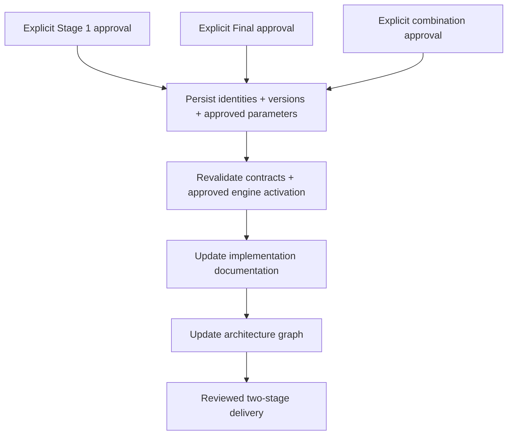

# `Phase 7 — تثبيت السياسات المعتمدة في Manifest وإعادة التحقق وتحديث الوثائق والرسم.`

**الحالة:** `NOT IMPLEMENTED YET`.

## 1. الفكرة العامة

ستثبت هذه المرحلة هوية وإصدار ومعاملات السياسات المعتمدة بعد مراجعة الأدلة، ثم تعيد التحقق وتحدث الوثائق والرسم. لا تعني وجود `Manifest` للأصول في الأولى أن هذه الخطوة اكتملت. `Manifest` الحالي يثبت أن اعتماد الترتيب ما زال مؤجلًا.

## 2. قبل → بعد

```text
Before
  ↓
Artifact Manifest: all ranking approvals UNAPPROVED
  ↓
Phase 7: NOT IMPLEMENTED YET
  ↓
After المخطط: approved policy identities/versions + revalidated activation contract
```

| `Before` الفعلي | `After` المخطط |
|---|---|
| `Manifest` يثبت أصول `33/47` وأدلة المصدر. | يثبت كذلك السياسات المعتمدة لكل مرحلة وتوليفتهما. |
| `Loader` الحالي خاص بمرحلة الأصول غير المفعلة. | مسار تفعيل متحقق منه حسب عقود التنفيذ والاعتماد المكتملة. |

## 3. الملفات المنتجة أو المعدلة

### ملفات جديدة

لا ملفات تنفيذ أو سجلات اعتماد جديدة. أسماء ملفات التسليم النهائية غير محددة في الخطة.

### ملفات معدلة

لا تعديل منسوب لهذه المرحلة على `models/shortlist_v2/manifest.json` أو التحميل أو وثائق التنفيذ. مجلد الشرح الحالي مخرج مهمة توثيق مستقلة، وليس تنفيذًا للبند السابع.

### `Artifacts` ناتجة

لا `Manifest` معتمد للترتيب ولا `Report` إعادة تحقق جديد. `Manifest` الحالي مخرج الأولى فقط.

### `Generated / Auxiliary files`

تحديث الرسم الحالي أو استعلامه لا يثبت اعتماد سياسة أو تنفيذ هذه المرحلة.

## 4. أهم الملفات بالتفصيل المختصر

| الملف الموجود | الفكرة | يدخل إليه | يخرج منه |
|---|---|---|---|
| `models/shortlist_v2/manifest.json` | تثبيت الأصول وأدلة المصدر وحالة الاعتماد الحالية. | نتيجة نشر الأولى. | عقود وبصمات واعتماد `UNAPPROVED`. |
| `src/recommendation/two_stage_artifacts.py` | فحص عقد الأصول الحالي قبل التفعيل. | `Manifest` والأصول المثبتة. | `TwoStageArtifacts` أو رفض. |

| `Function / Class` الموجود سابقًا | ماذا يفعل؟ |
|---|---|
| `validate_artifact_manifest()` | يتحقق من عقد الأولى ويطلب حالة الاعتماد غير المفعلة الحالية. |
| `load_two_stage_artifacts()` | يحمل الأصول دون الموافقة على تشغيل ترتيب إنتاجي. |

لا توابع اعتماد أو إعادة تحقق جديدة لهذه المرحلة بعد.

## 5. مخطط سير البيانات

المسار مخطط وغير منفذ:



1. يستلم قرارات اعتماد منفصلة وصريحة.
2. يثبت السياسات وإصداراتها ومعاملاتها المعتمدة.
3. يعيد التحقق من العقود والتفعيل.
4. يحدث الوثائق والرسم لتطابق التنفيذ المعتمد.

## 6. `Input → Processing → Output`

```text
INPUT المخطط: approval records + evaluated policy versions + artifact contracts
  ↓
PROCESSING المخطط: persist approved policies → revalidate → update docs/graph
  ↓
OUTPUT المخطط: reviewed Manifest + verification evidence + current documentation

المخرج الفعلي لهذه Phase حاليًا: لا يوجد
```

## 7. كيف تم اختبار المرحلة؟

لا اختبارات أو نتيجة إعادة تحقق لهذه المرحلة.

| مجال التحقق المخطط | ماذا يجب أن يثبت؟ |
|---|---|
| تثبيت القرارات | فصل هوية وإصدار واعتماد استراتيجيتي المرحلتين وتوليفتهما. |
| بوابة التفعيل | رفض التفعيل دون القرارات المطلوبة وعدم اختيار بديل غير معتمد. |
| إعادة التحقق | بقاء صحة العقود والأصول والنتائج بعد تثبيت السياسة. |

```text
Test result not recorded.
```

رفض حالة اعتماد أخرى في اختبار `Phase 1` ليس تنفيذًا لمسار التفعيل المستقبلي.

## 8. أهم ما أثبتته المرحلة

- لم تثبت تفعيلًا أو سياسة إنتاجية معتمدة بعد.
- قيم الاعتماد الثلاث الحالية ما زالت `UNAPPROVED`.
- التوثيق الجديد يصف هذه الفجوة ولا يغير قراراتها.

## 9. ما الذي لم تنفذه هذه `Phase`؟

```text
NOT DONE IN THIS PHASE
```

- تثبيت اعتماد أو تعديل عقد التفعيل أو إعادة التحقق منه.
- اعتماد ضمني لأن وثيقة الخطة معتمدة.
- تعديل المودلات أو إعادة تدريبها.
- `HTTP/API/Deployment`، وهي خارج نطاق خطة الربط الحالية.

## 10. المشاكل أو القيود المعروفة

- لا قرارات اعتماد مستقلة مسجلة للمرحلتين وتوليفتهما.
- `validate_artifact_manifest()` الحالي يرفض تغيير `ranking_approval` عن عقد الأولى؛ تحرير قيم `Manifest` يدويًا وحده لا يفعّل المسار.
- بوابات البندين الخامس والسادس لم تكتمل، وعقود حدود التشغيل ما زالت مفتوحة.

## 11. ماذا تستلم المرحلة التالية؟

```text
HANDOFF TO NEXT PHASE

المخرج المخطط، غير المتاح بعد
  ↓
reviewed core + approved strategy contracts + current docs
  ↓
نهاية بنود الخطة السبعة
  ↓
تكامل الخدمة/Backend أو Deployment عمل لاحق منفصل خارج هذه الخطة
```
