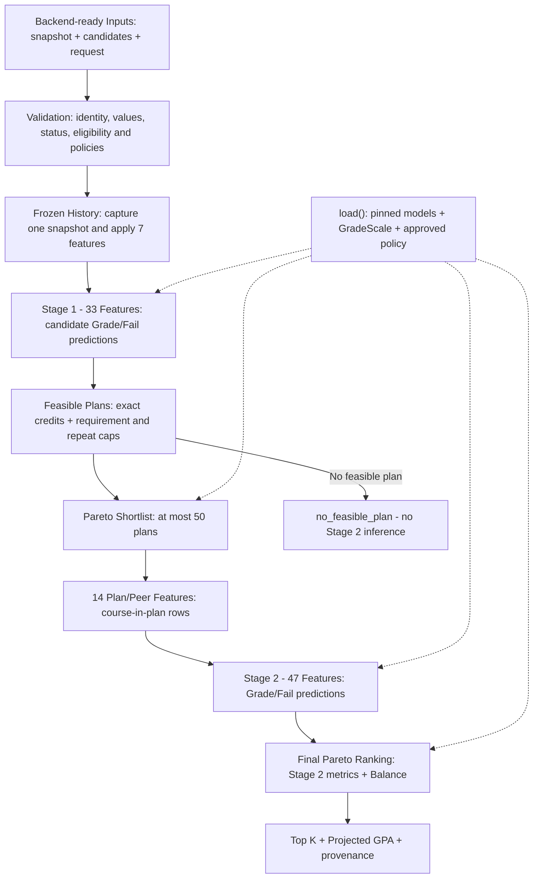
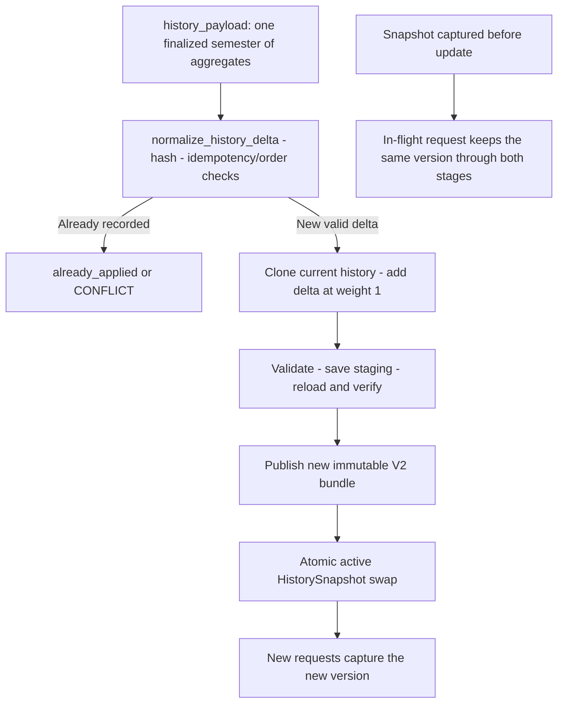

# المسار الفعلي لـ`Two-Stage Recommendation`

لقطة **`2026-10-08`**. جميع مراحل التنفيذ السبع `COMPLETE`، والحالة العامة `READY_FOR_STABILIZATION_REVIEW`. يصف الرسم مسار الكود الحالي في [two_stage_engine.py](../src/recommendation/two_stage_engine.py)، مع سياسة `pareto v1 → pareto v1` المعتمدة في [Manifest](../models/shortlist_v2/manifest.json).

## تحميل المحرك والطلب الرئيسي

نقطة الدخول هي `TwoStagePlanRecommender.load()` ثم `recommend_from_payloads()`. يجري تحميل المودلات الأربع والفئات ومقياس العلامات والسياسة والتاريخ مرة واحدة. في كل طلب يتحقق المحرك من اختياراته المثبتة، ثم يطبع المدخلات ويفحص القطع ويلتقط نسخة تاريخ واحدة.

الأسهم المتصلة هي حركة البيانات في الطلب؛ المتقطعة تبين اعتماد المكونات على إعداد التحميل. `Backend-ready` يعني عقد مدخلات داخل `Core`، ولا يعني وجود خدمة `HTTP` أو تكامل خارجي مكتمل.

| الخطوة | المكون الفعلي | المدخل → المخرج |
|---|---|---|
| التحميل والتحقق من السياسة | `load_two_stage_artifacts()`، `validate_ranking_policy()`، `FrozenHistoryManager.load()` | أصول `V2` مثبتة وسياسة كاملة الاعتماد → محرك محمل؛ لا مصادر تدريب أو تقارير أثناء التشغيل. |
| تجهيز المدخلات | `prepare_recommendation_payloads()` | `snapshot/candidates/request` → `PreparedRecommendationInputs` وقيم جاهزة محفوظة وقيود رسمية. |
| سلامة الزمن والتاريخ | `capture()`، `metadata_for_target()`، `_prepare_candidates()` | يشترط قطع التدريب والتاريخ قبل `target_part`؛ يطبق ميزات التاريخ السبع من نسخة واحدة مع توضيح عمرها. |
| توقع المرشحين | `score_course_rows()` بعقد `stage_feature_contract("stage1")` | `N` مرشحًا مؤهلًا × `33` ميزة؛ استدعاء واحد لكل مودل على كامل الصفوف. |
| الخطط الممكنة | `enumerate_feasible_plan_indices()` فوق `enumerate_plan_indices()` | كل تركيبات الهدف الدقيق التي تحقق رصيد الفئات وحدي الإعادة؛ لا حصص `Balance` أو حذف مرشحين مبكر. |
| الاختصار | `build_stage1_shortlist()` مع `compute_balance_components()` و`rank_evaluation_plans()` | مقاييس من توقعات `33` لكل خطة وهوية ثابتة → `Pareto` وترتيب كامل → أول `50` كحد أقصى. |
| سياق الخطة | `build_plan_rows()` و`compute_plan_context_features()` | خطط المختصر فقط → صف لكل ظهور مادة، مع `14` ميزة سياق مجمعة داخل `plan_id`. |
| توقع المرحلة الثانية | `_score_stage2()` ثم `score_course_rows()` بافتراضي `47` | `33 + 14` ميزة → توقعات جديدة للعلامة والفشل والنقاط لكل ظهور داخل خطة. |
| التلخيص والترتيب النهائي | `summarize_scored_plans()` ثم `rank_evaluation_plans()` | مقاييس `Stage 2` وحدها مع هوية و`Balance` من المختصر → ترتيب `Final Pareto`. |
| المخرج | `recommend_from_payloads()` | `status/metadata/recommendations`، `Top K` بين `1..50`، وتفاصيل المواد والإسقاط والمصدر. |

## مسار تحديث التاريخ المستقل

يفوض `TwoStagePlanRecommender.update_history_from_payload()` إلى `FrozenHistoryManager`. لا يشغل طلب التوصية هذا المسار ولا يرسل تاريخًا كاملًا لإعادة بنائه. فشل التحقق أو النشر يبقي النسخة السابقة؛ نفس الفصل والبصمة يعيدان `already_applied` دون رجوع إلى الوراء. التفاصيل وحدود التزامن المحلي في [Phase 3](PHASE_03_HISTORY_DELTA_SAVE_ATOMIC_SWAP.md).

## عقود وحدود يجب قراءتها مع الرسم

- **الميزات:** `33 = 47 − 14`. تتضمن `33` ميزات التاريخ السبع؛ إضافتها قبل التوقع لا تعني `33 + 7`. المصفوفة تحول ميزات موجودة ولا تعيد بناء تاريخ الطالب أو سياق الخطة تلقائيًا.
- **الساعات:** إذا لم يوجد `target_credits` صريح، فالنطاق `12–18` يعني هدفًا دقيقًا `18` دون رجوع إلى ساعات أقل. حدود الراسب والمنسحب والفئات قيود على الخطط الكاملة؛ `Balance` ترتيب مرن وليست حصة إلزامية.
- **الاستراتيجيتان:** الاختياران مستقلان ولو أن القرار الحالي اختار `pareto v1` لكليهما. يحسب `Pareto` جبهات عدم الهيمنة ثم ترتيبًا كاملًا؛ يعيد ترتيب الخطط داخل نطاق `Balance` فقط، بينما تحتفظ غير المشمولة بمواقع المرجع الأكاديمي.
- **حد المختصر:** `≤50` يحد عدد الخطط التي تصل إلى `Stage 2`، لا عدد المواد أو صفوف `Stage 2`، ولا عدد الخطط المولدة قبل القص.
- **لا ضمان Global Top-K:** المقاييس النهائية مصدرها توقعات `47`، لكن مجموعة البحث النهائي هي المختصر. أثبت التقييم المصحح فقد بعض خطط المرجع الكامل؛ لذلك `global_top_k_guaranteed=false`. كما قد يتغير ترتيب جبهات `Pareto` بتغير مجموعة الخطط.
- **الإسقاط:** `(current_gpa × current_gpa_credits + expected_quality_points) / (current_gpa_credits + plan_total_credits)`. ساعات المعدل من `Backend snapshot`؛ لا استبدال للعلامة السابقة عند الإعادة.
- **المدخلات الفارغة:** يعيد المحرك `no_feasible_plan` دون توقعات إذا لم يبق مرشح، ودون `Stage 2` إذا لم توجد خطة ممكنة. يظل التحقق من المدخلات والقطع والتاريخ قائمًا.
- **فجوة التحقق الحالية:** عقد `Validation` في الرسم لا يضمن دعم `grade_version_id` في `GradeScale`. الإصدار غير المدعوم قد يعيد `0/F` دون رفض. لا تخفي تسمية المرحلة هذه المشكلة.
- **جاهزية التشغيل:** عقود عدد المواد والزمن والذاكرة `UNRESOLVED`، والجودة على طلاب حقيقيين غير مثبتة. تفاصيل الفشل المعروف ونقل بايتات `Stage 2` في [README](README.md).

## أين تقرأ التفاصيل؟

[Phase 1: الأصول](PHASE_01_ARTIFACTS_AND_CONTRACTS.md) → [Phase 2: المدخلات والقيود](PHASE_02_PAYLOAD_ADAPTERS_MATRIX_CLASSIFICATION_CONSTRAINTS.md) → [Phase 3: التاريخ](PHASE_03_HISTORY_DELTA_SAVE_ATOMIC_SWAP.md) → [Phase 4: التوازن والترتيب](PHASE_04_BALANCE_METRICS_STRATEGIES.md) → [Phase 5: الربط](PHASE_05_TWO_STAGE_INTEGRATION_VALIDATION.md) → [Phase 6: الأدلة المصححة](PHASE_06_BENCHMARK_STRATEGY_APPROVAL.md) → [Phase 7: الاعتماد](PHASE_07_MANIFEST_POLICIES_REVALIDATION.md).

[FILE_MAP](FILE_MAP.md) يميز ملفات التشغيل عن الاختبارات والتجارب والتقارير والمحرك المحلي الباقي للتوافق.
