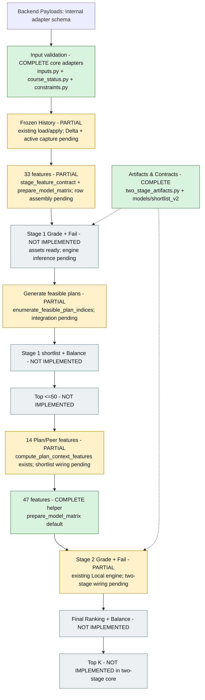

# المسار العام لـ`Two-Stage`

لقطة `2026-10-06`. هذا مخطط الهدف مع حالة مكوناته، وليس وصفًا لمحرك متكامل يعمل الآن.

`COMPLETE`: مكون مكتمل في نطاقه. `PARTIAL`: أجزاء موجودة والتحقق/الربط غير مكتمل. `NOT IMPLEMENTED`: مسؤولية جديدة لم تنفذ، حتى إن وجد مساعد قديم قريب منها.



| خطوة المسار | الحالة | ما الموجود وما المتبقي؟ |
|---|---|---|
| تجهيز مدخلات `Backend` داخل النواة | `COMPLETE` | `prepare_recommendation_payloads()` موجود واختبارات الثانية مسجلة؛ اتفاق النقل الحقيقي خارج مسؤولية المحول. |
| تحميل وتطبيق `Frozen History` | `PARTIAL` | `load_frozen_history()` و`CourseHistoryState.apply()` موجودان؛ `Delta` والتبديل والتقاط النسخة الجديدة غير منفذة. |
| بناء ميزات `33` | `PARTIAL` | العقد واختيار المصفوفة موجودان؛ تجميع الصفوف داخل المحرك الجديد غير موجود. |
| أصول `Stage 1/2` | `COMPLETE` | `load_two_stage_artifacts()` يحمل الأصول الأربعة المتحقق منها و`GradeScale`. |
| توقع كل مرشح بـ`Stage 1` | `NOT IMPLEMENTED` | لا محرك يجري الاستدعاءين على `N` صفًا؛ جاهزية المودل لا تعني تنفيذ هذه الخطوة. |
| توليد خطط ممكنة | `PARTIAL` | البحث الدقيق السابق وغلاف القيود الجديد موجودان؛ ربطهما بعد توقع الأولى غير منفذ. |
| الاختصار و`Top ≤50` | `NOT IMPLEMENTED` | لا `shortlist.py` ولا استراتيجية اختصار منفذة. |
| ميزات `14 Plan/Peer` | `PARTIAL` | `compute_plan_context_features()` موجود؛ تطبيقه على مختصر المرحلة الأولى ينتظر الربط. |
| تجهيز مصفوفة `47` | `COMPLETE` | المساعد الافتراضي الحالي موجود وتوافقه مع التحويل السابق مسجل ضمن اختبارات الثانية. |
| توقع `Stage 2` على المختصر فقط | `PARTIAL` | `AcademicPlanRecommender.score_rows()` مرجع محلي موجود؛ المحرك الجديد غير موجود. |
| الترتيب النهائي و`Top K` الجديد | `NOT IMPLEMENTED` | `rank_plans()` السابق لا ينفذ `Balance` المطلوب أو استراتيجية نهائية معتمدة. |

## مسار تحديث التاريخ المنفصل

```text
history_payload: Delta لفصل نهائي واحد
  ↓
Clone → aggregate update → validate → staging → reload → publish → atomic swap
  ↓
طلبات جديدة تلتقط نسخة التاريخ الجديدة

Status: NOT IMPLEMENTED
```

لا يرسل طلب التوصية التاريخ الكامل لإعادة بنائه. شرط المسار الجديد المخطط `history_as_of_part < target_part`، مع تاريخ قديم مسموح وبيانات توضح عمره؛ القواعد المحلية السابقة لم تُغير.

## حدود القراءة الصحيحة للمخطط

- `TwoStageArtifacts` يحمل المودلات والفئات ومقياس الدرجات و`Manifest`؛ لا يحمل التاريخ ولا يوافق على الترتيب.
- `prepare_model_matrix()` يحول ميزات موجودة؛ لا يبني ميزات التاريخ أو سياق الخطة من تلقاء نفسه.
- `Stage 1` تستخدم `33` لكل مرشح، و`Stage 2` تستخدم `47` لكل ظهور مادة داخل خطة مختصرة؛ توقعاتها وحدها تدخل النتيجة النهائية المخططة.
- `stage1_shortlist_strategy` و`final_ranking_strategy` مستقلتان؛ الاثنتان وتوليفتهما `UNAPPROVED`.
- `Top K` المخطط الأفضل داخل المختصر فقط، وليس ضمانًا لأفضلية عالمية بين جميع الخطط.
- المحرك المحلي الحالي يعمل بمسار `47` السابق؛ لا يمثل اكتمال خطة المرحلتين.
