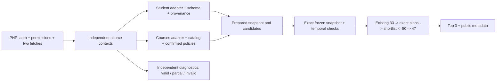

# تقرير تنفيذ Backend API

تاريخ التنفيذ: 2026-10-10. النطاق: [الخطة المعدّلة المعتمدة](../docs/BACKEND_API_IMPLEMENTATION_PLAN.md)، وتنفيذ `src/api/` والتغييرات المشتركة اللازمة فقط. العقد التشغيلي والأمثلة وخريطة الميزات في [README](../src/api/README.md).

## النتيجة بحسب المكوّن

| المكوّن | الحالة | الدليل أو الحد المتبقي |
|---|---|---|
| الواجهات الخمس وauth | **PASS** | HTTP tests للمفاتيح المنفصلة و422/409/503 وhealth؛ مفتاح الخدمة لا يصل إلى Delta |
| ربط هوية الردين | **PASS** | سياقان مستقلان، وفحص root/data/صفوف المصدر قبل الفلترة، والتوقف قبل inference |
| إثبات هوية Courses من محتواه | **PARTIAL** | المثال بلا هوية؛ `php_attested` هو المستوى المعلن، والمسؤولية على PHP |
| الطالب وGPA وschema وgaps | **PASS** | helper مشترك من الحساب الأصلي، توافق الدالة الكاملة، فصول غير مسجلة، منع target/future، المصادر والتعارض وnull |
| المواد وتصنيف المودل والمجموعات | **PASS** | course type من الكتالوج؛ attempt+1؛ groups مستقلة، dedup قبل eligibility، حدود exact وmax_new اختياري |
| التاريخ والتوافق السابق | **PASS** | cutoff صريحة بالـAPI، normal السابقة، أقدم explicit+enabled backtesting، exact bundle بلا fallback، وعدم تجاوز التدريب |
| تحميل التبعيات وhealth | **PASS** | import بلا تحميل، HTTP اختياري، تحميل مستقل، validation مع غياب المودلات/التاريخ/catalog |
| الأداء المؤقت | **PASS** | cap قابل للتغيير، خارج وضع الاختبار لا يطبق، تجاوز كامل دون قص، validation يحلل جميع المواد |
| اعتماد أداء الإنتاج | **PARTIAL** | حد الإنتاج وSLA وmemory budget `UNRESOLVED`؛ لا benchmark أو اعتماد إنتاج جديد |
| Delta read-only | **PASS** | schema والمجاميع والبصمة دون تاريخ؛ preview/replay/conflict عند وجوده؛ لا نشر أو تفعيل؛ تكافؤ مع نتائج فردية اصطناعية |
| إثبات تثبيت الفصل | **PARTIAL** | `admin_attested` مع مرجع رسمي؛ Python لا يثبت القرار الجامعي من سلامة المجاميع |
| PHP end-to-end مع الجامعة | **PARTIAL** | توثيق المسؤوليات والعقد مكتمل؛ الاتصال والهوية والصلاحيات الجامعية ينفذها PHP خارج هذا المشروع |
| توصية المدخلات الحقيقية المقدمة | **BLOCKED** | بيانات الدبلوم، مقام GPA الرسمي، العدادات الموثقة، الحالات السابقة، الاستثناءات وتفسير سياسات الجامعة غير مكتملة؛ لم تُشغّل توصية حقيقية |
| الأصول والتدريب وعقود الميزات والترتيب | **PASS** | protected hash مطابق، 33/47 ثابتة، Pareto/Pareto مع approval gate، بلا تدريب أو تعديل artifacts |
| خلو كامل الاختبارات من الفشل | **BLOCKED** | فشل baseline المعروف `capaciy_63` مقابل `capacity_63`؛ ليس regression من API |

`PASS` يعني أن السلوك المنفذ اجتاز اختباراته، وليس اعتماد تشغيل الجامعة. `PARTIAL` يحدد الربط أو الإثبات الجامعي المتبقي. `BLOCKED` أعلاه متعلق بمتطلبات الطلب الحقيقي وبفشل baseline؛ لم تُترك وظيفة Python مطلوبة بلا تنفيذ بسبب تلك العوائق.

## Before / After ومسار البيانات

قبل التنفيذ كان المحرك يستقبل payload جاهزًا بلا HTTP، وتاريخ المدير النشط مسموحًا أن يكون قديمًا، والقيود قائمة على requirement category. بعد التنفيذ:



لا تدخل group identity أوcaps أوGPA denominator في مصفوفة الميزات. يبقى `stage1_shortlist_strategy` مستقلًا عن `final_ranking_strategy`. الاستدعاءات القديمة التي لا تستخدم الإضافات الاختيارية تحافظ على القيود وfingerprint السابقين. `global_top_k_guaranteed=false` يبقى معلنًا.

## الملفات والواجهات المشتركة

| الملف | التغيير |
|---|---|
| `src/api/app.py` | app factory وlifespan وauth وroutes وDecimal JSON parsing وأخطاء آمنة لا تصعد إلى ASGI logs |
| `src/api/schemas.py` | Pydantic envelopes، IDs strict strings، mode وcredit shape وsource contexts وprovenance |
| `src/api/settings.py` | env keys وbacktesting والأداء وaliases، دون سياسات أكاديمية مفترضة |
| `src/api/validation.py` | validation results، هوية وaliases وأرقام ومصادر، وdiagnostics عامة |
| `src/api/student_adapter.py` | snapshot من حقول فعلية ومصادر موثقة، فحص schema، دبلوم ومقام رسمي، حسابات الأصل |
| `src/api/courses_adapter.py` | catalog وattempt/status وdedup وeligibility وسياسات المجموعات/الساعات |
| `src/api/history_adapter.py` | إعادة استخدام المجاميع الأصلية، preview بلا كتابة، فصل finalization عن lineage |
| `src/api/service.py` | dependency loading المستقل، التحضير والرفض قبل inference، قفل inference وmetadata عامة |
| `src/features/temporal_features.py` | استخراج GPA shifts إلى helper نقي تستخدمه الدالة الأصلية والـAdapter |
| `src/recommendation/constraints.py` | group caps وmax_new اختياريان دون تبديل البحث أو الترتيب |
| `src/recommendation/inputs.py` | حفظ group identity وقراءة القيود الاختيارية |
| `src/recommendation/history_update.py` | اختيار cutoff exact اختياري وpreview دون finalized إلزامي؛ update القديم بقي إلزاميًا |
| `src/recommendation/two_stage_engine.py` | kwargs cutoff اختيارية، fingerprint فقط عند وجود الإضافات، factory تربط موارد محملة ببوابة approval الأصلية |
| `pyproject.toml` | extras اختيارية `api` و`api-test` دون زيادة تبعيات المشروع الأساسية |

## الاختبارات والأدلة

التشغيل بالمفسر `.venv\Scripts\python.exe` من الجذر. `--basetemp` داخل `.pytest_cache` لعزل حزم التاريخ الاصطناعية. اختبارات HTTP شُغّلت خارج sandbox: asyncio توقف داخله عند إنشاء `socketpair` المحلي قبل دخول routes، وأثبت faulthandler ذلك. لم تُضف معالجة خاصة لـsandbox إلى كود الخدمة.

| المجموعة | النتيجة |
|---|---|
| baseline قبل التعديل، داخل sandbox | 1190 passed، فشلان، 6 subtests passed |
| API المركّزة النهائية | **70 passed** |
| الوحدات المرتبطة النهائية | **361 passed** |
| الكاملة النهائية | **1261 passed، 1 failed baseline، 6 subtests passed**؛ لا regression جديدة |

أمر المركّزة:

```powershell
.\.venv\Scripts\python.exe -m pytest tests/test_api_adapters.py tests/test_api_http.py tests/test_api_integration.py tests/test_api_core_extensions.py -q
```

المرتبطة تضيف `test_two_stage_activation.py`, `test_two_stage_payloads.py`, `test_two_stage_constraints.py`, `test_temporal_features.py`, `test_history_update.py`, `test_two_stage_engine.py`. أمر الكاملة `python -m pytest -q --tb=line --basetemp='.pytest_cache/api-acceptance-full'`.

أدلة محلية كاملة في `.pytest_cache/api-integration-audit/focused.txt`, `related.txt`, `full_suite.txt`, `progress.md`. الملفات المحلية ignored؛ النتائج المطلوبة موثقة هنا لتبقى قابلة للمراجعة دون إضافة بيانات تشغيل إلى Git.

التغطية السلوكية تشمل:

- اختلاف الطالب/الاختصاص/الفصل في كل سياق، هوية wrapper/data/صفوف المصدر، التاريخ الهدف/المستقبل وaliases المتعارضة؛ صفر inference عند الرفض.
- GPA shifts مع unregistered semesters وgaps، توافق full schema، قيم مجهولة بلا صفر مفترض، conflict Decimal قبل float، GPA خارج 0..4 وعدادات غير صحيحة/خارج المجال.
- كل مواد المثال المنقح دون truncation، حد أداء متغير ومعطل خارج وضع الاختبار، eligibility متعارضة قبل الفلترة، identical duplicates، حالات معادة واستثناءات مفوضة، وتصنيف catalog.
- حالة محرك صغيرة بمودلات deterministic تثبت 33 ثم47 وPareto/Pareto وTop3، ورفض ثلاث مواد من ساعتين عند بقاء أربع ساعات؛ ليست اختبار أداء.
- normal cutoff السابقة والأقدم explicit+enabled، bundle المفقودة بلا fallback، cutoff التدريب، وأخطاء HTTP دون PII/paths/raw values أو server traceback.
- Delta دون history، finalization منفصلة، replay/conflict، hash والحزمة لا يتغيران بالمعاينة، وتكافؤ المجاميع مع نتائج فردية اصطناعية دون تقدير points.

فشل baseline الثابت:

`tests/test_train_models.py::test_tune_model_evaluates_every_candidate_fold_and_selects_mean_metric[grade-capacity_63-mae]` يطلب `capacity_63`، بينما source يعرّف `capaciy_63`. لم يُغير source التدريب أو اختباراته؛ المجموعة الكاملة لا توصف green.

الفشل الثاني قبل التعديل كان `test_worker_subprocess_serializes_completed_search` داخل sandbox. نجح عند تشغيل الاختبارات خارج sandbox. لا توجد مشكلة benchmark جديدة من API، ولم يُغير runner الخاص به.

## المراجعة والحماية وGit

مراجعة مستقلة read-only وفق مهارة `requesting-code-review` كشفت أربع ملاحظات Important، بلا minors أو declined-to-judge. أُصلحت جميعها باختبارات RED→GREEN: تعارض eligibility قبل dedup، GPA/counters في full schema، Decimal source equality، وaliases الفصل التاريخي. أضيف فحص هوية root/wrapper ورقم خارج مجال المودل، وإعلان حالة nullable input في metadata.

Protected SHA-256: **1230 قبل / 1230 بعد** في `data/` و`models/`. `changed=[]`, `added=[]`, `removed=[]`. الحصران والمقارنة في `.pytest_cache/api-integration-audit/protected_{before,after,comparison}.json`. لم تتغير raw/V1/V2/models/Frozen History/experimental artifacts.

`pip check` و`git diff --check` اجتازا التحقق. توجد رسالة deprecation من Starlette بشأن testclient مع httpx؛ لا تمنع الاختبارات. لم يُغيّر dependency extra إلى httpx2 لأن httpx الحالي ضمن العقد الاختياري ويعمل.

`graphify update .` حدّث AST دون LLM أو API تكلفة: **3490 nodes، 8725 edges، 228 communities**. تعثر آخر استبدال لـgraph.json بقفل Windows داخل sandbox، ثم اكتمل التحديث خارجه. تعديلات graphify-out مولدة ومتوقعة، بما فيها backups للرسوم السابقة؛ last_query_stamp كان dirty من استعلامات التدقيق قبل التنفيذ. لم يُشغّل semantic labeling.

الفرع `fast_apis`، HEAD بقي `140cc53393d466d9b2ac9e4c2179a05c6224344a`. التغييرات محلية قابلة للمراجعة، **لا Git commit ولا merge/push/deploy**.

قرارات التنفيذ المسجلة:

1. استخدام فرع العمل الموجود `fast_apis` وcheckout الحالية للحفاظ على الأصول المحلية ignored؛ كلفة القرار إن لم يلائم سير العمل: التعديلات تشارك checkout الحالية، دون commit أو تبديل branch.
2. إبقاء `TOTAL_REG_*` غير المؤكدة زمنيًا تشخيصية وطلب مجاميع prior موثقة بدل طرح اصلساعات الهدف أو افتراض المقام؛ الكلفة: توضيح دلالة المجاميع من الجامعة قبل اعتماد البيانات الحقيقية.
3. تشغيل اختبارات HTTP خارج sandbox بسبب socketpair؛ الكلفة: مقارنة فشل العملية الفرعية وفق البيئة نفسها، دون تعديل الخدمة للتكيف مع sandbox.

## القيود المتبقية

يلزم PHP توفير الدبلوم ومقام المعدل الحقيقي وعداد الفصل السابق/المجاميع السابقة بدلالاتها الأصلية، وحالات المقررات السابقة وscope المحاولات، وتفويض الاستثناءات والسياسات الجامعية. الطلب الصحيح يجب أن يحدد load profile وسياسات كل REQUIREMENT_ID؛ لا يستطيع Adapter اعتمادها من الحروف Y أو type ID وحدها.

الاستجابات الحالية لا تثبت هذه المتطلبات. `PARTIAL` ليست نجاح تحقق كامل، و`BLOCKED` للطلب الحقيقي لا يُعالَج بملء افتراضي. حدود الإنتاج والأداء وتشغيل PHP end-to-end وتثبيت الفصل تتطلب بيانات أو قرارات خارج نطاق `src/api/` المنفذ.
