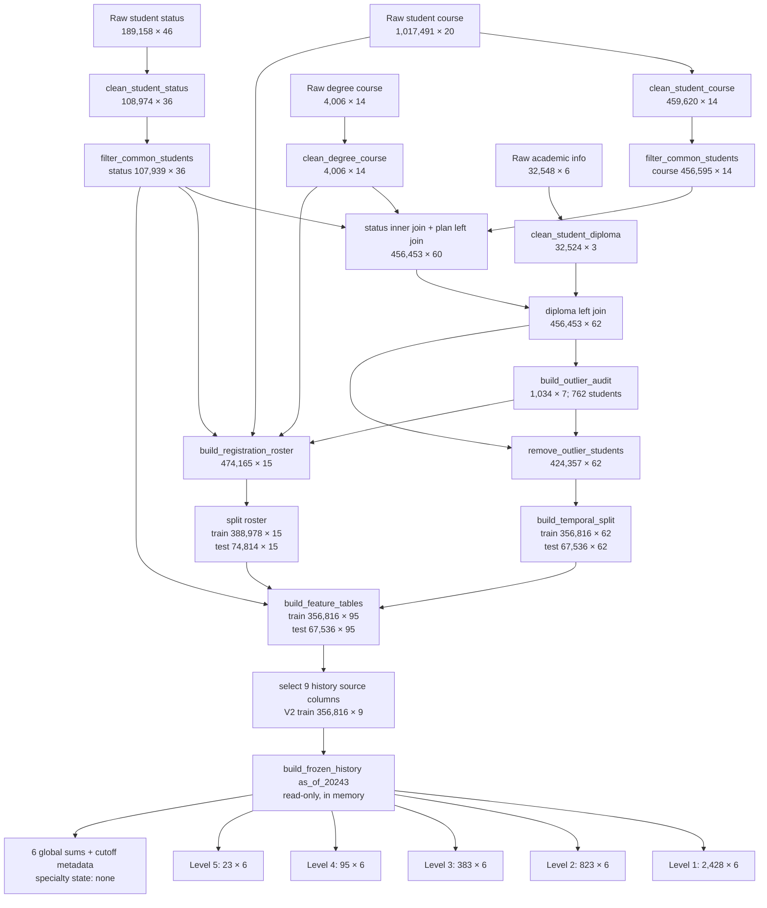

# Data to Features Pipeline: Input and Output Audit

**Measured on:** 2026-09-23. **Scope:** the current V2 data and feature path. All counts come from the existing Parquet files or from read-only, in-memory calls to current functions. No production file, model, or history bundle was rewritten. An artifact marked **in memory** below was computed for this audit and was not saved.

## One complete pipeline graph

The order follows `scripts/rebuild_common_students_v2.py:14-25` and the actual reads in `src/data/` and `src/features/`. The roster is a separate branch from raw registrations. It is not the target table after outlier removal. Frozen History is a separate explicit build after feature tables; it is not automatically saved by `build_temporal_features.py`.

## Input to output: cleaning

### `clean_degree_course.py`

Input: `data/raw/v_acd_degree_course.parquet`, **4,006 × 14**. Output: `data/clean/degree_course_v2.parquet`, **4,006 × 14**.

| Input rows | Rule → output | Removed |
| ---: | --- | ---: |
| 4,006 | Normalize names, IDs, numeric fields, and text; select 14 columns → **4,006 × 14** | 0 |

**Output shape:** one row per `degree_course_id`; 4,006 distinct IDs, no missing or duplicated IDs. Exact columns: `degree_course_id`, `course_id`, `degree_id`, `course_type_id`, `requirement_type_id`, `requirement_type_sl`, `course_name_sl`, `course_official_sl`, `degree_name_sl`, `year_order`, `semester_order`, `course_credits`, `credits_count`, `active`. `semester_order` and `year_order` each have 9 nulls. The output supplies the plan side of the `(degree_id, course_id)` joins.

### `clean_student_course.py`

Input: `data/raw/v_crg_student_course_raw.parquet`, **1,017,491 × 20**. First output: `data/clean/student_course_pre_common_v2.parquet`, **459,620 × 14**.

| Input rows | Rule → output | Removed |
| ---: | --- | ---: |
| 1,017,491 | Keep registration status `R/E` → 867,677 | 149,814 |
| 867,677 | Keep rows with usable `course_id` and `part_id` → 867,676 | 1 |
| 867,676 | Keep `part_id > 20193` → 521,042 | 346,634 |
| 521,042 | Keep final status `P/F/FE/FA` → 459,629 | 61,413 |
| 459,629 | Exclude any `N` in `in_agpa`, `in_gpa`, or `in_credits` → **459,620 × 14** | 9 |

**Output shape:** one row per `student_course_id`; 459,620 distinct IDs, no missing or duplicated IDs and no null values in the 14 output columns. Exact columns: `student_course_id`, `student_id`, `course_id`, `part_id`, `grade_id`, `final_mark`, `points`, `course_name_sl`, `degree_id`, `degree_name_sl`, `faculty_id`, `course_credits`, `attempt_number`, `course_outcome_status`. Input has 20 columns; `attempt_number` and `course_outcome_status` are added, while 8 raw columns are dropped. Key dtypes include string `student_id`, nullable integer `part_id`/`final_mark`/`attempt_number`, and nullable float `course_credits`.

### `clean_student_status.py`

Input: `data/raw/v_add_student_degree_status.parquet`, **189,158 × 46**. First output: `data/clean/student_status_pre_common_v2.parquet`, **108,974 × 36**.

| Input rows | Rule → output | Removed |
| ---: | --- | ---: |
| 189,158 | Keep `part_id > 20193` → 113,106 | 76,052 |
| 113,106 | Exclude semester suffix `4` → 113,098 | 8 |
| 113,098 | Exclude selected permanent status IDs → 110,386 | 2,712 |
| 110,386 | Exclude `WITHDRAWN` → 109,067 | 1,319 |
| 109,067 | Keep study mode `C` → 109,067 | 0 |
| 109,067 | Keep non-null `degree_id` → **108,974 × 36** | 93 |

**Output shape:** one row per `student_status_id`; 108,974 distinct IDs, no missing or duplicated IDs. Exact columns: `student_status_id`, `student_id`, `part_id`, `degree_id`, `degree_name_sl`, `start_part_id`, `finish_part_id`, `grade_version_id`, `prev_gpa_points`, `last_enrolled_gpa`, `observed_gap_semesters`, `gpa_points`, `start_agpa_points`, `start_total_in_courses`, `start_total_in_credits`, `end_total_in_courses`, `end_total_in_credits`, `end_agpa_points`, `semester_reg_courses`, `semester_reg_credits`, `semester_pass_courses`, `semester_pass_credits`, `semester_fail_courses`, `semester_fail_credits`, `total_semesters`, `total_reg_courses`, `total_reg_credits`, `total_pass_courses`, `total_pass_credits`, `total_fail_courses`, `total_fail_credits`, `reg_total_semesters`, `finish_status`, `degree_credits_count`, `start_level_name_short`, `end_level_name_short`. Two output columns did not exist in raw: `last_enrolled_gpa` and `observed_gap_semesters`. Their null counts are 8,990 and 13,572 respectively. Other notable nulls: `finish_part_id` 63,294 and `finish_status` 63,172. `student_id` is string; `part_id`/`observed_gap_semesters` are nullable integers; `last_enrolled_gpa` is a nullable float. This output supplies the status side of the course join and the status history input to Features.

### `filter_common_students.py`

Inputs are the two pre-common outputs above. The filter intersects **`student_id` only**; it does not join on degree or semester. Both outputs retain their original columns.

| Input rows | Rule → output | Removed |
| ---: | --- | ---: |
| 459,620 course rows | Keep students also present in status → `data/clean/student_course_v2.parquet`, **456,595 × 14** | 3,025 |
| 108,974 status rows | Keep students also present in course → `data/clean/student_status_v2.parquet`, **107,939 × 36** | 1,035 |

**Output shape:** each file has 12,792 distinct students. Course has 456,595 unique `student_course_id` values and no nulls across its 14 columns. Status has 107,939 unique `student_status_id` values; notable nulls are `finish_part_id` 63,041, `finish_status` 62,919, `observed_gap_semesters` 12,879, and `last_enrolled_gpa` 8,391. The matching student sets do **not** guarantee that every `(student_id, degree_id, part_id)` matches during enrichment.

## Input to output: joining, diploma, and outliers

### `build_student_course_enriched.py`

Inputs: clean course **456,595 × 14**, clean status **107,939 × 36**, clean degree course **4,006 × 14**. Output: `data/clean/student_course_enriched_v2.parquet`, **456,453 × 60**.

| Input rows | Rule → output | Removed |
| ---: | --- | ---: |
| 456,595 course rows | Inner join status on `(student_id, degree_id, part_id)`, `many_to_one` → 456,453 | 142 |
| 456,453 rows | Left join plan on `(degree_id, course_id)`, `many_to_one` → **456,453 × 60** | 0 |

**Output shape:** 456,453 unique `student_course_id` values; no duplicated target rows. `plan_match` is true in 456,386 rows and false in 67. `plan_requirement_type_id` is null in 67 rows; `plan_year_order` and `plan_semester_order` are null in 146 rows each. The course name of the degree becomes `degree_name_sl_course`; the status name becomes `degree_name_sl_status`. All other course, status, and prefixed plan columns are retained. The 142 course rows without matching status have no output row.

### `clean_student_diploma.py`

Inputs: `data/raw/v_add_academic_info.parquet`, **32,548 × 6**, plus the enriched course output, **456,453 × 60**. Outputs: `data/clean/student_diploma_v2.parquet` and `data/merged/student_course_enriched_with_diploma_v2.parquet`.

| Input rows | Rule → output | Removed |
| ---: | --- | ---: |
| 32,548 academic-info rows | Keep records with `diploma_type_id`; select `student_id`, `diploma_gpa`, `diploma_type_id` → **32,524 × 3** | 24 |
| 456,453 enriched course rows | Left join the diploma table on `student_id`, `many_to_one` → **456,453 × 62** | 0 |

**Output shape:** the diploma table has 32,524 distinct, non-null student IDs, no duplicate IDs, and no nulls in its three columns after the cleaner's forward fill. The merged course table has 456,453 unique `student_course_id` values. It adds exactly `diploma_gpa` and `diploma_type_id`; 25 course rows have nulls in both because they did not match a diploma row. The left join preserves every enriched course row.

### `clean_outliers.py`

Input: `data/merged/student_course_enriched_with_diploma_v2.parquet`, **456,453 × 62**. Outputs: an audit table and a filtered course table.

| Input rows | Rule → output | Removed |
| ---: | --- | ---: |
| 456,453 merged course rows | `build_outlier_audit()` → `data/merged/outlier_students_v2.parquet`, **1,034 × 7** audit records covering 762 students | Not a course-row filter |
| 456,453 merged course rows | Exclude every row belonging to any audited student → `data/merged/student_course_enriched_without_outliers_v2.parquet`, **424,357 × 62** | **32,096** |

**Filtered output shape:** 424,357 distinct, non-null `student_course_id` values. All 62 input columns remain in the same order with the same values for retained rows; a read-only reconstruction of the student filter matched the saved output exactly. The 62 columns consist of 14 cleaned course columns, 33 joined status columns, 13 plan columns, and 2 diploma columns. The 14 course columns are listed above; the status and plan column lists are in the appendix. The filtered output still has 25 null `diploma_gpa`/`diploma_type_id` values, 67 null `plan_requirement_type_id` values, and 140 null `plan_year_order`/`plan_semester_order` values. It has 64,781 null `observed_gap_semesters` values. These are output nulls, not additional removed rows.

**Audit output shape:** 1,034 unique `(student_id, scope, rule)` records with 7 columns: `student_id`, `scope`, `rule`, `expected`, `trigger_count`, `min_observed`, `max_observed`. A student may have multiple audit records. The largest rule by affected students is `attempt_number_outside_range` (375 students); rule counts overlap and must not be summed into a removed-student total.

## Input to output: temporal tables and Features

### `build_temporal_split.py`

Input: the filtered course table, **424,357 × 62**. Outputs: `data/temporal/temporal_train_v2.parquet` and `data/temporal/temporal_test_v2.parquet`.

| Input rows | Rule → output | Removed |
| ---: | --- | ---: |
| 424,357 | Select configured train parts → **356,816 × 62** | 67,541 assigned elsewhere |
| 67,541 outside train | Select test parts `20251/20252` → **67,536 × 62** | 5 incomplete `20253` rows |

No columns are added or removed. The two output tables retain unique `student_course_id` values. The 5 incomplete rows are not part of either output.

### `build_registration_roster.py`

Inputs: raw student course **1,017,491 × 20**, clean status, clean degree course, and the outlier audit. Output: `data/clean/registration_roster_v2.parquet`, **474,165 × 15**, then train/test roster files.

| Input rows | Rule → output | Removed |
| ---: | --- | ---: |
| 1,017,491 | Keep registration status `R/E` → 867,677 | 149,814 |
| 867,677 | Keep `part_id > 20193` → 521,042 | 346,635 |
| 521,042 | Inner join clean status on `(student_id, degree_id, part_id)` → 515,368 | 5,674 |
| 515,368 | Exclude audited students → 474,165 | 41,203 |
| 474,165 | Left join degree plan → **474,165 × 15** | 0 |
| 474,165 | Split by configured parts → train **388,978 × 15**, test **74,814 × 15**, and 10,373 rows of `20253` outside both | 10,373 outside train/test |

**Output shape:** one row per `student_course_id`; 474,165 distinct IDs, no duplicates or missing IDs. The 15 columns are `student_course_id`, `student_status_id`, `student_id`, `degree_id`, `faculty_id`, `course_id`, `part_id`, `course_credits`, `register_status`, `finish_status`, `plan_course_type_id`, `plan_requirement_type_id`, `plan_year_order`, `plan_semester_order`, `plan_credits_count`. This branch contains registered courses beyond the filtered target outcomes; its row count is therefore different from the temporal target tables.

### `build_temporal_features.py`

Inputs: temporal train/test **356,816 × 62 / 67,536 × 62**, train/test roster **388,978 × 15 / 74,814 × 15**, and clean status **107,939 × 36**. Outputs: `data/features/temporal_train_features_v2.parquet` and `data/features/temporal_test_features_v2.parquet`.

| Input rows | Rule → output | Removed |
| ---: | --- | ---: |
| 356,816 train target rows | Add 7 course-history columns → 69; add 14 plan-context columns → 83; add 10 student-history columns → 93; add `part_semester` and `is_fail` → **356,816 × 95** | 0 |
| 67,536 test target rows | Same column additions → **67,536 × 95** | 0 |

**Output shape:** the 95 columns comprise the 62 filtered course/status/plan/diploma columns plus 33 derived columns. `src/features/feature_contract.py` selects 47 of these columns for a model matrix; the 95-column table itself is the output of the Features section. The saved V2 test table is older than the current sequential history code: an in-memory rebuild changed 16 history/plan columns in the 33,128 rows of `20252`, while train and `20251` matched. This report uses the saved table's row and column shape, and labels the Frozen History measurement below as a fresh in-memory build.

## Final output shape: Frozen History

`src/features/build_frozen_history.py` selects `HISTORY_SOURCE_COLUMNS` from explicit feature sources and calls `build_frozen_history()`. For this audit, the current V2 train feature file was read with those 9 columns and the builder was called in memory with `as_of_part=20243` and `finalized_through_part=20243`. The function succeeded; nothing was saved.

| Input rows | Rule → output | Removed |
| ---: | --- | ---: |
| 356,816 × 95 V2 train feature rows | Select the 9 history source columns → **356,816 × 9** | 0 source rows |
| 356,816 × 9 selected rows | Aggregate by five fallback keys → **2,428 × 6**, **823 × 6**, **383 × 6**, **95 × 6**, **23 × 6** | No row deletion; rows become aggregate keys |
| 356,816 × 9 selected rows | Also produce 6 global sums and metadata with `source_row_count=356,816`, `source_min_part=20201`, `source_max_part=as_of_part=20243` | No row deletion |

**Selected input columns:** `student_course_id`, `part_id`, `degree_id`, `course_id`, `faculty_id`, `plan_requirement_type_id`, `course_credits`, `attempt_number`, `final_mark`. The read retained `feature_engineering_version=2` in DataFrame attrs.

**Aggregate output schema:** each level is indexed by a composite `key` and has the same 6 numeric columns: `effective_support`, `raw_count`, `mark_sum`, `fail_sum`, `attempt_sum`, `retake_sum`. Level 1 keys are `(degree_id, course_id)`; level 2 `course_id`; level 3 `(degree_id, plan_requirement_type_id, rounded course_credits)`; level 4 the same with `faculty_id`; level 5 `(plan_requirement_type_id, rounded course_credits)`. These are **not** 356,816 saved raw rows. For example, one masked level-1 aggregate has `effective_support=274.75`, `raw_count=517`, `mark_sum=20,968.75`, `fail_sum=13.75`, `attempt_sum=321.5`, and `retake_sum=30.5`.

**Global output:** `effective_support=258,532.25`, `raw_count=356,816`, `mark_sum=18,433,972`, `fail_sum=21,132.75`, `attempt_sum=298,499.25`, `retake_sum=30,403.25`. The in-memory Base build returned **no specialty state**. A Base format-2 save would contain `course_history_state.pkl` and `metadata.json`; the default `as_of_20243` directory already holds a V1 bundle, so the current exclusive-save code would reject a write there. No V2 bundle was created in this audit.

**Existing saved bundles are separate V1 outputs:**

| Input rows | Rule → output | Removed |
| ---: | --- | ---: |
| 365,585 V1 source rows | Existing `data/artifacts/history/as_of_20243/` (format 1) → aggregate table shapes **2,428 × 6 / 823 × 6 / 383 × 6 / 95 × 6 / 23 × 6** | Aggregated, not filtered |
| 400,507 V1 source rows | Existing `data/artifacts/history/as_of_20251/` (format 1) → aggregate table shapes **2,592 × 6 / 856 × 6 / 412 × 6 / 104 × 6 / 24 × 6** | Aggregated, not filtered |

Both saved V1 bundle directories have `course_history_state.pkl`, `specialty_history_state.pkl`, and `metadata.json`. Their hashes and cutoffs were checked by `load_frozen_history()`. Loading without an explicit specialty type returned no specialty object; that does not mean the specialty file is absent. The V1 source-row counts must not be substituted for the V2 in-memory source count.

## Appendix: 62-column outlier-filtered output inventory

The `424,357 × 62` filtered table has exactly these output groups. This inventory describes the shape of the data **after** `clean_outliers.py` and before the temporal split.

- **Clean course, 14:** `student_course_id`, `student_id`, `course_id`, `part_id`, `grade_id`, `final_mark`, `points`, `course_name_sl`, `degree_id`, `degree_name_sl_course`, `faculty_id`, `course_credits`, `attempt_number`, `course_outcome_status`.
- **Joined status, 33:** `student_status_id`, `degree_name_sl_status`, `start_part_id`, `finish_part_id`, `grade_version_id`, `prev_gpa_points`, `last_enrolled_gpa`, `observed_gap_semesters`, `gpa_points`, `start_agpa_points`, `start_total_in_courses`, `start_total_in_credits`, `end_total_in_courses`, `end_total_in_credits`, `end_agpa_points`, `semester_reg_courses`, `semester_reg_credits`, `semester_pass_courses`, `semester_pass_credits`, `semester_fail_courses`, `semester_fail_credits`, `total_semesters`, `total_reg_courses`, `total_reg_credits`, `total_pass_courses`, `total_pass_credits`, `total_fail_courses`, `total_fail_credits`, `reg_total_semesters`, `finish_status`, `degree_credits_count`, `start_level_name_short`, `end_level_name_short`.
- **Joined degree plan, 13:** `plan_degree_course_id`, `plan_course_type_id`, `plan_requirement_type_id`, `plan_requirement_type_sl`, `plan_course_name_sl`, `plan_course_official_sl`, `plan_degree_name_sl`, `plan_year_order`, `plan_semester_order`, `plan_course_credits`, `plan_credits_count`, `plan_active`, `plan_match`.
- **Joined diploma, 2:** `diploma_gpa`, `diploma_type_id`.
