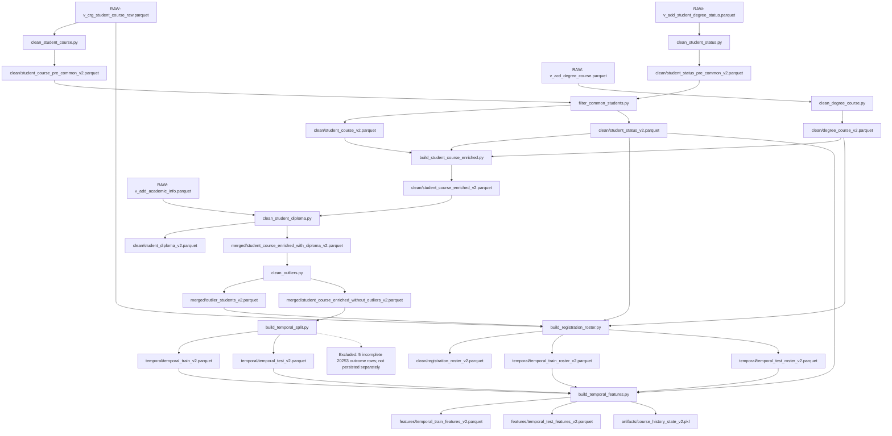

# Pre-Modeling Data V2 and Features V2 Audit

## 1. Executive Result

**READY FOR MODELING**

Audit date: 2026-09-26. Scope: the current standard `src.main` Data V2 and Features V2 build only. This decision concerns the correctness, reproducibility, and input usability of the two V2 feature tables. It does not certify unbiased future evaluation or convert the existing V1 trainer to V2.

All 17 canonical Parquet outputs exist and match replayed current transformations exactly, including row order, column order, values, nulls, and dtypes after an in-memory Parquet round trip. The supporting course-history pickle also matches the rebuilt training state exactly. Final features contain 356,816 training rows and 67,536 test rows, each with 95 columns and all 47 required predictors.

The final scoped tests report **304 passed, 0 failed, 0 skipped, 3 deselected, plus 6 subtests passed**. No model training, evaluation pipeline, experiment pipeline, or recommendation generation was run. No production source, dataset, model, V1 baseline, or existing frozen-history bundle was modified. SHA-256 comparisons found **0 changes and 0 new files among 497 existing data/model files**.

There are no Data/Features blockers. Section 11 records material policy and provenance review items, especially future-dependent cohort exclusion, diploma imputation, target semantics, and the current V1 training route. These remain unchanged as requested.

Repository HEAD: `2525d1c16b477cccbe4c5feb4e8fff64f0a5d8d9`.

Verified runtime: project `.venv`, Python `3.11.5`, pandas `3.0.5`, pyarrow `25.0.1`. In this runtime projected Parquet reads preserve the required feature attrs.

Combined SHA-256 of the audited `src/main.py`, `src/paths.py`, and current Data/Features Python sources: `0b8d8365270301eb139f056fa710148663451cb6e003345112903df8cb43e32b`. Measurements below come from current code and files; historical README numbers were not used as evidence.

## 2. Pipeline Map

One complete map of the standard build follows. All intermediate and final artifacts shown are V2. RAW filenames have no `_v2` suffix by design.



The executable dependency order in `src/main.py:27-41` is:

```text
clean_degree_course
clean_student_course
clean_student_status
filter_common_students
build_student_course_enriched
clean_student_diploma
clean_outliers
build_temporal_split
build_registration_roster
build_temporal_features
```

Degree-course cleaning is independent and can run first. Course and status cleaners read only their own RAW table; neither needs the other cleaner's output. Common-student filtering waits for both. Enrichment waits for the filtered pair and catalog. The roster branch waits for filtered status, catalog, and the outlier audit. Features wait for both splits, both rosters, and complete filtered student status history. This is a valid topological order.

`--section data` selects the first nine steps; `--section features` selects only `build_temporal_features`. Both the registry and a real `--from data --to features --dry-run` confirm this order. `build_frozen_history` is registered as request-specific, not standard. Its source and validation contracts were reviewed; neither `data/artifacts/history/as_of_20243/` nor `as_of_20251/` was rebuilt.

## 3. Artifact Inventory

Paths are relative to the project root. Producer names below refer to scripts under `src/data/`, except the feature builder under `src/features/`. Input identifiers reference upstream artifacts in this inventory or the four RAW inputs in Section 4. PASS requires existence, valid observed schema/keys, and equality to current transformation replay, rather than existence alone.

| Artifact | Producer | Inputs | Rows | Columns | Students | Parts | Schema status | PASS/FAIL |
| --- | --- | --- | --- | --- | --- | --- | --- | --- |
| `data/clean/degree_course_v2.parquet` | clean_degree_course | RAW catalog | 4,006 | 14 | — | — | Exact replay; 0 primary-key duplicates | PASS |
| `data/clean/student_course_pre_common_v2.parquet` | clean_student_course | RAW courses | 459,620 | 14 | 13,082 | 20201–20253 | Exact replay; 0 primary-key duplicates | PASS |
| `data/clean/student_status_pre_common_v2.parquet` | clean_student_status | RAW status | 108,974 | 36 | 13,415 | 20201–20261 (includes 20253/20261) | Exact replay; 0 primary-key duplicates | PASS |
| `data/clean/student_course_v2.parquet` | filter_common_students | Both pre-common tables | 456,595 | 14 | 12,792 | 20201–20253 | Exact replay; 0 primary-key duplicates | PASS |
| `data/clean/student_status_v2.parquet` | filter_common_students | Both pre-common tables | 107,939 | 36 | 12,792 | 20201–20261 (includes 20253/20261) | Exact replay; 0 primary-key duplicates | PASS |
| `data/clean/student_course_enriched_v2.parquet` | build_student_course_enriched | Filtered courses + status + catalog | 456,453 | 60 | 12,792 | 20201–20253 | Exact replay; 0 primary-key duplicates | PASS |
| `data/clean/student_diploma_v2.parquet` | clean_student_diploma | RAW academic info | 32,524 | 3 | 32,524 | — | Exact replay; 0 primary-key duplicates | PASS |
| `data/merged/student_course_enriched_with_diploma_v2.parquet` | clean_student_diploma | Enriched courses + clean diploma | 456,453 | 62 | 12,792 | 20201–20253 | Exact replay; 0 primary-key duplicates | PASS |
| `data/merged/outlier_students_v2.parquet` | clean_outliers | Courses with diploma | 1,034 | 7 | 762 | — | Exact replay; 0 primary-key duplicates | PASS |
| `data/merged/student_course_enriched_without_outliers_v2.parquet` | clean_outliers | Courses with diploma | 424,357 | 62 | 12,030 | 20201–20253 | Exact replay; 0 primary-key duplicates | PASS |
| `data/temporal/temporal_train_v2.parquet` | build_temporal_split | Courses without outliers | 356,816 | 62 | 10,261 | 20201–20243 | Exact replay; 0 primary-key duplicates | PASS |
| `data/temporal/temporal_test_v2.parquet` | build_temporal_split | Courses without outliers | 67,536 | 62 | 7,019 | 20251, 20252 | Exact replay; 0 primary-key duplicates | PASS |
| `data/clean/registration_roster_v2.parquet` | build_registration_roster | RAW courses + filtered status + catalog + outlier audit | 474,165 | 15 | 12,030 | 20201–20253 | Exact replay; 0 primary-key duplicates | PASS |
| `data/temporal/temporal_train_roster_v2.parquet` | build_registration_roster | Same roster-builder inputs | 388,978 | 15 | 10,270 | 20201–20243 | Exact replay; 0 primary-key duplicates | PASS |
| `data/temporal/temporal_test_roster_v2.parquet` | build_registration_roster | Same roster-builder inputs | 74,814 | 15 | 7,141 | 20251, 20252 | Exact replay; 0 primary-key duplicates | PASS |
| `data/features/temporal_train_features_v2.parquet` | build_temporal_features | Train + test + both rosters + filtered status | 356,816 | 95 | 10,261 | 20201–20243 | Exact replay; 0 primary-key duplicates | PASS |
| `data/features/temporal_test_features_v2.parquet` | build_temporal_features | Train + test + both rosters + filtered status | 67,536 | 95 | 7,019 | 20251, 20252 | Exact replay; 0 primary-key duplicates | PASS |
| `data/artifacts/course_history_state_v2.pkl` | build_temporal_features | Training outcomes | 5 aggregate tables | 6 sums per table | — | as_of_part = 20243 | Exact state/parameter replay | PASS |

The outlier audit has 1,034 rule/student rows for 762 distinct students; it is not expected to be unique on `student_id` alone. The history pickle stores aggregate keys, not 2,428 recommendation candidates. Its five table shapes are `2,428 × 6`, `823 × 6`, `383 × 6`, `95 × 6`, and `23 × 6`.

Important missing-value counts, excluding absent columns:

| Artifact | Required key nulls | Last enrolled GPA | Observed gap | Plan requirement | Diploma GPA | Finish status |
| --- | --- | --- | --- | --- | --- | --- |
| `degree_course_v2.parquet` | 0 | — | — | — | — | — |
| `student_course_pre_common_v2.parquet` | 0 | — | — | — | — | — |
| `student_status_pre_common_v2.parquet` | 0 | 8,990 | 13,572 | — | — | 63,172 |
| `student_course_v2.parquet` | 0 | — | — | — | — | — |
| `student_status_v2.parquet` | 0 | 8,391 | 12,879 | — | — | 62,919 |
| `student_course_enriched_v2.parquet` | 0 | 44,759 | 68,510 | 67 | — | 258,658 |
| `student_diploma_v2.parquet` | 0 | — | — | — | 0 | — |
| `student_course_enriched_with_diploma_v2.parquet` | 0 | 44,759 | 68,510 | 67 | 25 | 258,658 |
| `outlier_students_v2.parquet` | 0 | — | — | — | — | — |
| `student_course_enriched_without_outliers_v2.parquet` | 0 | 43,682 | 64,781 | 67 | 25 | 240,810 |
| `temporal_train_v2.parquet` | 0 | 34,476 | 55,575 | 67 | 9 | 174,797 |
| `temporal_test_v2.parquet` | 0 | 9,206 | 9,206 | 0 | 16 | 66,008 |
| `registration_roster_v2.parquet` | 0 | — | — | 129 | — | 10,143 |
| `temporal_train_roster_v2.parquet` | 0 | — | — | 84 | — | 48 |
| `temporal_test_roster_v2.parquet` | 0 | — | — | 0 | — | 0 |
| `temporal_train_features_v2.parquet` | 0 | 34,476 | 55,575 | 67 | 9 | 174,797 |
| `temporal_test_features_v2.parquet` | 0 | 9,206 | 9,206 | 0 | 16 | 66,008 |

Required keys are the observed primary keys and applicable `student_id`, `degree_id`, `course_id`, `part_id`, and `student_status_id`; all are complete. `finish_status` in enriched outcomes is student status metadata, not the course label (the cleaner stores `course_outcome_status`). Null graduation fields and prior history are legitimate and excluded from targets. Section 8 lists all missing numeric predictors, not only the summary columns above.

Snapshot SHA-256 for decisive inputs and outputs:

| File | SHA-256 |
| --- | --- |
| `data/raw/v_crg_student_course_raw.parquet` | `bb25f5413d67cfb3fe41e24f4efee1b90330e4cbdd41a06dcddf91ea33081bba` |
| `data/raw/v_add_student_degree_status.parquet` | `8395641d4dfcfd4e731ead84a53d38b6593e7f5349abf75156f4a10a7a962371` |
| `data/raw/v_acd_degree_course.parquet` | `13eafd910db4caead2132b17ce4a90d470dbaf691e488f14647e16a20efee848` |
| `data/raw/v_add_academic_info.parquet` | `bbaca16bd24c01602e02d35ee8be1068a33d6fa4ad6f1bb194a5caf7ad7cd3a3` |
| `data/features/temporal_train_features_v2.parquet` | `026faac5933709c0903dac1b0ea2ca88be71d55c1bb6f805eb265d0f4cbe204f` |
| `data/features/temporal_test_features_v2.parquet` | `6d2c8dd0f8aa44d68812d66a21480cc328ca51beb482c0431c3d304c1a14bf05` |
| `data/artifacts/course_history_state_v2.pkl` | `bd59a3d3cd5bf927cf5c8a67588dfa55abf998cdb0daf347fc2f097f6071d90f` |

## 4. V1/V2 Isolation

The actual `read_parquet` / `to_parquet` / history-save arguments were extracted from the scripts and resolved against `src/paths.py`. All standard intermediate reads and output writes are V2. RAW constants are shared input paths, not V1 artifacts.

| Script | Inputs | Outputs | Version | PASS/FAIL |
| --- | --- | --- | --- | --- |
| `src/data/clean_degree_course.py` | `DEGREE_COURSE_PATH` | `CLEAN_DEGREE_COURSE_PATH_V2` | RAW → V2 | PASS |
| `src/data/clean_student_course.py` | `STUDENT_COURSE_PATH` | `PRE_COMMON_STUDENT_COURSE_PATH_V2` | RAW → V2 | PASS |
| `src/data/clean_student_status.py` | `STUDENT_STATUS_PATH` | `PRE_COMMON_STUDENT_STATUS_PATH_V2` | RAW → V2 | PASS |
| `src/data/filter_common_students.py` | `PRE_COMMON_STUDENT_COURSE_PATH_V2`<br>`PRE_COMMON_STUDENT_STATUS_PATH_V2` | `CLEAN_STUDENT_COURSE_PATH_V2`<br>`CLEAN_STUDENT_STATUS_PATH_V2` | V2 → V2 | PASS |
| `src/data/build_student_course_enriched.py` | `CLEAN_STUDENT_COURSE_PATH_V2`<br>`CLEAN_STUDENT_STATUS_PATH_V2`<br>`CLEAN_DEGREE_COURSE_PATH_V2` | `STUDENT_COURSE_ENRICHED_PATH_V2` | V2 → V2 | PASS |
| `src/data/clean_student_diploma.py` | `ACADEMIC_INFO_PATH`<br>`STUDENT_COURSE_ENRICHED_PATH_V2` | `CLEAN_STUDENT_DIPLOMA_PATH_V2`<br>`STUDENT_COURSE_DIPLOMA_PATH_V2` | RAW → V2 | PASS |
| `src/data/clean_outliers.py` | `STUDENT_COURSE_DIPLOMA_PATH_V2` | `STUDENT_COURSE_WITHOUT_OUTLIERS_PATH_V2`<br>`OUTLIER_STUDENTS_AUDIT_PATH_V2` | V2 → V2 | PASS |
| `src/data/build_temporal_split.py` | `STUDENT_COURSE_WITHOUT_OUTLIERS_PATH_V2` | `TEMPORAL_TRAIN_PATH_V2`<br>`TEMPORAL_TEST_PATH_V2` | V2 → V2 | PASS |
| `src/data/build_registration_roster.py` | `STUDENT_COURSE_PATH`<br>`CLEAN_STUDENT_STATUS_PATH_V2`<br>`CLEAN_DEGREE_COURSE_PATH_V2`<br>`OUTLIER_STUDENTS_AUDIT_PATH_V2` | `CLEAN_REGISTRATION_ROSTER_PATH_V2`<br>`TEMPORAL_TRAIN_ROSTER_PATH_V2`<br>`TEMPORAL_TEST_ROSTER_PATH_V2` | RAW → V2 | PASS |
| `src/features/build_temporal_features.py` | `TEMPORAL_TRAIN_PATH_V2`<br>`TEMPORAL_TEST_PATH_V2`<br>`TEMPORAL_TRAIN_ROSTER_PATH_V2`<br>`TEMPORAL_TEST_ROSTER_PATH_V2`<br>`CLEAN_STUDENT_STATUS_PATH_V2` | `TEMPORAL_TRAIN_FEATURES_PATH_V2`<br>`TEMPORAL_TEST_FEATURES_PATH_V2`<br>`COURSE_HISTORY_STATE_PATH_V2` | V2 → V2 | PASS |

No standard build script reads a V1 intermediate, its own old output, `data/backup_v2_before_rebuild/`, `data/evaluation/`, `models/`, or `reports/`. The catalog, diploma table, and roster's direct RAW dependency are intentional. XML utilities are outside this standard path.

No Data or Features module imports Modeling, Experiments, Evaluation, or Recommendation. Shared calendar/cleaning helpers and feature contracts do not introduce downstream dependencies. Base frozen history accepts sources explicitly and does not import experimental specialty history.

Every saved intermediate matched a replay from its actual upstream inputs, and the independent cleaners matched RAW replay. This combination rules out a stale intermediate supplying a matching-shaped but different current build. Final `20252` features also match the current sequential-holdout implementation exactly.

Preservation: a before/after SHA-256 manifest covered all 497 existing files under `data/` and `models/`, including RAW, V1, V2, backup/evaluation files, models, and existing immutable history bundles. There were no content changes, additions, or deletions. These directories were hashed for preservation only; excluded directories were not transformation inputs.

## 5. Temporal Integrity

All outcome training rows belong to the 15 explicitly configured parts `20201, 20202, 20203, 20211, 20212, 20213, 20221, 20222, 20223, 20231, 20232, 20233, 20241, 20242, 20243`. Test contains only `20251` and `20252`. Both outcome and roster splits exclude `20253`. Unexpected outcome parts: **0**. Train/test `student_course_id` overlap: **0**.

Measured row conservation:

```text
456,453 before outliers − 32,096 removed = 424,357 after outliers
356,816 train + 67,536 test + 5 incomplete outcomes = 424,357
388,978 train roster + 74,814 test roster + 10,373 incomplete registrations = 474,165
356,816 temporal train rows = 356,816 train-feature rows
67,536 temporal test rows = 67,536 test-feature rows
```

The complete registration roster retains incomplete registrations; only its temporal train/test outputs exclude them. The full student-status input contains one `20261` status and 4,655 `20253` statuses. They are not target outcome/roster rows, and sorted backward-looking calculations do not let them affect earlier target features.

Part selection uses `isin(TRAIN_PARTS/TEST_PARTS)` and explicit sorting by `part_id`, not the incoming DataFrame order. Course-history processing also sorts distinct parts and rejects target parts at or before the saved history cutoff. Stable sorts and unique temporal keys make the observed order reproducible.

The cleaner excludes semester suffix 4 before calculating enrollment history; other invalid suffixes retain strict calendar rejection. All persisted current outcome/roster parts are valid. Current RAW cleaners replay successfully, so historical RAW/fixture errors are not current blockers.

## 6. Leakage Audit

Classification concerns transformations and source provenance separately. SAFE means no target/current or future outcome enters the predictor calculation in the observed current build. REVIEW identifies policy/provenance assumptions that the export and code alone cannot prove. No direct predictor family was classified LEAKAGE.

| Feature family | Classification | Evidence / limits |
| --- | --- | --- |
| Previous GPA / trend | SAFE | RAW-cleaner GPA poisoning at and after 20251 changed 0 of 7,959 current status predictors; at/after 20252 changed 0 of 7,432. Earlier GPA changes affected 6,124 later 20252 statuses as intended. Enrollment history is calculated before row policy filters. |
| Prior totals and registered-semester counter | SAFE transformation; REVIEW source provenance | prior_total_* copies start-of-semester total_* without subtracting current semester results. reg_total_semesters is shifted within student/degree. Retrospective source correction time is not recorded; see Section 11. |
| Course-history averages, rates, support, fallback, missingness | SAFE | For each semester apply() precedes update(). Only earlier finalized outcome rows enter sums; roster rows never update outcomes. Current/future marks are not apply() inputs. |
| Full plan context: all six plan_* predictors | SAFE | Computed from all registered R/E courses in the same student/degree/part, using credits and prior course-history values. Seeing the complete current registration plan is intended. |
| Peer context: all eight peer_* predictors | SAFE | Subtracts target weighted sums and credits; counts are plan_count − 1. Maximum logic handles tied maxima and removes the target maximum when unique. Singleton/unknown contexts remain missing. |
| 20251/20252 holdout history | SAFE under sequential finalized-outcome protocol | 20251 sees ≤20243; then finalized 20251 outcomes update a deep copy; 20252 sees ≤20251. No current 20252 results enter its own predictors. Returned training state stays 20243. |
| Attempt number | SAFE temporal construction; REVIEW observation window | Computed chronologically before P/F and GPA-inclusion filters, so withdrawals count as prior attempts. Grouped by student/course, not degree; history before 20201 is outside the cleaner window. |
| Course/catalog properties and start-of-semester status | REVIEW availability provenance | No current marks are read, but catalog/permanent-status exports lack effective-date/availability timestamps needed to prove historical as-of values. |
| Diploma GPA / type | REVIEW | Pre-university attributes are conceptually prior inputs, but global cross-student GPA ffill and full-export top-four type selection are policy decisions; neither is train-only fitting. |
| Student/cohort selection | REVIEW — demonstrated future dependence | Whole-student outlier removal is done before splitting and can use later records. This affects sample membership, not a predictor formula; quantitative evidence is in Section 11. |

Real-data history/plan poisoning changed all test marks to zero after feature application for the first holdout part:

| Target part | History cutoff before application | Changed current history rows | Changed plan-context rows | Interpretation |
| --- | --- | --- | --- | --- |
| 20251 | 20243 | 0 | 0 | Current results do not affect 20251 |
| 20252 | 20251 | 33,128 | 33,128 | Finalized 20251 changes later 20252 history |

A second check recomputed student-history inputs from poisoned RAW GPA exports, rather than only changing already-engineered rows, and confirmed the current-part invariance above. Existing unit tests additionally cover poisoning current/future outcomes, tied peer maxima, zero/missing credits, and consecutive held-out parts through `build_temporal_course_history()` itself.

The saved training state is unchanged by test roll-forward: cutoff `20243`, global raw count `356,816`, effective weighted support `258,532.25`. All five tables, global sums, smoothing `20`, and minimum support `20` match the current reconstruction exactly.

`final_mark`, `is_fail`, `points`, current semester performance, end-of-semester GPA, and raw IDs remain in the full artifact for targets/provenance. They are not predictors: intersections of `BASE_FEATURES` with both `LEAKAGE_COLUMNS` and `RAW_ID_COLUMNS` are empty. Downstream must use the explicit contract instead of every numeric column.

## 7. Data Integrity

Key and merge findings:

- `degree_course_id` and `(degree_id, course_id)` are unique in the 4,006-row catalog.
- Both pre-common and filtered status have unique `student_status_id` and `(student_id, degree_id, part_id)`. Filtered status additionally has **0** duplicate `(student_id, part_id)` rows, preventing same-part GPA shifts across multiple degrees in the actual data.
- Every outcome and roster artifact has **0** duplicate `student_course_id` and **0** duplicate `(student_id, course_id, part_id)` rows. Repeated `student_status_id` across courses is the intended one-status-to-many-courses relationship.
- Common-student filtering keeps exactly **12,792 students** in each cleaned table. It excludes 290 course-only and 623 status-only students, while preserving all rows of retained students. It intersects student IDs, not exact semester keys.
- Enrichment uses an inner `many_to_one` join on student/degree/part: **142** cleaned course rows have no exact status match and are excluded (`456,595 → 456,453`). This is deliberate and characterized by tests, but `main()` does not print the dropped count; see Section 11.
- The curriculum left join retains **67** unmatched course rows with `plan_match=False`; it does not drop them. Diploma left join retains **25** unmatched rows for one student, preserving `456,453` rows.
- Feature attachment uses left joins. They lack explicit `validate=` guards, but this snapshot has unique lookup keys and **0** missing target registrations, and all original 62 columns match their temporal source tables exactly. There is no feature-induced row multiplication or loss.
- Re-running the actual outlier rules on retained outcomes finds **0** violations. No numeric value was changed or imputed by this audit.

Registration roster findings:

- Reads RAW courses intentionally; it preserves registrations without observed final P/F outcomes and therefore represents workload better than cleaned outcome rows alone.
- Contains **474,165 registrations / 12,030 students**, all within the shared status-student set and none belonging to an excluded outlier student.
- Required IDs and credits are complete. Status and catalog joins validate many-to-one. All 424,352 complete train/test outcomes have a corresponding roster registration.
- Registration codes: `R=474,158`, `E=7`. Finish-code examples include `P=386,780`, `F=36,823`, `W=23,613`, and `missing=10,143`. Finish status is retained for provenance, not read by plan difficulty formulas.
- Train roster: **388,978 rows / 10,270 students**. Test roster: **74,814 rows / 7,141 students**. They use the same constants as outcome splits. Higher roster counts are expected because incomplete/withdrawn/non-PF outcomes remain registrations.

Measured output summaries:

| Measure | TRAIN | TEST | Matches supplied reference |
| --- | --- | --- | --- |
| Rows | 356,816 | 67,536 | YES |
| Students | 10,261 | 7,019 | YES |
| Mark-based fail rate | 8.441% | 10.258% | YES |
| GPA trend coverage | 75.631% | 74.252% | YES |
| Direct course-history coverage (fallback ≤2) | 89.944% | 96.680% | YES |

Value checks on all numeric artifact columns found **0 infinities**. Final marks are within 0–100, GPA predictors within 0–4, attempts within 1–5, course credits nonnegative, and all history/plan/peer failure rates and prior-failure credit ratios within 0–1. All missingness flags agree with their formulas. Counts, peer counts, and peer credit subtraction agree for every target row.

Zero effective support is limited to **27,009 training rows in the first observed semester 20201**, where earlier history is absent; test has none. These rows have missing difficulty averages and explicit missingness flags. Large fallback support values count historical observations across broader keys, not course credit loads. All missing numeric values are retained as missing, without audit-time filling.

Extremes worth interpreting, rather than automatically capping:

| Feature | Train min / median / p99 / max | Test min / median / p99 / max |
| --- | --- | --- |
| diploma_gpa | 9.65 / 88.67 / 100 / 100 | 8.57 / 92.87 / 100 / 100 |
| course_credits | 0 / 3 / 6 / 24 | 1 / 3 / 6 / 24 |
| plan_total_credits | 1 / 17 / 25 / 39 | 1 / 17 / 25 / 39 |
| plan_course_count | 1 / 6 / 9 / 10 | 1 / 6 / 9 / 10 |
| course_history_effective_support | 0 / 75.25 / 810.75 / 15240.8 | 0.25 / 245.25 / 69587.2 / 258532 |
| prior_total_reg_credits | 0 / 86 / 298 / 495 | 0 / 80 / 288 / 496.5 |
| prior_fail_credit_ratio | 0 / 0.0522388 / 0.571429 / 1 | 0 / 0.0258065 / 0.558824 / 1 |

Diploma GPA uses its source percentage-like scale, not the university 0–4 GPA scale. There are 1,768 zero-credit training courses and no zero-credit test courses; the approved policy allows zero credits. A 24-credit course is legitimate in the catalog. Maximum plan load is 39 credits / 10 courses in each split. These are non-blocking review observations, not impossible values.

Actual outlier policy (`src/data/clean_outliers.py`):

| Status feature | Allowed upper bound |
| --- | --- |
| observed_gap_semesters | 2 |
| semester_reg_courses | 10 |
| semester_reg_credits | 39 |
| semester_pass_courses | 10 |
| semester_pass_credits | 27 |
| semester_fail_courses | 6 |
| semester_fail_credits | 24 |
| total_semesters | 38 |
| total_reg_courses | 176 |
| total_reg_credits | 573.706 |
| total_pass_courses | 87 |
| total_pass_credits | 275.379 |
| total_fail_courses | 96 |
| total_fail_credits | 340.5 |
| reg_total_semesters | 36 |

The code also checks nonnegative start/end totals, credits, degree credits, and these status quantities; GPA columns must be within 0–4; course marks 0–100, points 0–4, and attempts 1–5; course credits have no generic upper cap. Logical rules reject pass+fail course/credit totals exceeding registered totals (semester and cumulative), registered semesters exceeding total semesters, and end credits/courses below start totals. Repeated status values are inspected once per `student_status_id`. Any triggered rule excludes all rows of that student.

Actual triggered rules in the current export are shown below; student counts overlap across rules and must not be summed to infer unique excluded students.

| Triggered rule | Distinct students | Trigger records |
| --- | --- | --- |
| attempt_number_outside_range | 375 | 787 |
| end_courses_below_start_courses | 15 | 31 |
| end_credits_below_start_credits | 16 | 37 |
| observed_gap_semesters_above_limit | 53 | 53 |
| reg_total_semesters_above_limit | 24 | 75 |
| semester_fail_courses_above_limit | 49 | 53 |
| semester_fail_credits_above_limit | 30 | 34 |
| semester_pass_courses_above_limit | 29 | 29 |
| semester_pass_credits_above_limit | 69 | 69 |
| semester_reg_courses_above_limit | 65 | 65 |
| semester_reg_credits_above_limit | 88 | 91 |
| total_course_totals_exceed_registered | 11 | 50 |
| total_credit_totals_exceed_registered | 18 | 70 |
| total_fail_courses_above_limit | 14 | 93 |
| total_fail_credits_above_limit | 13 | 95 |
| total_pass_courses_above_limit | 54 | 95 |
| total_pass_credits_above_limit | 49 | 96 |
| total_reg_courses_above_limit | 20 | 95 |
| total_reg_credits_above_limit | 20 | 96 |
| total_semesters_above_limit | 22 | 79 |

## 8. Feature Contract

Both final Parquet files were read from disk using pandas and pyarrow. Their full 95-column order and every dtype match. All 47 `BASE_FEATURES` exist in both tables: **42 numeric + 5 categorical**, with no train-only/test-only column. The builder adds 33 columns to each original 62-column temporal table: seven course-history, fourteen plan/peer context, ten student-history, `part_semester`, and `is_fail`.

The actual `prepare_model_matrix()` was applied to all persisted rows, with category levels learned only from training:

```text
Train matrix: 356,816 × 47
Test matrix:   67,536 × 47
Numeric dtype: float32
Categorical dtype: pandas category, shared training levels
Matrix column order: BASE_FEATURES
```

`FEATURE_ENGINEERING_VERSION == 2`. Crucially, pandas re-read sees `attrs={'feature_engineering_version': 2}` in both full and projected reads using the trainer's requested columns (`part_id`, `final_mark`, `is_fail`, and `BASE_FEATURES`). `require_current_features()` passes after these actual disk reads. Metadata survival is verified in this environment, not assumed from the builder assignment.

Targets `final_mark`, `is_fail`, `points`, and `course_outcome_status` are present and have **0 nulls**. `is_fail` equals `final_mark < 50` on every row. Official P/F semantics differ on some rows; see Section 11. No target or raw ID is included in the predictor matrix.

Categorical values are normalized valid observed codes; missing values map to `__MISSING__`. No category-level fitting used test rows. There are **9,305 test rows with diploma type `51.111` absent from training**; they correctly map to `__UNKNOWN__`. All other test categorical values are known training values. Full schemas match even when observed category values differ.

All missing numeric predictor counts are explicit here (a dash means zero):

| Numeric predictor | Train missing rows | Test missing rows |
| --- | --- | --- |
| course_history_avg_attempt | 27,009 | 0 |
| course_history_avg_mark | 27,009 | 0 |
| course_history_fail_rate | 27,009 | 0 |
| course_history_retake_rate | 27,009 | 0 |
| diploma_gpa | 9 | 16 |
| gpa_prev_1 | 34,476 | 9,206 |
| gpa_prev_2 | 86,954 | 17,389 |
| gpa_trend_delta | 86,954 | 17,389 |
| observed_gap_semesters | 55,575 | 9,206 |
| peer_credit_weighted_avg_attempt | 29,737 | 292 |
| peer_credit_weighted_avg_mark | 29,737 | 292 |
| peer_credit_weighted_fail_rate | 29,737 | 292 |
| peer_difficulty_credit_load | 29,737 | 292 |
| peer_max_fail_rate | 29,727 | 292 |
| plan_credit_weighted_avg_attempt | 27,009 | 0 |
| plan_credit_weighted_avg_mark | 27,009 | 0 |
| plan_credit_weighted_fail_rate | 27,009 | 0 |
| plan_credits_count | 67 | 0 |
| plan_difficulty_credit_load | 27,009 | 0 |
| plan_semester_order | 140 | 0 |
| plan_year_order | 140 | 0 |
| prior_fail_credit_ratio | 34,091 | 9,184 |
| prior_registered_semesters | 23,708 | 22 |

Missing history in the first semester, left-censored GPA/registration history, unmatched diploma/catalog data, and singleton peer contexts explain these nulls. They are supported by the numeric/category preparation contract. No input-compatibility failure was observed.

**Current consumer boundary:** `src/modeling/train_models.py:371-372` still reads the unsuffixed V1 feature constants. Therefore the V2 files are ready to serve as Modeling V2 inputs, but the current `--section modeling` command still trains on V1. Changing that route is a separate Modeling V2 task. This audit neither executes nor modifies it; no model/category artifact is required to build Data/Features V2. `category_levels_v2.json` is not a missing Features output because category levels are learned by training.

## 9. Tests

Commands were run from the repository root with the project virtual environment. Runner tests patch subprocess dispatch; no real model/experiment/evaluation stages are launched by those tests. Data pipeline integration tests use synthetic RAW tables, temporary Parquet files, and V1 sentinels.

Final scoped test command:

```powershell
.\.venv\Scripts\python.exe -B -m pytest -q -p no:cacheprovider `
  tests/test_academic_calendar.py tests/test_clean_utils.py `
  tests/test_clean_degree_course.py tests/test_clean_student_course.py `
  tests/test_clean_student_status.py tests/test_filter_common_students.py `
  tests/test_build_student_course_enriched.py tests/test_clean_student_diploma.py `
  tests/test_clean_outliers.py tests/test_build_registration_roster.py `
  tests/test_temporal_features.py tests/test_feature_contract_responsibilities.py `
  tests/test_v2_paths.py tests/test_v2_pipeline.py tests/test_main_runner.py `
  tests/test_recommendation_dependency_direction.py `
  tests/test_feature_pipeline.py::FeaturePipelineTests::test_feature_version_survives_parquet_projection_and_rejects_old_models `
  tests/test_frozen_history.py `
  --deselect tests/test_frozen_history.py::FrozenHistoryTests::test_course_specialty_mismatch_refused_by_save_load_and_recommender `
  --deselect tests/test_frozen_history.py::FrozenHistoryModelIntegrationTests::test_same_models_load_two_versions_without_reading_any_training_table `
  --deselect tests/test_frozen_history.py::FrozenHistoryModelIntegrationTests::test_selection_is_required_and_missing_version_is_not_rebuilt `
  --junitxml=C:\Users\ASUS\AppData\Local\Temp\academic-advisor-pre-modeling-v2-audit-20260926\scoped-tests.xml
```

| Check / command | Passed | Failed | Skipped | Deselected | Result |
| --- | --- | --- | --- | --- | --- |
| Final scoped pytest command above | 304 | 0 | 0 | 3 | PASS; 6 subtests passed; 13.76 s |
| Initial same suite with two model-loader deselection selectors pointing to the wrong class | 306 | 0 | 0 | 1 | PASS; 6 subtests passed; 23.09 s |
| python -B -m src.main --from data --to features --dry-run | 10 standard steps | 0 | — | — | PASS; no steps executed |
| Real-data read-only transformation replay | 17 Parquet outputs + state | 0 | — | — | PASS; exact current build |
| RAW GPA and outcome poisoning / value checks | All stated checks | 0 | — | — | PASS |
| Full repository suite | Not run | — | — | — | Outside requested execution scope |

Test-selection disclosure: the initial command's two model-loader exclusions used `FrozenHistoryTests` instead of the actual `FrozenHistoryModelIntegrationTests` class. Consequently two existing-model loading tests ran read-only. They did not fit models, predict recommendations, or execute a production recommendation workflow. The final command corrects the selectors and excludes all three serving tests. No existing immutable bundle was rewritten; test bundles were confined to temporary directories. This is included so the validation record accurately describes every run.

The full suite was not run because it includes real artifact-backed recommendation integration and CLI subprocess tests (`tests/test_local_recommendation.py`), plus evaluation/experiment tests outside this audit. No real-training tests were intentionally selected. This is a scope decision, not a claimed full-suite pass.

Coverage includes independent RAW cleaners, semester-four policy/strict calendar, attempts including withdrawal, common-student sets, merge cardinality, preservation of V1, the full synthetic V2 chain, temporal cutoff/poisoning, consecutive holdout roll-forward, peer exclusion/tied maximum cases, Parquet feature-version persistence, and AST dependency rules. No production fixes or new repository tests were necessary.

Reproducibility evidence: actual independent RAW cleaners and every downstream transformation were replayed in memory. Saved values/dtypes/order are exact matches, not tolerance-only shape comparisons. The supporting state is also exact. There is no random sampling in the standard Data/Features transformations. The audit did not run the entire persisted pipeline twice. This establishes current-environment value reproducibility for the existing ordered RAW exports, not byte-identical Parquet output across library versions or invariance of global diploma ffill to arbitrary RAW row reordering.

Audit tooling was temporary. The first probe stopped while serializing a dictionary containing a pandas missing-value key. Its completed Data evidence and original hash manifest were retained; a corrected resume replayed only Features and remaining checks. No pipeline defect was inferred from this audit-tool exception. The report is the only new repository artifact.

## 10. Blockers

**None in the current standard Data V2 / Features V2 build or in the two persisted V2 feature inputs.** All required outputs exist, match current transformations, satisfy the observed contract, and pass scoped tests. No corrective edit or rebuild was made.

The current V1 training route is explicitly documented in Section 8. It must be changed as part of implementing Modeling V2; this is not a defect in these feature files and is not treated as a Data/Features readiness blocker.

## 11. Non-blocking Review Items

### REVIEW ITEM: Future-dependent population selection

Whole-student outlier removal sees all available outcomes before splitting, including later semesters and current-semester performance. Recomputing the audit on outcomes through 20243 flags 648 students, whereas the full audit flags 762. The 114 students flagged only later include 109 students with **4,168 earlier rows removed because of later flags**. This is demonstrated cohort-selection leakage/bias, even though the surviving rows' predictors do not contain future outcomes.

This is a design-level review item as requested, not an automatic policy change. It does not prevent fitting models on the current approved retrospective cohort, but future holdout results must not be represented as unbiased deployment estimates without separately resolving/acknowledging the cohort policy. Permanent-status filtering, completed-outcome/GPA-inclusion filtering, and common-student intersection also define the observed population; their availability times are not demonstrated by the export alone.

### REVIEW ITEM: Diploma preprocessing uses the full export

The code chooses the four most frequent diploma types on the whole academic-info export, then maps other types to `55.111`. It globally forward-fills GPA across student rows: **446 missing RAW diploma GPAs become filled**. This reproduces the approved current logic, but donor values can come from a different student and depend on RAW row order. These operations are not learned strictly from the training cohort. The new test type `51.111` is unseen by training and correctly becomes unknown at matrix preparation.

### REVIEW ITEM: Official fail versus modeled fail

There are **489 training rows and 42 test rows** whose official `course_outcome_status` is fail while `final_mark >= 50` and modeled `is_fail == 0`. All mismatches have this direction. The builder and history intentionally define fail as mark below 50; the split's summary uses official P/F. Both are internally consistent, but future model reporting must name the target accurately. No label was altered.

### REVIEW ITEM: RAW temporal provenance and cumulative counters

No availability timestamps establish whether historical catalog/status exports were revised after a target semester. Prior total copying is safe under the documented start-of-semester contract. Among 94,630 comparable status transitions, total registered credits match the previous semester's registered-credit increment in 94,621 (9 differ), and failed credits match in 94,622 (8 differ). Registered-course counts differ in 2,011 transitions and failed-course counts in 469. Status filters/gaps, transfer/count semantics, or corrections can explain differences; the audit does not infer current-outcome leakage from them or change counters. Source timing/semantics remain a review item.

### REVIEW ITEM: Observed joins are valid but some guards/reporting are absent

The two feature left joins do not enforce `validate='many_to_one'`, although current lookup keys are unique and exact row conservation passes. The enrichment inner join silently excludes 142 unmatched course/status rows and prints only the resulting match rate. This audit reports the count explicitly. Future auditability/defensive guards can be considered separately without redesigning the current build.

### REVIEW ITEM: Missing history, catalog/diploma coverage, and zero credits

Historical missingness, 67 unmatched training catalog rows, 25 unmatched diploma outcome rows, and 1,768 zero-credit training rows are retained deliberately. No targets are missing; numeric/category preparation supports these cases. Monitor coverage and clarify any future zero-credit training/evaluation policy rather than applying an unsolicited cap or fill.

### REVIEW ITEM: Sequential holdout protocol requires finalized previous results

Using finalized 20251 outcomes for 20252 is appropriate only when those results are actually finalized before predicting 20252. Part IDs alone do not prove result-approval time. Freeze and document the same history protocol in Modeling V2; a one-shot prediction of both semesters at the 20243 cutoff would be a different protocol.

### REVIEW ITEM: Modeling route and frozen history are separate

Current `src.main --section modeling` still consumes V1. Implement explicit V2 training input/output routing in a separate task before expecting it to train on these files, preserving V1 models. The standalone frozen-history CLI is request-specific and is not needed for training-table readiness. Its base-only bundle does not include optional specialty history; that serving integration requirement is outside this audit. Existing frozen bundles were preserved.

## 12. Final Decision

```text
Data V2: PASS
Features V2: PASS

temporal_train_features_v2.parquet: READY
temporal_test_features_v2.parquet: READY

Safe to begin Modeling V2: YES
```

YES means the current approved V2 Data/Features artifacts can be handed to a deliberately implemented Modeling V2 stage. It does not mean the current V1 trainer automatically switches inputs, or that cohort/provenance review items have been resolved. No model was trained and no formulas, policies, artifacts, or production source files were changed.
