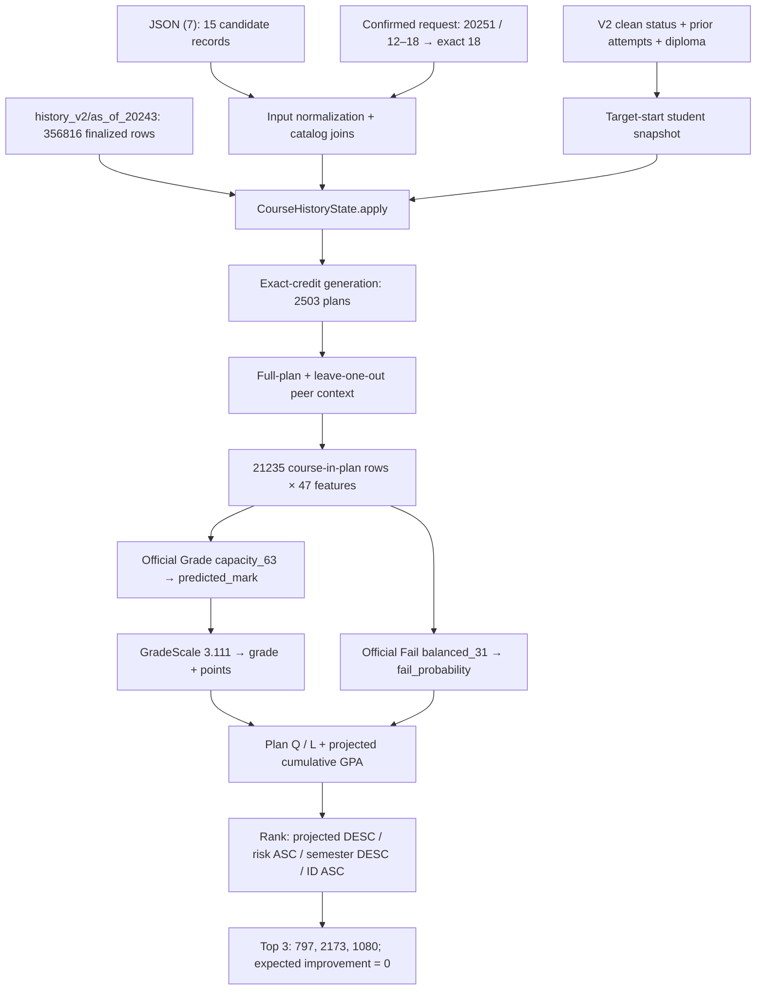

# Recommendation Trace — Student 29485.111

تتبّع عربي تفصيلي للتشغيل الرسمي V2 بتاريخ 2026-09-27. الأرقام التالية ناتجة عن تشغيل واحد حقيقي للطالب المطلوب. مصادر الحساب هي كود الإنتاج الحالي وملفات debug المحفوظة، وليست أرقام trace قديم أو نتائج مودل تجريبي.

## 1. Executive Summary

الطلب المؤكد من المستخدم: `json/exportdata (7).json`، الطالب `29485.111`، الفصل `20251`، مجال الساعات `12–18`. اختير الاختصاص `42.111` من سجل حالة V2 الفريد لهذا الطالب والفصل. المجال يحفظ كمنشأ للطلب، ويشتق منه هدف **18 ساعة بالضبط**.

المسار الرسمي حمّل Grade `capacity_63` الذي يتوقع `final_mark` و Fail `balanced_31`، مع 47 خاصية رسمية، و GradeScale المشترك وتاريخ `history_v2/as_of_20243`. لم يحمّل selected_model الخاص بالتجارب، ولم يستعمل تاريخ الاختصاص التجريبي.

| المؤشر | القيمة الفعلية |
| --- | ---: |
| candidate_count | 15 |
| matching_plan_count | 2,503 |
| scored_plan_count | 2,503 |
| scored course-in-plan rows | 21,235 |
| returned_plan_count | 3 |
| plans_with_expected_improvement | 0 |
| has_expected_improvement | false |
| current_gpa | 3.12 |
| current_gpa_credits | 68 |
| best expected_plan_gpa | 3.041666667 |
| best projected_cumulative_gpa | 3.103604651 |
| status / reason | ok / null |

أفضل ثلاث خطط تشترك في Q=54.75 و L=18، لذلك تتعادل في المعدل الفصلي والتراكمي المتوقعين. الفصل بينها فعليًا يأتي من ساعات الرسوب المتوقعة. لا توجد خطة تتجاوز التراكمي الحالي 3.12، لكن العقد الحالي يعيد أفضل ثلاث خطط مطابقة. انخفاض المعدل المتوقع ليس سببًا لإفراغ النتيجة.

**حدود التفسير:** هذا تشغيل inference للطلب المحدد. لا يثبت أن قائمة التصدير كانت القائمة المتاحة تاريخيًا في بداية 20251، ولا يثبت تحسنًا فعليًا أو دقة خطط لم يسجلها الطالب. لم يُشغّل XML evaluation أو تدريب أو تجربة أو benchmark أو cohort run.


### خريطة التشغيل الفعلي



خصائص الحمل تختلف بين الخطط؛ لذلك generation وplan context يسبقان prediction النهائي. أقسام التقرير التالية تفصل كل وحدة، ولا تعني أرقام عناوينها أن التوقع يسبق generation في كود الإنتاج.

## 2. Source Files Found

| الملف | صفوف | الدور |
| --- | --- | --- |
| [exportdata (7).json](<D:/AI/Real projects/Academic_Advisor_Simple/json/exportdata (7).json>) | 15 | قائمة المرشحين المستخدمة |
| [exportdata (7).xml](<D:/AI/Real projects/Academic_Advisor_Simple/xml/exportdata (7).xml>) | 15 | تصدير غني للتحقق من العلاقة؛ ليس input التشغيل |
| [exportdata (12).json](<D:/AI/Real projects/Academic_Advisor_Simple/json/exportdata (12).json>) | 20 | قائمة أخرى للطالب؛ لم تُشغّل |
| [exportdata (12).xml](<D:/AI/Real projects/Academic_Advisor_Simple/xml/exportdata (12).xml>) | 20 | تصدير غني للتحقق من العلاقة؛ ليس input التشغيل |

بحث `rg -l '29485[.]111' json` وجد الملفين (7) و(12) فقط في مجلد JSON. كلا الملفين يحوي صفوف هذا الطالب وحده وكلها `IS_REQUESTABLE=Y`. مطابقة كل زوج JSON/XML أثبتت المساواة في معرّفات المقررات والساعات والأسماء، دون افتراض تاريخ عملية التصدير أو كيفية إنشائها. لا يوجد ملف status أو metadata مستقل للطالب في هذين JSON؛ هذه المعلومات تأتي من النظام.

XML (7) يضم `END_AGPA_POINTS=3.11` و`GPA_POINTS=0` و`CREDITS_COUNT=170` و`STUDENT_DEGREE_ID=30782.111`. XML (12) يضم `END_AGPA_POINTS=3.08` و`GPA_POINTS=2.93`. **PART_ID فارغ في الزوجين**. هذه القيم لا تعرّف الطلب ولا تؤخذ إلى المصفوفة. `STUDENT_DEGREE_ID` هو معرّف ارتباط الطالب بالاختصاص، وليس `degree_id=42.111` المستخدم لمطابقة الكتالوج.

لم ندمج القائمتين ولم نفسر الثانية تلقائيًا على أنها الفصل 20252. تفاصيل المصدر والبصمات محفوظة في [source_inventory.json](<D:/AI/Real projects/Academic_Advisor_Simple/data/debug/recommendation_trace_29485_111/source_inventory.json>).


## 3. Request Identification

لا يوجد request envelope كامل في الملف (7). هو array من candidate records فقط:

```json
{"STUDENT_ID":29485.111,"COURSE_ID":319.111,"COURSE_CREDITS":2,"IS_REQUESTABLE":"Y","COURSE_NAME_SL":"الصحة السنية العامة وطب الأسنان الوقائي"}
```

القيم المفقودة في المصدر جرى حسمها برسالة المستخدم الصريحة، لا من GPA المنشور في XML:

```json
{"student_id":"29485.111","degree_id":"42.111","target_part":20251,"min_credits":12,"max_credits":18,"target_credits":18,"history_as_of_part":20243,"top_n":3}
```

الطالب والمقررات والساعات والأسماء و requestability تأتي من التصدير. الفصل ومجال الساعات يأتيان من المستخدم. الاختصاص يأتي من حالة الطالب الرسمية للفصل. لقطة البداية والخصائص والسلم والمودلز والتاريخ تأتي من النظام. لا يستنتج adapter الساعات المطلوبة من مجموع قائمة المرشحين.

هذه القيم محفوظة في [request_summary.json](<D:/AI/Real projects/Academic_Advisor_Simple/data/debug/recommendation_trace_29485_111/request_summary.json>). الأمر التالي هو **صيغة CLI مكافئة للتشغيل المنجز**؛ استُدعيت وظائف الإنتاج من wrapper رصد معزول للحصول على intermediate rows، ولم نُعد تشغيل CLI مرة ثانية:

```powershell
.\.venv\Scripts\python.exe -m src.recommend_local --candidates "json/exportdata (7).json" --student-id "29485.111" --degree-id "42.111" --part-id 20251 --history-as-of-part 20243 --min-credits 12 --max-credits 18 --top-n 3 --output-dir "data/debug/NEW_ISOLATED_RUN_DIRECTORY"
```

مجلد النتائج المنجز لا يعاد استخدامه لتشغيل آخر؛ completion marker هو `result.json`.


## 4. Which Official V2 Artifacts Were Loaded

| artifact | path | SHA-256 |
| --- | --- | --- |
| grade_model | [grade_regressor_v2.txt](<D:/AI/Real projects/Academic_Advisor_Simple/models/grade_regressor_v2.txt>) | 3794be06899046e15e854129bdd3a16437f791f3e4b72a7b0a99bf656bdebf8a |
| fail_model | [fail_risk_classifier_v2.txt](<D:/AI/Real projects/Academic_Advisor_Simple/models/fail_risk_classifier_v2.txt>) | 28bd34fb756c7670157a1748a0469e2b066b711d5decb9064fd433190a96d1e2 |
| model_metadata | [model_metadata_v2.json](<D:/AI/Real projects/Academic_Advisor_Simple/models/model_metadata_v2.json>) | 8af46218a697eebc9873349a2a8ae9a2d8488278b56909cd5fc6b4a7ef82c83a |
| category_levels | [category_levels_v2.json](<D:/AI/Real projects/Academic_Advisor_Simple/data/artifacts/category_levels_v2.json>) | 4fb4f3dff5f1d1bf70972ad9d02384a01f73e4689fb514937f2d70eb966982f6 |
| grade_scale | [v_acs_grade.parquet](<D:/AI/Real projects/Academic_Advisor_Simple/data/raw/v_acs_grade.parquet>) | 557e1cb7b03b09d690d639c8d61c50e5e537360d0dec0684e6a283047111aad2 |

ثوابت المسارات هي `GRADE_MODEL_PATH_V2`, `FAIL_MODEL_PATH_V2`, `MODEL_METADATA_PATH_V2`, `CATEGORY_LEVELS_PATH_V2`, و`GRADE_SCALE_PATH` في `src/paths.py`. الـ loader يتحقق من وجود الملفات الخمسة ومن engineering version=2، و target Grade=`final_mark`، وهويات المرشحين الرسمية، والمسارات المعلنة، وقائمة الخصائص وترتيبها في metadata وفي كلا LightGBM headers. الفئات الرسمية يجب أن تحتوي missing/unknown ولا تتكرر.

مودلا Grade و Fail مدرّبان عبر cutoff=20243 بحسب `model_metadata.course_history.initial_history_cutoff`؛ تاريخ إنشاء metadata هو `2026-09-26T11:11:54.102592+00:00`. هذا دليل metadata، وليس تحققًا مستقلًا من كل صف training. history serving يمكن أن يتقدم بعد ذلك من دون إعادة fit للمودل.

السجل الكامل في [provenance.json](<D:/AI/Real projects/Academic_Advisor_Simple/data/debug/recommendation_trace_29485_111/provenance.json>). metadata الرسمية لا تحتوي `dataset_version` صريحًا حاليًا؛ loader يعتبر غيابه V2، مع تحقق المسارات الرسمية وهويات المودلز والعقد. يجب عدم وصف هذا الحقل كأنه موجود في المصدر.


## 5. Which Frozen History Was Selected and Why

### المعنى والمواعيد الأربعة

Frozen History هو **state تجميعي محفوظ لا يتغير أثناء خدمة الطلب**؛ ليس سجل الطالب وحده وليس قائمة المواد المرشحة. يحفظ إحصاءات مقررات من نتائج سابقة نهائية بحسب cutoff واضح. النموذج لا يتعلم من النتائج الجديدة وقت الخدمة؛ نحن نضيف خصائص تاريخية معروفة فقط.

| المفهوم | في هذا الطلب | المعنى |
| --- | --- | --- |
| training cutoff | 20243 | الحد الذي تنسب إليه metadata تدريب المودلين |
| serving cutoff | 20243 | أحدث فصل يدخل aggregate state المختار |
| target semester | 20251 | الفصل الذي نبني له الخطط |
| finalized history | حتى 20243 | نتائج موثقة في bundle كنهائية قبل استخدامها |

اختيار snapshot السابق يأتي من `previous_academic_part`: لأن الهدف ينتهي بـ 1، الفصل السابق هو صيف السنة السابقة: `(2025−1)*10+3=20243`. لا يكفي طرح 1 من 20251 لأن 20250 غير صالح في التقويم. لو كان الهدف 20252 فالسابق 20251؛ ولو 20253 فالسابق 20252. يلزم وجود bundle فعلي مناسب، ولا ينشئ resolver bundle تلقائيًا. التاريخ الأقدم لا يقبل افتراضيًا إلا بتفعيل opt-in خاص للـ backtest؛ لم نفعله.

```text
20251 sees finalized outcomes <= 20243
20252 sees finalized outcomes <= 20251
20252 does NOT see 20252 outcomes
```

### الـ bundle الفعلي المستخدم

| الدليل | القيمة |
| --- | --- |
| directory | [as_of_20243](<D:/AI/Real projects/Academic_Advisor_Simple/data/artifacts/history_v2/as_of_20243>) |
| metadata | [metadata.json](<D:/AI/Real projects/Academic_Advisor_Simple/data/artifacts/history_v2/as_of_20243/metadata.json>) |
| course state | [course_history_state.pkl](<D:/AI/Real projects/Academic_Advisor_Simple/data/artifacts/history_v2/as_of_20243/course_history_state.pkl>) |
| as_of_part / source_max_part / finalized_through_part | 20243 / 20243 / 20243 |
| source_min_part | 20201 |
| source rows | 356816 |
| dataset_version / format_version / engineering version | V2 / 2 / 2 |
| created_at_utc | 2026-09-27T09:32:31.282082+00:00 |
| state SHA-256 | 7df5ad133f816d641d5bf89820b572010350b70270b0739e58af6b90ce4949d4 |
| selected prefix SHA-256 | aefc54601cd9a2b5c22ac0d4830cffd1244bf2b3d55b0e26a9b97e80620c50ae |
| metadata SHA-256 | 6d1dc990b188584d8dbfd070a87109fa174d15e41dcf3078d2cca6c4d8e68538 |

### من أين بُني؟

هذا bundle كان موجودًا قبل المهمة. مصدره `data/features/temporal_train_features_v2.parquet`، SHA-256=`026faac5933709c0903dac1b0ea2ca88be71d55c1bb6f805eb265d0f4cbe204f`. يعيد builder قراءة **9 أعمدة تاريخ فقط**:

```text
student_course_id, part_id, degree_id, course_id, faculty_id,
plan_requirement_type_id, course_credits, attempt_number, final_mark
```

لا يستعمل builder كل الـ features المحسوبة كمداخل aggregate، ولا يستعمل خطة الطالب الحالية أو توقعات المودل. يختار `part_id<=as_of_part`، يشترط المصدر ينتهي عند cutoff نفسه، uniqueness لمعرّف المحاولة، نتائج finite ونهائية، ثم يرتب `part_id,student_course_id` ويمر فصلًا فصلًا عبر `CourseHistoryState.update`. يدعم النموذج الفشل التاريخي كـ`final_mark<50` من العلامة، ولا يحتاج outcome المستقبل.

حالة 20243 تحتوي 356,816 صف مصدر: 15 فصلًا من 20201 إلى 20243. الـ row count ليس عدد مفاتيح state: توجد 2,428 مفاتيح degree×course، و 823 course، و 383 degree×requirement×rounded credits، و 95 faculty×requirement×rounded credits، و 23 requirement×rounded credits.

المحتوى النهائي: خمس جداول مفاتيح وكل منها يحفظ `effective_support,raw_count,mark_sum,fail_sum,attempt_sum,retake_sum`، و global sums، cutoff، `smoothing_k=20` و`min_support=20`. لا يحتوي قائمة طلب الطالب ولا student snapshot ولا plans ولا specialty history رسميًا. الـ student ID ليس مفتاحًا في aggregate state.

حزمة `as_of_20251` الموجودة هي توضيح للمسار التالي فقط: metadata تسجل 391,224 صفًا، أي prefix السابق مع 34,408 نتائج 20251. تأتي من V2 train + V2 test باختيار prefix حتى 20251. لم تُحمّل للتوصية الحالية ولم يُشغّل طلب 20252. توفر ملفات test التي تحوي 20252 لا يعني أن نتائج 20252 دخلت prefix؛ الاختيار الزمني يستبعدها قبل aggregation و fingerprinting.

### لماذا frozen، وكيف يمنع التسرب؟

الحفظ يحجز مجلدًا جديدًا حصريًا، يكتب state ثم metadata completion marker، ويرفض الكتابة فوق أي نسخة سابقة. loader يتحقق من hash قبل فتح state ومن version والقيم الزمنية، ويرفض specialty artifacts في V2. `apply` يرفض أي row هدفه لا يأتي بعد cutoff. لا تستدعي التوصية `update` ولا تضيف predicted outcomes إلى التاريخ. تحققنا من ثبات الجداول والـ global sums داخل التشغيل ومن بصمات الملفات بعده.

أعدنا حساب selected-prefix fingerprint من الأعمدة التسعة ومطابقته مع metadata، وحسبنا source hash الحالي ومطابقته. هذا فحص قراءة؛ لم نبنِ bundle جديدًا. اختيار prefix يستثني النتائج الحالية/المستقبلية، لكن صحة توقيت إعلان الجامعة أن النتائج نهائية ليست قابلة للإثبات من جدول نهائي وحده. `finalized_through_part` شهادة صريحة مسجلة عند بناء الحزمة، لا timestamp للاعتماد الجامعي.

تاريخ الطالب السابق نفسه يحوي 26 محاولة حتى 20242. هذه المحاولات الـ 26 كلها موجودة ضمن prefix الـ bundle، لكن الصفوف المرشحة تستخدم إحصاءات المجموعة لا متوسط الطالب لتلك المقررات. الطالب لا يملك صف 20243 شخصيًا، ومع ذلك cutoff العام الصحيح هو 20243؛ لا نرجعه إلى 20242 لأن آخر فصل مسجل للطالب أقدم.

أدلة قابلة للقراءة: [history_evidence.json](<D:/AI/Real projects/Academic_Advisor_Simple/data/debug/recommendation_trace_29485_111/history_evidence.json>)، [student_history_contribution.parquet](<D:/AI/Real projects/Academic_Advisor_Simple/data/debug/recommendation_trace_29485_111/student_history_contribution.parquet>). كود البناء [`build_frozen_history`](<D:/AI/Real projects/Academic_Advisor_Simple/src/features/frozen_history.py:70>) والتحميل [`load_frozen_history`](<D:/AI/Real projects/Academic_Advisor_Simple/src/features/frozen_history.py:202>) والاختيار [`validate_history_selection`](<D:/AI/Real projects/Academic_Advisor_Simple/src/features/frozen_history.py:48>).


## 6. Input Parsing

**(A) ما يدخل:** candidate array من JSON (7)، مع student_id و degree_id والفصل والساعات المؤكدة خارجه.

**(B) ما يحدث:** قراءة utf-8-sig، array إلى DataFrame، أسماء uppercase إلى snake_case، وتنظيف ID كنص مع الحفاظ على .111؛ اختيار الطالب و IS_REQUESTABLE=Y. credit resolver يستخدم Decimal، ويسجل lower=12 و upper=18؛ enumeration يأخذ upper وحده.

**(C) ما يخرج:** 15 صفًا، 0 صف مصفى، 0 duplicates، لا import errors أو warnings؛ target_credits=18.

**(D) لماذا:** ربط ملف candidates بطلب واضح وبهوية الطالب؛ حماية المفاتيح والسياسة من اختلاف تنسيق التصدير.

**(E) أخطر نقطة:** اعتبار candidate JSON طلبًا كاملًا، أو تحويل معرف عشري إلى عدد صحيح، أو افتراض range مرن يقبل 12..18.
كود المسار: [`load_local_inputs`](<D:/AI/Real projects/Academic_Advisor_Simple/src/recommendation/inputs.py:168>) و[`normalize_candidates`](<D:/AI/Real projects/Academic_Advisor_Simple/src/recommendation/inputs.py:48>).


## 7. Student Snapshot Construction

**(A) ما يدخل:** student_status_v2.parquet (107,939 صفًا كمرجع، 6 صفوف للطالب)، student_course_v2.parquet (456,595 صفًا كمرجع، 41 للطالب)، student_diploma_v2.parquet (32,524 صفًا، صف واحد للطالب).

**(B) ما يحدث:** اختيار حالة فريدة لـ(29485.111,42.111,20251). استخدام start_* من صف الهدف؛ ترتيب التاريخ حتى الهدف وحساب gpa_prev والعدادات المنقولة من total_* التي تصف البداية. gpa_prev_1 من last_enrolled_gpa أو shifted prior GPA، gpa_prev_2 من تاريخ سابق، prior_registered_semesters من reg_total_semesters في الصف السابق. faculty من المحاولات الأقدم في الاختصاص، والدبلوم من مرجع الدبلومات؛ validate_snapshot ينظف IDs.

**(C) ما يخرج:** 22 حقلًا في snapshot: 21 STUDENT_SNAPSHOT_COLUMNS مع part_id. current_gpa=3.12، و C=prior_total_reg_credits=68 دون override.

**(D) لماذا:** تحديد ما كان معروفًا في بداية الهدف بدل نسخ نهاية الفصل أو لقطة أقدم وتسميتها فصلًا جديدًا.

**(E) أخطر نقطة:** end_agpa_points ونتائج الهدف لا يجوز أن تقرر توقعه. read status واسع لكن الصفوف تستخدم cutoff/shift؛ last_enrolled_gpa وتفسير total_* حقول يعتمد عليها عقد المصدر.
| الحقل | القيمة |
| --- | --- |
| student_id | 29485.111 |
| degree_id | 42.111 |
| faculty_id | 3.111 |
| grade_version_id | 3.111 |
| gpa_prev_1 | 2.67 |
| gpa_prev_2 | 3.47 |
| gpa_trend_delta | -0.8 |
| gpa_trend_missing | 0 |
| start_agpa_points | 3.12 |
| start_total_in_courses | 26 |
| start_total_in_credits | 68 |
| prior_total_reg_courses | 26 |
| prior_total_reg_credits | 68 |
| prior_total_fail_courses | 0 |
| prior_total_fail_credits | 0 |
| prior_fail_credit_ratio | 0 |
| prior_registered_semesters | 4 |
| observed_gap_semesters | 0 |
| diploma_gpa | 97.13 |
| diploma_type_id | 15.111 |
| degree_credits_count | 185 |
| part_id | 20251 |

هذه snapshot من الإنتاج الحالي، وحفظت في [student_snapshot.parquet](<D:/AI/Real projects/Academic_Advisor_Simple/data/debug/recommendation_trace_29485_111/student_snapshot.parquet>) و[student_snapshot.json](<D:/AI/Real projects/Academic_Advisor_Simple/data/debug/recommendation_trace_29485_111/student_snapshot.json>). [`build_student_snapshot`](<D:/AI/Real projects/Academic_Advisor_Simple/src/recommendation/inputs.py:125>).


## 8. Candidate Course Preparation

**(A) ما يدخل:** 15 candidate records من JSON، catalog=degree_course_v2.parquet والمفتاح (degree_id,course_id)، ومحاولات الطالب المنظفة الأقدم.

**(B) ما يحدث:** مطابقة one_to_one للكتالوج، والتحقق من الساعات، واستكمال course/requirement type و year/semester order و plan_credits_count. الاسم المرسل له أولوية ثم اسم الكتالوج. attempt_number=max retained prior attempt+1 عبر درجات الطالب؛ لا نتائج target/future. فرز course_id نصيًا بشكل stable.

**(C) ما يخرج:** 15 مادة فريدة، جميعها matched، ولا credit conflicts؛ attempt_number=1 لكل المرشحين. آخر محاولة تاريخية شخصية 20242.

**(D) لماذا:** تجهيز قائمة معتمدة ذات خصائص متسقة مع التدريب قبل بناء combinations.

**(E) أخطر نقطة:** IS_REQUESTABLE=Y تفويض أهلية المصدر، وليس إثباتًا يستنتجه المحرك. لا يعيد فحص prerequisites أو الشُعب والمقاعد وتعارض الوقت. الاختلاف 185 vs170 محفوظ وليس مصححًا تلقائيًا.
| course_id | course_name | course_credits | attempt_number | plan_year_order | plan_semester_order | plan_credits_count |
| --- | --- | --- | --- | --- | --- | --- |
| 1032.111 | طب الأسنان الشرعي | 1 | 1 | 3 | 2 | 170 |
| 308.111 | الإسعافات الأولية | 2 | 1 | 2 | 2 | 170 |
| 309.111 | علم الأدوية | 2 | 1 | 2 | 2 | 170 |
| 310.111 | التغذية | 1 | 1 | 4 | 1 | 170 |
| 311.111 | تدبير الأمراض العامة | 1 | 1 | 3 | 2 | 170 |
| 314.111 | علم الإطباق | 1 | 1 | 2 | 2 | 170 |
| 317.111 | العلوم السلوكية ومهارات التواصل | 2 | 1 | 3 | 2 | 170 |
| 318.111 | مكافحة العدوى | 1 | 1 | 2 | 2 | 170 |
| 319.111 | الصحة السنية العامة وطب الأسنان الوقائي | 2 | 1 | 3 | 1 | 170 |
| 328.111 | علم الأشعة و التصوير في طب الأسنان (2) | 2 | 1 | 3 | 2 | 170 |
| 332.111 | التشريح المرضي الخاص بالفم والأسنان | 4 | 1 | 3 | 2 | 170 |
| 346.111 | تقويم الأسنان (1) | 3 | 1 | 4 | 1 | 170 |
| 350.111 | تعويض الأسنان الثابتة (3) | 3 | 1 | 4 | 2 | 170 |
| 354.111 | تعويض الأسنان المتحركة (2) | 3 | 1 | 3 | 2 | 170 |
| 359.111 | مداواة أسنان ترميمية (2) | 3 | 1 | 3 | 2 | 170 |

الحزمة candidate لا تملك prediction ثابتًا لكل مادة بعد؛ context النهائي يأتي بعد تكوين الخطة. ملفات [candidate_courses.parquet](<D:/AI/Real projects/Academic_Advisor_Simple/data/debug/recommendation_trace_29485_111/candidate_courses.parquet>) و[candidates_with_history.parquet](<D:/AI/Real projects/Academic_Advisor_Simple/data/debug/recommendation_trace_29485_111/candidates_with_history.parquet>).


## 9. Feature Assembly

الـ 47 BASE_FEATURES = **42 numeric +5 categorical**. الربط المنطقي هو student snapshot + candidate catalog/attempt + frozen course history + context لكل خطة، وليس JSON→predict مباشرة.

قبل توليد الخطة تكون خصائص الطالب والمادة والتاريخ جاهزة. بعد توليد الخطة يحسب `compute_plan_context_features(..., group_columns=["plan_id"])` الخصائص الـ 14 المتعلقة بالحمل والـ peers. الصف المقروء في الجدول الآتي هو **المادة 1032.111 داخل plan_id=797**؛ الـ row قبل prediction يملك هذه الخصائص، و X يحولها إلى dtypes الرسمية. IDs المستخدمة لل joins، ومنها student/degree/course/faculty/plan_id، لا تدخل الـ 47.

**(A)** المدخلات: snapshot، candidate+history rows، عضوية الخطة المتولدة. **(B)** تكرار بيانات الطالب على المادة وإضافة calendar، ثم سياق الخطة والـ leave-one-out peers. **(C)** 47 قيمة منظمة للـ X. **(D)** التوقع يتعلم عن طالب ومادة ضمن حمل فصل محدد. **(E)** استخدام قائمة الـ 15 كلها كسياق خطة، أو استعمال نتائج الفصل في context، يغير معنى features.

| # | الخاصية | المجموعة | المصدر | نوع X | قيمة المثال | المعنى |
| --- | --- | --- | --- | --- | --- | --- |
| 1 | gpa_prev_1 | student history / diploma | snapshot | float32 | 2.67 | آخر GPA فصل سابق: 2.67، وليس التراكمي 3.12 |
| 2 | gpa_prev_2 | student history / diploma | snapshot | float32 | 3.47 | GPA السابق لآخر GPA: 3.47 |
| 3 | gpa_trend_delta | student history / diploma | snapshot | float32 | -0.8 | 2.67−3.47=−0.8 |
| 4 | gpa_trend_missing | student history / diploma | snapshot | float32 | 0 | علم غياب فرق الاتجاه |
| 5 | start_agpa_points | student history / diploma | snapshot | float32 | 3.12 | التراكمي المتاح في بداية الفصل |
| 6 | start_total_in_courses | student history / diploma | snapshot | float32 | 26 | عدد المواد الداخلة المحفوظ عند البداية |
| 7 | start_total_in_credits | student history / diploma | snapshot | float32 | 68 | ساعات الداخل المحفوظة عند البداية؛ ليس current semester credits |
| 8 | prior_total_reg_courses | student history / diploma | snapshot | float32 | 26 | إجمالي التسجيلات السابق من total_reg_courses |
| 9 | prior_total_reg_credits | student history / diploma | snapshot | float32 | 68 | إجمالي الساعات المسجلة السابق؛ هو C في serving هنا |
| 10 | prior_total_fail_courses | student history / diploma | snapshot | float32 | 0 | عدد المواد الراسبة السابق |
| 11 | prior_total_fail_credits | student history / diploma | snapshot | float32 | 0 | ساعات الرسوب السابق |
| 12 | prior_fail_credit_ratio | student history / diploma | snapshot | float32 | 0 | prior fail credits / prior registered credits |
| 13 | prior_registered_semesters | student history / diploma | snapshot | float32 | 4 | عدد الفصول من الصف السابق لنفس الطالب والاختصاص |
| 14 | observed_gap_semesters | student history / diploma | snapshot | float32 | 0 | انقطاع ملاحظ في لقطة البداية |
| 15 | diploma_gpa | student history / diploma | snapshot | float32 | 97.13 | 97.13 من مرجع شهادة الطالب |
| 16 | course_credits | course / degree plan | candidate / catalog / prior attempts | float32 | 1 | ساعات هذه المادة؛ لا تجمع credits كل المرشحين كخطة واحدة |
| 17 | attempt_number | course / degree plan | candidate / catalog / prior attempts | float32 | 1 | max attempt السابق+1؛ هنا 1 |
| 18 | plan_year_order | course / degree plan | candidate / catalog / prior attempts | float32 | 3 | سنة المادة داخل الخطة المرجعية |
| 19 | plan_semester_order | course / degree plan | candidate / catalog / prior attempts | float32 | 2 | ترتيب المادة فصليًا في الكتالوج؛ ليس part_semester |
| 20 | plan_credits_count | course / degree plan | candidate / catalog / prior attempts | float32 | 170 | 170 ساعة للخطة المرجعية من كتالوج الاختصاص |
| 21 | degree_credits_count | course / degree plan | target status snapshot | float32 | 185 | 185 من حالة الطالب، مستقل عن plan_credits_count=170 |
| 22 | course_history_avg_mark | course history | CourseHistoryState.apply | float32 | 77.053899007 | متوسط العلامات التاريخي بعد smoothing |
| 23 | course_history_fail_rate | course history | CourseHistoryState.apply | float32 | 0.043021712 | نسبة final_mark<50 تاريخيًا بعد smoothing |
| 24 | course_history_avg_attempt | course history | CourseHistoryState.apply | float32 | 1.081364175 | متوسط attempt_number التاريخي بعد smoothing |
| 25 | course_history_retake_rate | course history | CourseHistoryState.apply | float32 | 0.061894447 | نسبة attempt_number>1 التاريخية بعد smoothing |
| 26 | course_history_effective_support | course history | CourseHistoryState.apply | float32 | 18 | مجموع الأوزان التاريخية؛ ليس عدد الصفوف بالضرورة |
| 27 | course_history_fallback_level | course history | CourseHistoryState.apply | float32 | 1 | أكثر مفتاح متاح تحديدًا؛ 1=degree×course |
| 28 | course_history_missing | course history | CourseHistoryState.apply | float32 | 1 | علم دعم قليل أو fallback واسع؛ لا يعني القيم NaN هنا |
| 29 | plan_course_count | plan context / peers | الخطة المتولدة × التاريخ المجمد | float32 | 9 | عدد مواد الخطة المرشحة نفسها |
| 30 | plan_total_credits | plan context / peers | الخطة المتولدة × التاريخ المجمد | float32 | 18 | مجموع ساعات الخطة؛ 18 لكل الخطط المقيمة |
| 31 | plan_credit_weighted_fail_rate | plan context / peers | الخطة المتولدة × التاريخ المجمد | float32 | 0.064357983 | sum(credit×history_fail_rate)/valid_credits |
| 32 | plan_credit_weighted_avg_mark | plan context / peers | الخطة المتولدة × التاريخ المجمد | float32 | 73.106393255 | sum(credit×history_avg_mark)/valid_credits |
| 33 | plan_credit_weighted_avg_attempt | plan context / peers | الخطة المتولدة × التاريخ المجمد | float32 | 1.104666138 | sum(credit×history_avg_attempt)/valid_credits |
| 34 | plan_difficulty_credit_load | plan context / peers | الخطة المتولدة × التاريخ المجمد | float32 | 1.158443695 | sum(credit×history_fail_rate)؛ قبل prediction |
| 35 | peer_course_count | plan context / peers | الخطة المتولدة × التاريخ المجمد | float32 | 8 | عدد مواد الخطة الأخرى باستثناء المادة الحالية |
| 36 | peer_total_credits | plan context / peers | الخطة المتولدة × التاريخ المجمد | float32 | 17 | 18−ساعات المادة الحالية |
| 37 | peer_credit_weighted_fail_rate | plan context / peers | الخطة المتولدة × التاريخ المجمد | float32 | 0.065613058 | متوسط fail rate التاريخي للمواد الأخرى بالساعات |
| 38 | peer_credit_weighted_avg_mark | plan context / peers | الخطة المتولدة × التاريخ المجمد | float32 | 72.874187034 | متوسط العلامة التاريخي للمواد الأخرى بالساعات |
| 39 | peer_credit_weighted_avg_attempt | plan context / peers | الخطة المتولدة × التاريخ المجمد | float32 | 1.106036841 | متوسط المحاولة التاريخي للمواد الأخرى بالساعات |
| 40 | peer_difficulty_credit_load | plan context / peers | الخطة المتولدة × التاريخ المجمد | float32 | 1.115421983 | حمل صعوبة الخطة بعد طرح مساهمة المادة الحالية |
| 41 | peer_max_fail_rate | plan context / peers | الخطة المتولدة × التاريخ المجمد | float32 | 0.105393002 | أعلى نسبة تاريخية بين المواد الأخرى؛ يعالج ties في maxima |
| 42 | peer_difficulty_missing | plan context / peers | الخطة المتولدة × التاريخ المجمد | float32 | 0 | علم غياب متوسط صعوبة peers |
| 43 | plan_course_type_id | course / degree plan | candidate / catalog / prior attempts | category | 1 | نوع المادة من الكتالوج |
| 44 | plan_requirement_type_id | course / degree plan | candidate / catalog / prior attempts | category | 3 | نوع المتطلب من الكتالوج |
| 45 | diploma_type_id | student history / diploma | snapshot | category | 15.111 | نوع الدبلوم، يُطابق فئات التدريب |
| 46 | grade_version_id | calendar / policy | snapshot | category | 3.111 | نسخة السلم 3.111 من snapshot؛ تحدد تحويل العلامة أيضًا |
| 47 | part_semester | calendar / policy | target_part % 10 | category | 1 | 20251 % 10 = 1؛ سياسة/تقويم categorical |

في plan 797: عدد المواد 9، ساعات الخطة 18، peers للمادة ذات الساعة الواحدة=8 مواد/17 ساعة. متوسط صعوبة الخطة التاريخي=0.064357983، وحمل الصعوبة=1.158443695. هذان **features قبل prediction**، ولا يساويان `expected_failed_credits=0.173434142` الذي يحسب من Fail model بعده.

مصدر assembly: [`AcademicPlanRecommender.prepare_candidates`](<D:/AI/Real projects/Academic_Advisor_Simple/src/recommendation/engine.py:56>) و[`compute_plan_context_features`](<D:/AI/Real projects/Academic_Advisor_Simple/src/features/temporal_features.py:338>). الصفوف العينية [model_ready_sample_rows.parquet](<D:/AI/Real projects/Academic_Advisor_Simple/data/debug/recommendation_trace_29485_111/model_ready_sample_rows.parquet>)؛ المصفوفة التي تحوي الخصائص فقط [model_matrix_sample.parquet](<D:/AI/Real projects/Academic_Advisor_Simple/data/debug/recommendation_trace_29485_111/model_matrix_sample.parquet>).


## 10. Course History Feature Injection

**(A) ما يدخل:** candidate rows بمفاتيح degree/course/faculty/requirement/credits و target_part=20251، و state.as_of_part=20243.

**(B) ما يحدث:** apply يبحث عن مفاتيح fallback 5→1، بحيث المفتاح الأكثر تحديدًا الموجود يكتب فوق الأوسع. المتوسط لكل مقياس يحسب (local weighted sum +20×global mean)/(local effective support+20). المتاح يحدد اختيار المفتاح حتى إذا كان support قليلًا؛ min_support لا يمنع اختياره، بل يرفع missing flag.

**(C) ما يخرج:** سبعة course_history columns. كل الـ 15 يستخدم level=1؛ بعض الدعم قليل ويرفع course_history_missing=1، مع قيم smoothed finite.

**(D) لماذا:** تعريف صعوبة المادة من نتائج سابقة، وتقليل ضوضاء المجموعات الصغيرة مع fallback للمقررات غير المدعومة محليًا.

**(E) أخطر نقطة:** الخلط بين raw_count و effective_support؛ أو اعتبار min_support عتبة إسقاط للمادة؛ أو إعادة update بنتائج الهدف.


| level | المفتاح |
| --- | --- |
| 1 | degree_id × course_id |
| 2 | course_id |
| 3 | degree_id × requirement type × rounded credits |
| 4 | faculty_id × requirement type × rounded credits |
| 5 | requirement type × rounded credits |
| 6 | global prior فقط |

الأوزان: 0.25 قبل 2022 و 1.0 ابتداءً من 2022؛ sum(mark×weight)، sum((mark<50)×weight)، sum(attempt×weight)، sum((attempt>1)×weight). rounded credits داخل مفتاح fallback تعريف إحصائي في التدريب؛ سياسة مطابقة ساعات الخطة تبقى exact ولا تستخدم هذا rounding.

مثال المادة `1032.111`، المفتاح `42.111||1032.111`:

| sum | القيمة |
| --- | --- |
| effective_support | 18 |
| raw_count | 18 |
| mark_sum | 1502 |
| fail_sum | 0 |
| attempt_sum | 18 |
| retake_sum | 0 |

الـ global mean mark = 18,433,972 / 258,532.25 = 71.302408113495. ومنه:

```text
smoothed mark = (1502.0 +20×71.302408113495)/(18.0+20)
              = 77.053899007102
smoothed fail = (0.0 +20×0.081741252784)/(18+20)
              = 0.043021711991
```

الدعم18<20، لذلك `missing=1` حتى مع level1 وقيم موجودة. هذه خصائص مجموعة المادة، وليست درجات الطالب على المادة. الـsmoothing يربطها بprior عام من نفس prefix الآمن. كود الإنتاج [`CourseHistoryState.apply`](<D:/AI/Real projects/Academic_Advisor_Simple/src/features/temporal_features.py:149>). التفاصيل لكل الـ15 في [course_history_math.json](<D:/AI/Real projects/Academic_Advisor_Simple/data/debug/recommendation_trace_29485_111/course_history_math.json>).

| course_id | course_history_avg_mark | course_history_fail_rate | course_history_avg_attempt | course_history_retake_rate | course_history_effective_support | course_history_fallback_level | course_history_missing |
| --- | --- | --- | --- | --- | --- | --- | --- |
| 1032.111 | 77.053899007 | 0.043021712 | 1.081364175 | 0.061894447 | 18 | 1 | 1 |
| 308.111 | 73.477664035 | 0.025151155 | 1.047566748 | 0.036184446 | 45 | 1 | 0 |
| 309.111 | 71.797354604 | 0.0574047 | 1.030765704 | 0.025202925 | 113 | 1 | 0 |
| 310.111 | 71.317056902 | 0.043021712 | 1.081364175 | 0.061894447 | 18 | 1 | 1 |
| 311.111 | 76.358862938 | 0.058386609 | 1.110422809 | 0.083999606 | 8 | 1 | 1 |
| 314.111 | 77.942215168 | 0.015872088 | 1.030017851 | 0.022834844 | 83 | 1 | 0 |
| 317.111 | 79.244544926 | 0.044184461 | 1.083563206 | 0.063567269 | 17 | 1 | 1 |
| 318.111 | 75.90368274 | 0.083152415 | 1.040294538 | 0.036090846 | 156 | 1 | 0 |
| 319.111 | 69.684007376 | 0.119764775 | 1.14053812 | 0.106908589 | 2 | 1 | 1 |
| 328.111 | 72.201926491 | 0.105393002 | 1.123673546 | 0.094079559 | 5 | 1 | 1 |
| 332.111 | 72.54764374 | 0.07431023 | 1.14053812 | 0.106908589 | 2 | 1 | 1 |
| 346.111 | 72.262963577 | 0.07107935 | 1.134427767 | 0.10226039 | 3 | 1 | 1 |
| 350.111 | 71.478483918 | 0.077848812 | 1.147230411 | 0.111999475 | 1 | 1 | 1 |
| 354.111 | 71.157755071 | 0.051088283 | 1.096619957 | 0.073499655 | 12 | 1 | 1 |
| 359.111 | 65.480170047 | 0.117392189 | 1.106079972 | 0.090666437 | 28 | 1 | 0 |


## 11. Model Matrix and Feature Contract

**(A) ما يدخل:** صف لكل (plan_id,course_id)، category_levels_v2.json و ordered BASE_FEATURES.

**(B) ما يحدث:** numeric إلى float32 عبر to_numeric(errors=coerce)، و categorical إلى strings. null→__MISSING__؛ قيمة غير معروفة→__UNKNOWN__؛ إنشاء pandas.Categorical بمستويات التدريب وبترتيبها. X=matrix[BASE_FEATURES] تحديدًا.

**(C) ما يخرج:** دفعتان: X الأولى 17,201×47 لـ 2,000 خطة، والثانية 4,034×47 لـ 503 خطط. المجموع 21,235 course-in-plan rows، وهو ليس 15 candidate rows فقط.

**(D) لماذا:** منع تغير ترتيب الأعمدة أو رموز category أو إدخال outcome/ID في المودل.

**(E) أخطر نقطة:** تعلم categories جديدة عند serving أو إدخال ترتيب مختلف يعطي معنى مختلفًا للمودل. numeric coercion قد ينتج NaN، ولا يساوي fabricated zero.
رصدنا نفس object identity للـX المستخدم في Grade وFail داخل كل batch. sample matrix المحفوظة أعيد بناؤها **دون predict** من الصفوف الملتقطة باستخدام نفس prepare_model_matrix؛ actual prediction call log يثبت columns وidentity. لا unknown/missing category في sample المختارة: {"unknown": {"plan_course_type_id": 0, "plan_requirement_type_id": 0, "diploma_type_id": 0, "grade_version_id": 0, "part_semester": 0}, "missing": {"plan_course_type_id": 0, "plan_requirement_type_id": 0, "diploma_type_id": 0, "grade_version_id": 0, "part_semester": 0}}. لا تحتوي X `final_mark,points,is_fail,gpa_points,end_agpa_points` أو IDs. [`prepare_model_matrix`](<D:/AI/Real projects/Academic_Advisor_Simple/src/features/feature_contract.py:138>).


## 12. Grade Prediction

**(A) ما يدخل:** X من 47 خاصية، grade_regressor_v2.txt (`capacity_63`، LightGBM regression).

**(B) ما يحدث:** grade_model.predict(X,num_threads=4) ثم فحص finite ثم clip إلى[0,100]. الـ target الرسمي final_mark وليس points؛ الوحدة علامة من 100.

**(C) ما يخرج:** predicted_mark لكل مادة داخل خطة. القيم الفعلية الخام في هذا التشغيل بين 76.866439437 و 86.905831709؛ لم تتجاوز حدود clip.

**(D) لماذا:** توقع مستوى أداء الطالب على المادة في سياق الخطة، ثم تحويله بالسلم المناسب قبل التجميع.

**(E) أخطر نقطة:** الخلط بين مودل العلامة و Direct Points التجريبي، أو تقريب العلامة قبل GradeScale، أو التعامل مع prediction كمعلومة نتيجة نهائية.
فعلًا score_rows يحسب marks ثم failures على نفس X، يفحصهما finite، ثم يعيّن clipped marks ويحوّلها ويعيّن clipped fail. ترتيب التقرير يشرح المخرجات المعنوية؛ الـFail predict call يسبق GradeScale assignment داخل الدالة. [`AcademicPlanRecommender.score_rows`](<D:/AI/Real projects/Academic_Advisor_Simple/src/recommendation/engine.py:85>).


## 13. GradeScale Conversion

**(A) ما يدخل:** predicted_mark بعد clip و grade_version_id=3.111 من snapshot، وجدول v_acs_grade.parquet المشترك.

**(B) ما يحدث:** GradeScale.from_parquet يحتفظ pass bands finish_status=P. convert يبدأ بـ F/0، ينتقي سلم النسخة، ويرتب from_percent، ثم searchsorted(side=right)−1 لاختيار أعلى lower threshold<=mark.

**(C) ما يخرج:** expected_grade و expected_points لكل row. مثال 84.966999908→B→3.0، و 85.012567822→B+→3.25.

**(D) لماذا:** جعل GPA المتوقع من نقاط المؤسسة المناسبة للنسخة، بدل جمع علامات من 100.

**(E) أخطر نقطة:** التحويل step function؛ التقريب لعدد صحيح قبل conversion يغيّر النتيجة قرب 85. التنفيذ يعتمد from_percent، وليس اختبار to_percent الأعلى.
| grade_version_id | from_percent | to_percent | grade_show | points |
| --- | --- | --- | --- | --- |
| 3.111 | 50 | 54 | D | 1.5 |
| 3.111 | 55 | 59 | D+ | 1.75 |
| 3.111 | 60 | 64 | C- | 2 |
| 3.111 | 65 | 69 | C | 2.25 |
| 3.111 | 70 | 74 | C+ | 2.5 |
| 3.111 | 75 | 79 | B- | 2.75 |
| 3.111 | 80 | 84 | B | 3 |
| 3.111 | 85 | 89 | B+ | 3.25 |
| 3.111 | 90 | 94 | A- | 3.5 |
| 3.111 | 95 | 97 | A | 3.75 |
| 3.111 | 98 | 100 | A+ | 4 |

حدود التنفيذ المستمرة هي [50,55)، [55,60)، ... [80,85)، [85,90)، إلى 98+؛ عمود to_percent في المصدر لا يُستخدم للبحث. لذلك 84.966999 ليست F بسبب أن to_percent=84، ولا B+ بسبب تقريبها إلى 85. below50→F/0.

اسم `expected_points` في النظام هو **نقاط السلم عند العلامة المتوقعة**. رياضيًا هذا تحويل point estimate، وليس تكامل E[points] على توزيع درجات، ولا mean mark /25. لا يضرب النظام expected_points في (1−fail_probability). الـ Fail model يدخل مقياس الخطر منفصلًا.

نسخة مفقودة/غير معروفة للسلم تترك القيمة الافتراضية F/0 في التنفيذ الحالي؛ قد تختلط بفشل حقيقي رغم finite validation. نسخة3.111 في هذا الطلب موجودة ومثبتة في الجدول، لذلك لم يقع هذا الاحتمال. مراجعة القراءة فقط لا تصلح المنطق ولا تغيره. [`GradeScale.convert`](<D:/AI/Real projects/Academic_Advisor_Simple/src/grade_scale.py:16>).


## 14. Fail Prediction

**(A) ما يدخل:** نفس X بالهوية والأعمدة المستخدمة في Grade، ومودل fail_risk_classifier_v2.txt (`balanced_31`).

**(B) ما يحدث:** predict يعيد probability للهدف training `(final_mark<50).astype(int)`؛ فحص finite ثم clip إلى[0,1]. لا يأخذ predicted_mark كميزة جديدة.

**(C) ما يخرج:** fail_probability لكل course-in-plan row. قيم الخام في batch log ضمن[0,1]؛ مثال مادة 1032.111=0.008131930704.

**(D) لماذا:** تقدير مخاطر الفشل وإظهارها وتجميع expected_failed_credits لكسر التعادل بين الخطط.

**(E) أخطر نقطة:** المخاطرة ليست فشلًا مؤكدًا أو شرط استبعاد أو توقع grade منفصلًا. ليس تاريخ fail_rate هو fail_probability؛ الأول feature من نتائج سابقة والثاني prediction.

أمثلة من **plan797 نفسه**؛ الحقول مرتبطة بهذا السياق ولا تمثل رقمًا ثابتًا للمقرر في كل الخطط:

| course_id | course_name | course_credits | predicted_mark | expected_grade | expected_points | fail_probability |
| --- | --- | --- | --- | --- | --- | --- |
| 1032.111 | طب الأسنان الشرعي | 1 | 84.966999908 | B | 3 | 0.008131931 |
| 309.111 | علم الأدوية | 2 | 80.804616448 | B | 3 | 0.007999121 |
| 310.111 | التغذية | 1 | 81.073175664 | B | 3 | 0.008436495 |
| 311.111 | تدبير الأمراض العامة | 1 | 85.012567822 | B+ | 3.25 | 0.00848802 |
| 317.111 | العلوم السلوكية ومهارات التواصل | 2 | 86.905831709 | B+ | 3.25 | 0.007804514 |


## 15. Plan Generation

**(A) ما يدخل:** 15 candidate rows مرتبة و Decimal target18، قبل prediction النهائي.

**(B) ما يحدث:** DFS inclusion/exclusion لكل مقرر، دون فرض عدد مواد. يحول credits و target من Decimal(str(value)) إلى integer units بمقياس مشترك. suffix sums تدعم pruning إذا total>18 أو total+remaining<18. terminal subset تقبل حين total==18 و total>0.

**(C) ما يخرج:** 2,503 تركيبة مطابقة من أصل 2^15=32,768 subsets محتملة. course_count يتراوح 6..11. كل تركيب ينتج rows مكررة للمواد مع plan_id للتقييم.

**(D) لماذا:** تحديد خطط feasible وفق سياسة الساعات المعتمدة قبل حساب توقعات تعتمد على سياق الخطة.

**(E) أخطر نقطة:** تقييم المواد مرة واحدة بمعزل عن combinations ثم جمعها، أو قبول 15/17 لأنها داخل range، يختلف عن الكود الحالي.
| course_count | plan_count |
| --- | --- |
| 6 | 5 |
| 7 | 250 |
| 8 | 1020 |
| 9 | 989 |
| 10 | 235 |
| 11 | 4 |

أمثلة subsets مستقلة من candidates الفعلية؛ accepted هنا يعني تطابق الساعات، وليس top3:

| المقررات | الساعات | القرار |
| --- | --- | --- |
| 308.111, 332.111, 346.111, 350.111 | 12 | مرفوض: لا يساوي 18 |
| 308.111, 332.111, 346.111, 350.111, 354.111 | 15 | مرفوض: لا يساوي 18 |
| 1032.111, 332.111, 346.111, 350.111, 354.111, 359.111 | 17 | مرفوض: لا يساوي 18 |
| 308.111, 332.111, 346.111, 350.111, 354.111, 359.111 | 18 | مطابق للهدف |

الإحصاء المستقل وجد 2,175 subsets من 12 ساعة، و 2,877 من 15، و 2,745 من 17؛ كلها خارج مجموعة الخطط المقيمة لهذا الطلب. لا يُحسب model prediction لها ولا يحدث fallback إليها.

لا يوجد rejection إضافي للخطط هنا بسبب GPA أو المخاطر أو prerequisites. input validation قد يوقف الطلب قبل generation عند credits conflict أو duplicate متعارض أو مقرر خارج الكتالوج أو فصل مختلف. أمثلة invalid history اختبرناها ورفضت قبل scoring. لا توجد حالة فعلية ثانية مرفوضة لسبب آخر بين الـ 2,503 ويجب عدم اختراعها.

المواد ذات 0 credits اختيارية إن وجدت حتى بعد بلوغ 18، لذلك يؤثر وجودها على course_count/context دون Q/L. لا توجد مادة صفرية في هذا الطلب. مطابقة الساعات لا تستخدم floating epsilon أو rounding؛ decimal integer scaling يحفظ fractional credits أيضًا.

إذا لم توجد أي combination مطابقة: لا enters scoring loop، status=`no_matching_credit_plan`، reason يذكر target، matching/scored/returned=0 وrecommendations=[]. هذا فرع كود واختبارات صناعية؛ **ليس نتيجة الطالب الحالية**. [`enumerate_plan_indices`](<D:/AI/Real projects/Academic_Advisor_Simple/src/recommendation/plan_generation.py:22>).


## 16. Plan Scoring

**(A) ما يدخل:** scored course rows لكل plan_id، و G=3.12، C=68 من snapshot.prior_total_reg_credits.

**(B) ما يحدث:** لكل مادة quality=credits×expected_points و failed=credits×fail_probability. تجمع حسب plan_id للحصول على Q و L وعدد المواد والخطر، ثم حساب GPA الفصلي والتراكمي.

**(C) ما يخرج:** summary من 11 عمودًا لكل خطة، يشمل التحسن والتكرار والمخاطرة.

**(D) لماذا:** تقييم أثر الخطة على الرصيد السابق بدل الترتيب على معدل الفصل وحده.

**(E) أخطر نقطة:** اعتبار المعدل الفصلي 3.041667 هو التراكمي؛ أو استخدام عدد المواد بدل الساعات؛ أو افتراض policy لاستبدال محاولات الإعادة.


```text
Q = Σ(course_credits × expected_points)
L = Σ(course_credits)
expected_plan_gpa = Q / L
projected_cumulative_gpa = (G×C + Q) / (C+L)
expected_failed_credits = Σ(course_credits × fail_probability)
```

بالخطة 797: G=3.12 التراكمي الحالي، C=68 رصيد الساعات السابق، Q=54.75 مجموع quality points المتوقع للخطة، L=18 ساعات الخطة.

```text
G×C = 3.12×68 = 212.16
expected_plan_gpa = 54.75/18 = 3.041666666667
projected_cumulative_gpa = (212.16+54.75)/(68+18)
                         = 266.91/86 = 3.103604651163
expected_cumulative_gpa_gain = 3.103604651163−3.12 = −0.016395348837
is_expected_cumulative_improvement = false
```

وزن المواد بالساعات فعليًا في أفضل خطة:

| course_id | course_credits | expected_points | quality | fail_probability | failed |
| --- | --- | --- | --- | --- | --- |
| 1032.111 | 1 | 3 | 3 | 0.008131931 | 0.008131931 |
| 309.111 | 2 | 3 | 6 | 0.007999121 | 0.015998241 |
| 310.111 | 1 | 3 | 3 | 0.008436495 | 0.008436495 |
| 311.111 | 1 | 3.25 | 3.25 | 0.00848802 | 0.00848802 |
| 317.111 | 2 | 3.25 | 6.5 | 0.007804514 | 0.015609029 |
| 328.111 | 2 | 3 | 6 | 0.014076686 | 0.028153372 |
| 346.111 | 3 | 3 | 9 | 0.010233879 | 0.030701637 |
| 350.111 | 3 | 3 | 9 | 0.010737537 | 0.032212611 |
| 354.111 | 3 | 3 | 9 | 0.008567602 | 0.025702806 |

Q=54.75. expected_failed_credits=0.173434142333؛ هذا مجموع ساعات×احتمال وليس عدد مواد متوقعًا ولا شرطًا يتطلب independence بين المقررات لجمع التوقعات.

`is_expected_cumulative_improvement` مقارنة strict `projected>G`، لا ≥. `has_expected_improvement` في metadata يعني وجود أي خطة تحسن بين جميع الخطط، و plans_with_expected_improvement يعدّها. `projected_gpa_requires_repeat_policy`=any(attempt_number>1) داخل الخطة؛ جميع مرشحي هذه الحالة attempt1، لذلك كل flags false. الكشف محافظ لأنه يرى المحاولات السابقة المنظفة المحفوظة فقط.

projection الحالي additive دون replacement للإعادات. كما أن C هنا رصيد التسجيل السابق من عقد المصدر، وليس تحققًا مستقلًا من كل ساعات المقام الرسمية لدى الجامعة. أرقام GPA المعروضة في المصدر قد تكون مدورة؛ الحساب يطبق قيم snapshot كما هي. `gpa_gain` القديم يبقى gap فصلي=3.041666667−3.12، وليس objective الترتيب.

كود الإنتاج [`summarize_scored_plans`](<D:/AI/Real projects/Academic_Advisor_Simple/src/recommendation/plan_scoring.py:43>).


## 17. Plan Ranking

**(A) ما يدخل:** summary لجميع 2,503 خطط feasible.

**(B) ما يحدث:** فرز stable بالمفاتيح الأربعة: projected_cumulative_gpa DESC، expected_failed_credits ASC، expected_plan_gpa DESC، plan_id ASC. top_n=3. اختيار top لكل batch ثم جمع summaries وترتيبها نهائيًا.

**(C) ما يخرج:** جميع summaries مرتبة، و best3 مع تفاصيل مقرراتها. plan_id هو هوية enumeration من 0، وليس rank.

**(D) لماذا:** إعطاء ترتيب محدد قابل للتفسير؛ المخاطرة تكسر التعادل دون إسقاط الخطط.

**(E) أخطر نقطة:** تقريب projected GPA أثناء sorting أو اعتبار plan_id الأصغر دائمًا أفضل؛ النتائج تحفظ full precision وتعرض تقريبًا فقط.
| plan_id | course_count | total_credits | expected_quality_points | expected_plan_gpa | projected_cumulative_gpa | expected_failed_credits | is_expected_cumulative_improvement |
| --- | --- | --- | --- | --- | --- | --- | --- |
| 797 | 9 | 18 | 54.75 | 3.041666667 | 3.103604651 | 0.173434142 | false |
| 2173 | 9 | 18 | 54.75 | 3.041666667 | 3.103604651 | 0.174463725 | false |
| 1080 | 10 | 18 | 54.75 | 3.041666667 | 3.103604651 | 0.174751484 | false |
| 2223 | 7 | 18 | 54.75 | 3.041666667 | 3.103604651 | 0.175146164 | false |
| 914 | 9 | 18 | 54.75 | 3.041666667 | 3.103604651 | 0.175204696 | false |

شرح ترتيب الخمس الأولى بالتحديد:

1. 797 فوق 2173: التراكمي والمعدل الفصلي و Q/L متطابقة؛0.173434142<0.174463725 من ساعات الرسوب المتوقعة.
2. 2173 فوق 1080: نفس التعادل؛0.174463725<0.174751484.
3. 1080 فوق 2223: نفس التعادل؛0.174751484<0.175146164.
4. 2223 فوق 914: نفس التعادل؛0.175146164<0.175204696.

كل الخمس Q=54.75،L=18. اختلاف عدد المواد 7/9/10 لا يقرر ترتيبها مباشرة. المتوقع بالنقاط stepwise يجعل ties شائعة، لذلك criterion2 ظاهر بوضوح في هذا الطالب. criteria3 و 4 لم يحتاجا لكسر تعادل الخمس الأولى. لو تعادلت كل المفاتيح الثلاثة، plan_id ASC يجعل النتيجة deterministic. لا claim أن الفرق الصغير في probability يمثل فرقًا عمليًا كبيرًا أو calibrated guarantee.

كود الفرز [`rank_plans`](<D:/AI/Real projects/Academic_Advisor_Simple/src/recommendation/plan_scoring.py:20>).


## 18. Top 3 Output

| rank | plan_id | course_count | المقررات | expected_plan_gpa | projected_cumulative_gpa | expected_failed_credits |
| --- | --- | --- | --- | --- | --- | --- |
| 1 | 797 | 9 | 1032.111, 309.111, 310.111, 311.111, 317.111, 328.111, 346.111, 350.111, 354.111 | 3.041666667 | 3.103604651 | 0.173434142 |
| 2 | 2173 | 9 | 309.111, 311.111, 314.111, 317.111, 318.111, 328.111, 346.111, 350.111, 354.111 | 3.041666667 | 3.103604651 | 0.174463725 |
| 3 | 1080 | 10 | 1032.111, 310.111, 311.111, 314.111, 317.111, 318.111, 328.111, 346.111, 350.111, 354.111 | 3.041666667 | 3.103604651 | 0.174751484 |

كل خطة 18 ساعة؛ لا تحسن متوقعًا في أي منها. plan_id797 و 2173 لهما 9 مواد، و 1080 له 10 مواد. تفاصيل كل مقرر في الخطط الثلاث:

### Rank 1 — plan 797

| course_id | course_name | course_credits | predicted_mark | expected_grade | expected_points | fail_probability |
| --- | --- | --- | --- | --- | --- | --- |
| 1032.111 | طب الأسنان الشرعي | 1 | 84.966999908 | B | 3 | 0.008131931 |
| 309.111 | علم الأدوية | 2 | 80.804616448 | B | 3 | 0.007999121 |
| 310.111 | التغذية | 1 | 81.073175664 | B | 3 | 0.008436495 |
| 311.111 | تدبير الأمراض العامة | 1 | 85.012567822 | B+ | 3.25 | 0.00848802 |
| 317.111 | العلوم السلوكية ومهارات التواصل | 2 | 86.905831709 | B+ | 3.25 | 0.007804514 |
| 328.111 | علم الأشعة و التصوير في طب الأسنان (2) | 2 | 81.60916769 | B | 3 | 0.014076686 |
| 346.111 | تقويم الأسنان (1) | 3 | 81.57495053 | B | 3 | 0.010233879 |
| 350.111 | تعويض الأسنان الثابتة (3) | 3 | 81.237485718 | B | 3 | 0.010737537 |
| 354.111 | تعويض الأسنان المتحركة (2) | 3 | 81.043345564 | B | 3 | 0.008567602 |

### Rank 2 — plan 2173

| course_id | course_name | course_credits | predicted_mark | expected_grade | expected_points | fail_probability |
| --- | --- | --- | --- | --- | --- | --- |
| 309.111 | علم الأدوية | 2 | 80.804616448 | B | 3 | 0.007999121 |
| 311.111 | تدبير الأمراض العامة | 1 | 85.012567822 | B+ | 3.25 | 0.008595964 |
| 314.111 | علم الإطباق | 1 | 83.147612905 | B | 3 | 0.006744084 |
| 317.111 | العلوم السلوكية ومهارات التواصل | 2 | 86.905831709 | B+ | 3.25 | 0.007804514 |
| 318.111 | مكافحة العدوى | 1 | 81.845193214 | B | 3 | 0.010360101 |
| 328.111 | علم الأشعة و التصوير في طب الأسنان (2) | 2 | 81.60916769 | B | 3 | 0.014076686 |
| 346.111 | تقويم الأسنان (1) | 3 | 81.57495053 | B | 3 | 0.010233879 |
| 350.111 | تعويض الأسنان الثابتة (3) | 3 | 81.237485718 | B | 3 | 0.010866164 |
| 354.111 | تعويض الأسنان المتحركة (2) | 3 | 81.043345564 | B | 3 | 0.008567602 |

### Rank 3 — plan 1080

| course_id | course_name | course_credits | predicted_mark | expected_grade | expected_points | fail_probability |
| --- | --- | --- | --- | --- | --- | --- |
| 1032.111 | طب الأسنان الشرعي | 1 | 84.966999908 | B | 3 | 0.008235384 |
| 310.111 | التغذية | 1 | 81.073175664 | B | 3 | 0.008436495 |
| 311.111 | تدبير الأمراض العامة | 1 | 85.012567822 | B+ | 3.25 | 0.008595964 |
| 314.111 | علم الإطباق | 1 | 83.147612905 | B | 3 | 0.006744084 |
| 317.111 | العلوم السلوكية ومهارات التواصل | 2 | 86.905831709 | B+ | 3.25 | 0.007804514 |
| 318.111 | مكافحة العدوى | 1 | 81.845193214 | B | 3 | 0.010360101 |
| 328.111 | علم الأشعة و التصوير في طب الأسنان (2) | 2 | 81.60916769 | B | 3 | 0.014076686 |
| 346.111 | تقويم الأسنان (1) | 3 | 81.57495053 | B | 3 | 0.010233879 |
| 350.111 | تعويض الأسنان الثابتة (3) | 3 | 81.237485718 | B | 3 | 0.010737537 |
| 354.111 | تعويض الأسنان المتحركة (2) | 3 | 81.043345564 | B | 3 | 0.008567602 |

### Schema الفعلي

metadata/result يحفظ identity/version/artifact provenance/history/training، request credits والسياسة، G/C ومصدر C، target/cutoff والتحقق الزمني، status/reason، العدادات، best metrics، top_n/batch/elapsed/created_at، files، و recommendations. لا توجد توصية استبعاد تلقائي بناءً على تحسن GPA.

| حقل counts | المعنى | القيمة |
| --- | --- | ---: |
| candidate_count | عدد المقررات الفريدة بعد adapter | 15 |
| matching_plan_count | عدد التركيبات المطابقة التي دخلت loop | 2503 |
| scored_plan_count | عدد summaries المقيمة بنجاح | 2503 |
| returned_plan_count | عدد الخطط المرسلة في recommendations | 3 |
| plans_with_expected_improvement | عدد الخطط التي projected>G ضمن جميع المقيمة | 0 |
| has_expected_improvement | هل العدد السابق>0؟ | false |
| accepted_plan_count | alias توافق قديم لكل feasible scored؛ لا يعني improved | 2503 |

per-plan fields: `plan_id,course_count,total_credits,expected_quality_points,expected_plan_gpa,projected_cumulative_gpa,expected_cumulative_gpa_gain,is_expected_cumulative_improvement,expected_failed_credits,projected_gpa_requires_repeat_policy,gpa_gain`، ويضاف في returned package `rank,courses`.

per-course fields: `plan_id,course_id,course_name,course_credits,predicted_mark,expected_points,expected_grade,fail_probability`.

status لهذه الحالة=`ok`, reason=null. package الرسمي المكتمل في [result.json](<D:/AI/Real projects/Academic_Advisor_Simple/data/debug/recommendation_trace_29485_111/result.json>). قوائم top3 في [top3_plans.parquet](<D:/AI/Real projects/Academic_Advisor_Simple/data/debug/recommendation_trace_29485_111/top3_plans.parquet>).


## 19. Important Intermediate Tables

كل الملفات التالية معزولة داخل `data/debug/recommendation_trace_29485_111/`؛ بيانات الطالب محلية في المسار المهمل في Git، ولا توجد commit أو نشر خارجي.

| الملف | صفوف | bytes |
| --- | --- | --- |
| [candidate_courses.parquet](<D:/AI/Real projects/Academic_Advisor_Simple/data/debug/recommendation_trace_29485_111/candidate_courses.parquet>) | 15 | 6795 |
| [candidates_with_history.parquet](<D:/AI/Real projects/Academic_Advisor_Simple/data/debug/recommendation_trace_29485_111/candidates_with_history.parquet>) | 15 | 26629 |
| [course_history_math.json](<D:/AI/Real projects/Academic_Advisor_Simple/data/debug/recommendation_trace_29485_111/course_history_math.json>) | object/list | 13849 |
| [courses.parquet](<D:/AI/Real projects/Academic_Advisor_Simple/data/debug/recommendation_trace_29485_111/courses.parquet>) | 21235 | 61867 |
| [generated_plans.parquet](<D:/AI/Real projects/Academic_Advisor_Simple/data/debug/recommendation_trace_29485_111/generated_plans.parquet>) | 2503 | 28386 |
| [grade_scale_bands.parquet](<D:/AI/Real projects/Academic_Advisor_Simple/data/debug/recommendation_trace_29485_111/grade_scale_bands.parquet>) | 11 | 7221 |
| [history_evidence.json](<D:/AI/Real projects/Academic_Advisor_Simple/data/debug/recommendation_trace_29485_111/history_evidence.json>) | object/list | 1086 |
| [history_metadata.json](<D:/AI/Real projects/Academic_Advisor_Simple/data/debug/recommendation_trace_29485_111/history_metadata.json>) | object/list | 1380 |
| [import_report.json](<D:/AI/Real projects/Academic_Advisor_Simple/data/debug/recommendation_trace_29485_111/import_report.json>) | object/list | 288 |
| [model_feature_contract.json](<D:/AI/Real projects/Academic_Advisor_Simple/data/debug/recommendation_trace_29485_111/model_feature_contract.json>) | object/list | 5275 |
| [model_matrix_sample.parquet](<D:/AI/Real projects/Academic_Advisor_Simple/data/debug/recommendation_trace_29485_111/model_matrix_sample.parquet>) | 55 | 33042 |
| [model_ready_sample_rows.parquet](<D:/AI/Real projects/Academic_Advisor_Simple/data/debug/recommendation_trace_29485_111/model_ready_sample_rows.parquet>) | 55 | 42162 |
| [plans.parquet](<D:/AI/Real projects/Academic_Advisor_Simple/data/debug/recommendation_trace_29485_111/plans.parquet>) | 2503 | 46819 |
| [prediction_calls.json](<D:/AI/Real projects/Academic_Advisor_Simple/data/debug/recommendation_trace_29485_111/prediction_calls.json>) | object/list | 6919 |
| [protected_after_sha256.json](<D:/AI/Real projects/Academic_Advisor_Simple/data/debug/recommendation_trace_29485_111/protected_after_sha256.json>) | object/list | 18227 |
| [protected_before_sha256.json](<D:/AI/Real projects/Academic_Advisor_Simple/data/debug/recommendation_trace_29485_111/protected_before_sha256.json>) | object/list | 18227 |
| [provenance.json](<D:/AI/Real projects/Academic_Advisor_Simple/data/debug/recommendation_trace_29485_111/provenance.json>) | object/list | 3668 |
| [ranked_plans.parquet](<D:/AI/Real projects/Academic_Advisor_Simple/data/debug/recommendation_trace_29485_111/ranked_plans.parquet>) | 2503 | 46819 |
| [request_summary.json](<D:/AI/Real projects/Academic_Advisor_Simple/data/debug/recommendation_trace_29485_111/request_summary.json>) | object/list | 649 |
| [result.json](<D:/AI/Real projects/Academic_Advisor_Simple/data/debug/recommendation_trace_29485_111/result.json>) | object/list | 19856 |
| [scored_courses.parquet](<D:/AI/Real projects/Academic_Advisor_Simple/data/debug/recommendation_trace_29485_111/scored_courses.parquet>) | 21235 | 778316 |
| [source_inventory.json](<D:/AI/Real projects/Academic_Advisor_Simple/data/debug/recommendation_trace_29485_111/source_inventory.json>) | object/list | 1926 |
| [student_history_contribution.parquet](<D:/AI/Real projects/Academic_Advisor_Simple/data/debug/recommendation_trace_29485_111/student_history_contribution.parquet>) | 26 | 6647 |
| [student_prior_attempts.parquet](<D:/AI/Real projects/Academic_Advisor_Simple/data/debug/recommendation_trace_29485_111/student_prior_attempts.parquet>) | 26 | 10028 |
| [student_snapshot.json](<D:/AI/Real projects/Academic_Advisor_Simple/data/debug/recommendation_trace_29485_111/student_snapshot.json>) | object/list | 671 |
| [student_snapshot.parquet](<D:/AI/Real projects/Academic_Advisor_Simple/data/debug/recommendation_trace_29485_111/student_snapshot.parquet>) | 1 | 14407 |
| [student_status_source.parquet](<D:/AI/Real projects/Academic_Advisor_Simple/data/debug/recommendation_trace_29485_111/student_status_source.parquet>) | 6 | 23874 |
| [top3_plans.parquet](<D:/AI/Real projects/Academic_Advisor_Simple/data/debug/recommendation_trace_29485_111/top3_plans.parquet>) | 3 | 7798 |
| [verification.json](<D:/AI/Real projects/Academic_Advisor_Simple/data/debug/recommendation_trace_29485_111/verification.json>) | object/list | 2365 |

`courses.parquet` هو stream الـ 8 حقول الرسمية لكل course-in-plan لجميع الخطط، و`plans.parquet` جميع ranked summaries. `scored_courses.parquet` نسخة موسعة ملتقطة تحوي الخصائص والسياق مع التوقعات لكل 21,235 صفًا. `generated_plans.parquet` يحفظ membership لكل plan مستنتجًا من rows التي جرى تقييمها؛ ليس نتيجة مختلفة أو generation policy أخرى. `ranked_plans.parquet` يطابق plans، و top3=head3.

`model_ready_sample_rows` يحوي صفوف top5 و plan0 مع السياق والتوقعات كأدلة رصد؛ للوصول إلى **قبل prediction** استخدم الأعمدة الـ 47 فقط في `model_matrix_sample`. لا تدّعي أن prediction fields تدخل المودل. sample matrix reconstruction حدث بعد تشغيل predict بغرض التوثيق ودون predict إضافي.

`student_status_source.parquet` يحوي 6 status rows تشخيصية ومنها end fields؛ ليس serving snapshot ولا model input. `student_prior_attempts.parquet` يحوي 26 محاولةسابقة، و`student_history_contribution` يبين أي صفوف شخصية تساهم في prefix. لا يستعمل التقرير نتائج 20251 لتقييم خطط بديلة لم تُسجل.


## 20. Leakage and Contract Checks

التحقق التالي جديد، ومحدود بالفحوص المذكورة:

| الفحص | الدليل الفعلي |
| --- | --- |
| اختيار التاريخ | 20251 > 20243، والفصل السابق 20243، و allow_older_history=false |
| metadata و state | as_of_part و source_max_part و finalized_through_part كلها 20243 |
| هوية المصدر | SHA-256 الحالي لملف المصدر يطابق metadata |
| المحتوى المختار | إعادة حساب fingerprint لصفوف prefix الـ 356,816 يطابق metadata |
| سلامة state | loader تحقق من SHA-256 قبل القراءة |
| عقد المودلين | المسارات الرسمية V2، 47 عمودًا بالترتيب نفسه في headers |
| مدخل Grade و Fail | matrix_identity واحد لكل زوج استدعاءات فعلية داخل كل batch |
| نتائج الهدف والمستقبل | تغيير حقول النتائج الحالية والمستقبلية في نسخة status لم يغير snapshot بعد تطبيق validate_snapshot نفسه |
| المحاولات المستقبلية | تغيير attempt_number لصفوف الهدف والمستقبل في نسخة history لم يغير candidates |
| سياسة الساعات | كل خطة مقيمة 18 ساعة؛ تعداد مستقل لجميع subsets أكد 2,503 خطط |
| الحساب | إعادة جمع Q وساعات الرسوب المتوقعة وإعادة projection لكل الخطط طابقت summaries |
| الترتيب | الفرز النهائي مطابق للمفاتيح الأربعة، و returned=min(3,count) |
| ثبات التاريخ | جداول state و global sums و cutoff بقيت ثابتة أثناء التشغيل |
| الملفات المحمية | 116 ملفًا ببصمات قبل/بعد؛ صفر تغييرات |
| الاختبارات المركزة | 71 passed in 8.61s |

الملفات المحمية بالبصمات تشمل كل ملفات Python الإنتاجية الموجودة تحت src، وكل ملفات models بما فيها V1 والتجارب، وكل ملفات data/artifacts بما فيها تاريخ V1/V2 والفئات، وملفات JSON/XML المصدرية، ومراجع V2 الأربعة، و feature train/test V2، و GradeScale المشترك. هذا نطاق محدد من 116 ملفًا، وليس ادعاءً بفحص بصمات كل ملفات raw والنتائج في المشروع. الأسماء الكاملة محفوظة في manifests.

```powershell
.\.venv\Scripts\python.exe -m pytest tests/test_recommendation_v2.py tests/test_recommendation_inputs_v2.py tests/test_frozen_history_v2.py tests/test_projected_recommendation.py -q
# 71 passed in 8.61s
```

لم يُعدّل كود الإنتاج، لذلك اقتصر pytest الجديد على العقد ذي الصلة. لا ندعي نجاح كامل full suite. هذه الاختبارات تستخدم بيانات صناعية، ولا تشغّل توصية حقيقية لطلاب إضافيين.

### طريقة الرصد وحدودها

استدعى التتبع `load_local_inputs` و`AcademicPlanRecommender.load` و`save_recommendations` الفعلية. أغلفة داخل الذاكرة رصدت استدعاءات `predict` و`score_rows` الأصلية وأعادت مخرجاتها كما هي. لم يتغير feature contract أو ranking أو credit policy.

انتهت التوصية وحُفظ result.json قبل توقف فحص debug أولي بسبب مقارنة معرّف الدبلوم كنص مع قيمته الرقمية. صُححت المقارنة بتطبيق `validate_snapshot` المستخدم في الإنتاج. ثم أكمل `verify_capture.py` التحقق من النتائج المحفوظة. اختلاف dtype عند قراءة Parquet عولج بتجاهل dtype ونوع فهرس الأعمدة في مقارنة القيم فقط. **لم يُعد predict أو تشغيل التوصية بعد ذلك**؛ إعادة قراءة المودلز للتحقق لا تستدعي predict.

`model_matrix_sample.parquet` إعادة بناء حتمية للخصائص الـ 47 من صفوف الرصد، دون predict إضافي. أما `prediction_calls.json` فيرصد المصفوفات التي دخلت predict بالفعل ويثبت ترتيب الأعمدة وهوية X المشتركة. ملف `scored_courses.parquet` يحتفظ بكل الصفوف المحسوبة، وملفا courses/plans يحويان الإخراج الرسمي.

الأدلة في مجلد debug: `verification.json`, `prediction_calls.json`, `protected_before_sha256.json`, `protected_after_sha256.json`. هذه الفحوص تمنع خلط نتائج الهدف بمدخلات هذا الطلب، ولا تثبت توقيت اعتماد الجامعة لنتائج الماضي أو كل قرارات cohort cleaning عبر تاريخ المشروع.

## 21. Risks / Edge Cases

### مراجعة قراءة فقط لمسار الكود

| المسألة | الأدلة | أثرها على تفسير هذا الطالب |
| --- | --- | --- |
| تاريخ قائمة الأهلية غير مثبت | PART_ID فارغ في التصدير؛ المستخدم أكد الهدف | تشغيل الطلب المؤكد ممكن؛ صلاحية القائمة كـ backtest تاريخي تحتاج دليلًا إضافيًا |
| المرشحون والتسجيل الفعلي لا يتقاطعان | 8 مواد فعلية في student_course للفصل 20251؛ overlap=0 مع المرشحين الـ 15 | نتائج تسجيل الطالب لا تقيس دقة البدائل؛ لم نحسب لها MAE أو accuracy |
| اختلاف رصيد المنهج والدرجة | degree_credits_count=185 في status، و plan_credits_count=170 في catalog/XML | احتمال اختلاف مصدر أو منهج؛ حفظ المحرك القيم كما هي ولم يصلح curriculum alignment |
| دعم محلي صغير | المادة 350 دعمها 1، والمادتان 319 و 332 دعمهما 2، ومقررات أخرى دون 20 | تأثير smoothing كبير؛ يجب إبراز دعم التاريخ وعدم عرض المجموعة كأنها كبيرة |
| تحويل العلامة غير خطي | 84.966999→B، و 85.012568→B+ | لا تقريب قبل التحويل؛ expected_points هو تحويل العلامة المتوقعة وليس توقعًا محسوبًا من توزيع احتمالي |
| grade version غير موجودة | GradeScale.convert يترك F/0 الافتراضي دون exception مخصص | خطر على طلبات أخرى؛ نسخة هذا الطالب 3.111 موجودة ومثبتة |
| التراكمي المتوقع additive | لا استبدال لمحاولات الإعادة، ولا إعادة حساب مستقلة لمقام GPA الرسمي | النتيجة سيناريو وفق العقد، وليست قرارًا جامعيًا نهائيًا |
| finalization | metadata تسجل شهادة نهائية النتائج، ولا تسجل اعتماد الجامعة التاريخي | لا يمكن إثبات متى أغلقت الجامعة النتائج من metadata وحدها |
| version في metadata المودل | dataset_version غير موجود؛ loader يعتبر غيابه V2 | هوية المسار مثبتة بالمسارات والمرشحين والـ headers؛ لا ندعي وجود حقل version صريح |
| تعداد التركيبات | exhaustive enumeration | 15 مقررًا تناسب هذا التشغيل المحدود؛ لا تعميم هنا على قوائم ضخمة أو batch |

الحكم على الطلب: **ينفذ العقد المؤكد بصورة متسقة مع كود الإنتاج الحالي**، مع قيود منشأ القائمة وتفسير GPA المذكورة. لا يلزم تعديل منطق المشروع لإنجاز التتبع. لإثبات تاريخ الأهلية يلزم تعريف procedure واستعلاماتها وتوقيت التصدير والفصل الذي تخصه؛ هذه المعلومات لا تختلق من نتائج الطالب اللاحقة.

لا يدّعي هذا التقرير أن درجات البدائل تحققت فعلًا، أو أن اختلاف مخاطر صغير بين خطتين يمثل فرقًا عمليًا مضمونًا. لا confidence intervals أو probability calibration جديدة في هذه المهمة.

## 22. Final Recommendation Summary

**Real recommendation executed: YES — one student, one target request.** الطالب `29485.111`، الاختصاص `42.111`، الفصل `20251`. مجال الطلب `12–18` أعطى هدفًا دقيقًا `18`. التاريخ المستخدم `history_v2/as_of_20243`، والمودلان الرسميان Grade `capacity_63` و Fail `balanced_31` مع 47 BASE_FEATURES.

النتيجة `ok`: 15 candidate، و 2,503 matching/scored plans، و 3 returned plans، وصفر خطط يتوقع لها تحسين التراكمي. ترتيب الأفضل: 797 ثم 2173 ثم 1080. أفضل معدل فصل متوقع 3.041666667، وأفضل تراكمي متوقع 3.103604651 مقابل الحالي 3.12.

لم تُخفض الساعات، ولم تُسقط الخطط بسبب ضعف GPA، ولم يُجر تدريب أو تجربة أو batch أو XML evaluation أو كتابة فوق official artifacts. جميع نتائج التتبع محفوظة محليًا في `data/debug/recommendation_trace_29485_111/`.

لا توجد قيم طلب ناقصة تمنع شرح **الحالة المؤكدة**. إثبات تاريخ الأهلية وسياسة GPA الجامعية الكاملة يبقيان حدودًا للتفسير، لا معلومات يجوز تخمينها.

الـStoryboard المستقل: [recommendation_student_29485_111_storyboard.md](<D:/AI/Real projects/Academic_Advisor_Simple/reports/recommendation_student_29485_111_storyboard.md>).
